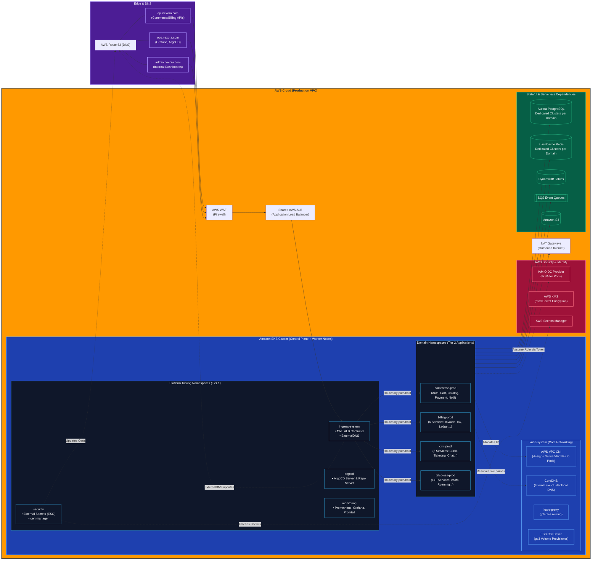

# The Ultimate Enterprise Architecture: Complete Network & Dependency Map

This document illustrates the entire AWS and Kubernetes ecosystem, leaving nothing out. It maps the sub-domains, the AWS VPC CNI network, the platform dependencies (like ArgoCD and External Secrets), and all 30+ domain microservices.

## 1. The Complete Ecosystem Diagram

---

## 2. Exhaustive Technical Breakdown (The "Glue" Components)

To truly understand this architecture, you must understand the underlying dependencies that make Kubernetes functional on AWS.

### 1. Sub-Domains, Edge Routing, and ExternalDNS
Traffic doesn't magically reach the cluster. It requires DNS and load balancing:
*   **Sub-Domains (Route 53):** We separate traffic logically. `api.nexora.com` handles all mobile/web customer traffic. `ops.nexora.com` is restricted to corporate VPN IP addresses and hosts Grafana and ArgoCD.
*   **ExternalDNS (Inside `ingress-system`):** This Kubernetes add-on watches your Ingress resources. When you deploy a new microservice that needs a URL, ExternalDNS automatically makes an API call to AWS Route 53 to create the A-Record pointing to your ALB. You never configure DNS manually.
*   **AWS ALB Controller:** Automatically provisions the physical AWS Load Balancer based on your Kubernetes Ingress YAML.

### 2. The CNI & Internal Networking (`kube-system`)
Kubernetes needs a network fabric to allow pods to communicate.
*   **AWS VPC CNI:** Unlike Flannel or Calico, the AWS VPC CNI assigns native, routable AWS VPC IP addresses (Elastic Network Interfaces - ENIs) directly to every single Pod. This means a Pod in EKS is treated exactly like an EC2 instance by the AWS network.
*   **CoreDNS:** The phonebook of the cluster. When the Commerce Cart service wants to talk to the Payment service, it doesn't use an IP. It calls `http://payment-service.commerce-prod.svc.cluster.local`. CoreDNS translates this to the target Pod's IP.
*   **kube-proxy:** Manages the low-level `iptables` rules on the worker nodes to ensure traffic hitting a Service is successfully routed to the backend Pods.

### 3. The Security Integration Layer
Security in EKS relies heavily on deep integration with AWS IAM.
*   **IAM OIDC Provider (IRSA):** IAM Roles for Service Accounts. This is the cryptographic link between Kubernetes and AWS. It allows a Kubernetes Pod to generate a secure JSON Web Token (JWT), trade it with AWS STS, and receive temporary AWS permissions. No hardcoded access keys are used anywhere.
*   **External Secrets Operator (ESO):** Lives in the `security` namespace. It syncs database passwords from AWS Secrets Manager and converts them into native Kubernetes Secrets just-in-time.
*   **AWS KMS (etcd encryption):** Kubernetes stores all its state (and secrets) in a database called `etcd`. AWS KMS provides envelope encryption so that `etcd` is encrypted at rest.
*   **cert-manager:** Automatically talks to Let's Encrypt (or AWS ACM) to rotate SSL/TLS certificates before they expire.

### 4. Platform Operations (Tier 1 Tooling)
*   **ArgoCD:** The GitOps engine. It constantly watches your Git repositories and compares them to the live EKS cluster state. If a developer manually edits a deployment via `kubectl`, ArgoCD immediately overwrites it to match Git (self-healing).
*   **Prometheus / Promtail:** The observability engine. Prometheus scrapes metrics (CPU/RAM/Requests) from every pod every 15 seconds. Promtail tails the stdout/stderr logs of every container and ships them to Grafana Loki.

### 5. Multi-Tenant Applications & Databases (Your Tier 2 Scope)
*   **Domain Namespaces:** The 30 microservices are segmented into namespaces (`commerce-prod`, `billing-prod`, etc.). Kubernetes **NetworkPolicies** govern these borders (e.g., stopping a compromised CRM pod from talking to the Commerce Payment pod).
*   **App-Level Dependencies:** Each domain has its own dedicated AWS databases. Aurora for relational data, ElastiCache Redis for transient caching, DynamoDB for serverless NoSQL locks, and SQS for decoupled asynchronous events.
