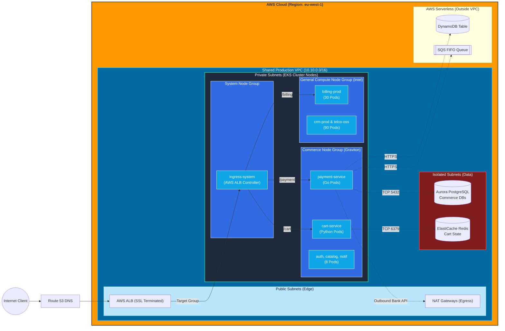

# The Master Whiteboard: X-Ray Vision of AWS, EKS, and Microservices

This diagram represents the exact physical and logical mapping of your microservices. It demonstrates how AWS networking (VPCs, Subnets, EC2 Nodes) perfectly overlaps with Kubernetes logic (Namespaces, Services, Pods).

## 1. The Ground-Level Architecture Diagram

---

## 2. Step-by-Step Interview Narrative

When asked to trace a request, walk through these 5 layers:

### 1. DNS & Subdomain Routing (The Outer Edge)
*"The user navigates to `api.nexora.com/cart`. **Route 53** holds the A-Record for the `api` subdomain, which points to the **AWS Application Load Balancer (ALB)** living in our Public Subnets."*

### 2. The VPC & Kubernetes Bridge (Ingress)
*"The ALB terminates SSL and forwards the traffic into our Private Subnets, hitting the EC2 instances (EKS Worker Nodes). Specifically, it hits the NodePorts opened by the **AWS Load Balancer Controller** pods running in the `ingress-system` namespace. The Ingress controller looks at the URL path (`/cart`) and uses Kubernetes internal rules to route traffic to the **Kubernetes Service** named `cart-service`."*

### 3. Kubernetes Logical Abstraction (Namespaces & Services)
*"Inside the cluster, we use **Namespaces** to logically separate the 30 microservices. The 5 Commerce services live in `commerce-prod`, while the 6 Billing services live in `billing-prod`. The `cart-service` acts as an internal load balancer (ClusterIP). It uses iptables/kube-proxy to round-robin the traffic to the actual healthy **Pods** (e.g., `cart-pod-1` or `cart-pod-2`)."*

### 4. Kubernetes Physical Layer (Node Groups & Pods)
*"Namespaces are just logical, but we also enforce **physical node isolation** using EKS Node Groups with Taints and Tolerations. The `kube-system` pods run on dedicated system EC2 nodes. The 25 billing/CRM/OSS services run on a massive pool of General Compute EC2 nodes. Our 5 Commerce services run on a dedicated Node Group of Graviton EC2 instances. So when traffic hits `cart-pod-1`, that container is physically executing on a specific Commerce EC2 instance inside the Private Subnet."*

### 5. Connecting to the Dependents (Databases & AWS Services)
*"Once the code inside `cart-pod-1` executes, it needs to save the user's shopping cart. Because the pod is sitting in a Private Subnet, it can route traffic down into our **Isolated Subnets** to talk to the **ElastiCache Redis** cluster on port 6379. If this was the Payment Pod, it might need to write to **DynamoDB** or **SQS**. Because those are serverless, the pod's traffic leaves the EC2 instance, traverses the AWS backbone via VPC Endpoints, and authenticates to DynamoDB securely using its IRSA (IAM Role for Service Account) token."*
