# The Master Cloud & DevOps Engineering Blueprint
### Ground-Level Enterprise Architecture, Multi-Tenant Kubernetes, Workload Sizing Math, CI/CD Pipelines, and Operational Reliability

---

## Table of Contents
1. [Enterprise Architecture & Team Operating Model](#1-enterprise-architecture--team-operating-model)
   - 1.1 The Enterprise Context: Nexora Global Telecommunications
   - 1.2 The 4 Organizational DevOps Archetypes in Modern Tech
   - 1.3 The 3-Tier Enterprise Structure
   - 1.4 Inside the 7-Member DevOps Squad: T-Shaped Dynamics & The On-Call Shield
   - 1.5 The 2-Week Agile SDLC Cadence: Two-Board Operating Model
   - 1.6 Cross-Team RACI Responsibility Matrix
   - 1.7 The Strategic Role of QA / SDET Engineers in Automated GitOps
2. [The 5 Core Microservices: Ground-Level Anatomy & Execution Runtimes](#2-the-5-core-microservices-ground-level-anatomy--execution-runtimes)
   - 2.1 Language vs. Runtime: Low-Level Technical Differentiation
   - 2.2 End-to-End Customer Request Flow
   - 2.3 Deep-Dive Technical Specification of the 5 Services
3. [Enterprise Cloud & AWS Infrastructure Isolation Strategy](#3-enterprise-cloud--aws-infrastructure-isolation-strategy)
   - 3.1 Domain-Driven Multi-Account Cloud Architecture
   - 3.2 Logical vs. Physical Resource Isolation
   - 3.3 Blast Radius Protection & PCI-DSS Scope Containment
   - 3.4 Cross-Domain Synchronous & Asynchronous Communication
4. [Multi-Tenant Kubernetes (Amazon EKS) Architecture, Node Groups & Security](#4-multi-tenant-kubernetes-amazon-eks-architecture-node-groups--security)
   - 4.1 Multi-Tenant Cluster Namespace Architecture
   - 4.2 Production Node Group Topology & Hard Compute Isolation (Taints & Tolerations)
   - 4.3 Node Instance Sizing: Graviton4 (ARM) vs. Intel Decisions
   - 4.4 Real-World vs. Textbook Multi-Tenancy (CNI NetworkPolicy, Admission Control, PCI Taints)
   - 4.5 Ground-Level Packet Journey: Browser to Container Worker
   - 4.6 Kubernetes Developer RBAC Configuration
   - 4.7 Zero-Trust Network Isolation (NetworkPolicies)
   - 4.8 IAM Roles for Service Accounts (IRSA) Deep Dive
   - 4.9 Secrets Management: External Secrets Operator (ESO)
5. [Workload Sizing, HPA Mathematics & Karpenter Autoscaling](#5-workload-sizing-hpa-mathematics--karpenter-autoscaling)
   - 5.1 The "3 Replicas Floor" vs. Peak Capacity Mathematics
   - 5.2 Active Users vs. Request Throughput Funnel
   - 5.3 Per-Service Autoscaling Ceiling & Metric Configuration Matrix
   - 5.4 The Nested Dual-Autoscaler Architecture (HPA + Karpenter)
   - 5.5 Aligning Namespace ResourceQuotas with Node Group Capacity
6. [Continuous Integration (CI) Pipeline Engineering](#6-continuous-integration-ci-pipeline-engineering)
   - 6.1 Shift-Left Security & Pre-Build vs. Post-Build Gates
   - 6.2 Production Multi-Stage Dockerfile Pattern
   - 6.3 Complete Reusable GitHub Actions CI Workflow
   - 6.4 Build Optimization: Slashing CI Duration from 18m to 3.5m
7. [Continuous Delivery (CD), GitOps & 4-Tier Promotion Engine](#7-continuous-delivery-cd-gitops--4-tier-promotion-engine)
   - 7.1 The 4-Tier Environment Promotion Pipeline
   - 7.2 GitOps Kustomize Repository Directory Layout
   - 7.3 ArgoCD Production Application Configuration
   - 7.4 Zero-Downtime Pod Lifecycle & Graceful Termination
   - 7.5 Promotion Failure Handling & Automated Rollback
8. [Production Observability, Metrics & Telemetry Deep Dive](#8-production-observability-metrics--telemetry-deep-dive)
   - 7.1 The Observability Architecture Stack
   - 8.2 The 4 Golden Signals: Production PromQL Formulas
   - 8.3 Production Alertmanager Configuration
9. [Operational Automations, Python Scripting & FinOps](#9-operational-automations-python-scripting--finops)
   - 9.1 Non-Production Nightly Auto-Scaling Script (Python + K8s API)
   - 9.2 AWS ECR Image Retention Lifecycle Policy
   - 9.3 Orphaned EBS Volume & Snapshot Cleanup
   - 9.4 Bastion Host Hardening with Ansible
10. [The Production Incident Triage Playbook (5 Real-World Incidents)](#10-the-production-incident-triage-playbook-5-real-world-incidents)
    - 10.1 Incident 1: HTTP 504 Gateway Timeout (Redis Pool Starvation)
    - 10.2 Incident 2: Pods CrashLooping / Exit Code 137 (JVM OOMKilled)
    - 10.3 Incident 3: CoreDNS CPU Throttling & Cascading Lookups
    - 10.4 Incident 4: AWS IRSA AccessDenied on Boot (OIDC Thumbprint Expiry)
    - 10.5 Incident 5: GitOps Manifest Drift & Infinite Sync Loop
    - 10.6 Ground-Level CLI Triage Commands Reference
11. [The 5 Critical Architectural Challenges & Engineering Solutions](#11-the-5-critical-architectural-challenges--engineering-solutions)

---

# 1. Enterprise Architecture & Team Operating Model

### 1.1 The Enterprise Context: Nexora Global Telecommunications
To establish an authentic, real-world foundation, all technical systems are modeled on **Nexora Global Telecommunications** (reflecting enterprise telecom GCC environments like *Vodafone / _VOIS*). 

Nexora operates a platform of **30+ backend microservices** serving millions of mobile subscribers, prepaid/postpaid billing cycles, e-SIM activations, and payment transactions across multiple European and Asian markets.

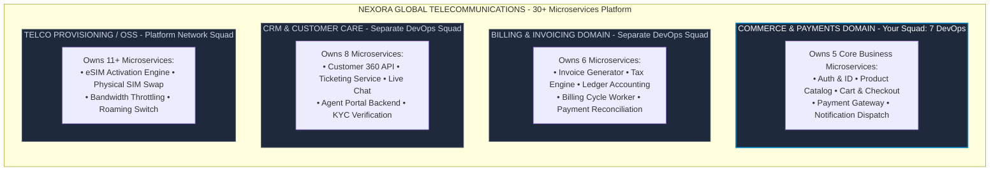

---

### 1.2 The 4 Organizational DevOps Archetypes in Modern Tech

1. **Centralized DevOps / Shared Services Team**:
   - *How it works*: A single pool of 5–10 DevOps engineers manages infrastructure and pipelines for 20+ product teams. Devs submit Jira tickets for every S3 bucket, IAM role, or pipeline fix.
   - *Where seen*: Traditional enterprises and early-stage cloud migrations.
   - *Major drawback*: DevOps becomes a severe operational bottleneck.
2. **Embedded DevOps Engineers (Cross-Functional Squads)**:
   - *How it works*: 1–2 DevOps engineers sit directly inside a single feature team (e.g., Checkout Squad).
   - *Where seen*: High-growth startups and fast-moving scale-ups.
   - *Major drawback*: Causes architectural divergence and tooling silos across teams.
3. **Platform Engineering / Internal Developer Platform (IDP)**:
   - *How it works*: A central platform team treats internal developers as "customers" and builds self-service "Golden Paths" (automated Terraform modules, Backstage service portals, standardized Helm charts).
   - *Where seen*: Cloud-native scale-ups and mature tech companies ("You build it, you run it").
4. **Site Reliability Engineering (SRE)**:
   - *How it works*: Product teams write their own infrastructure and deployment scripts; dedicated SREs partner with critical services to govern Service Level Objectives (SLOs), error budgets, incident response, and chaos testing.
   - *Where seen*: Big Tech (Google, Netflix, Uber).

---

### 1.3 The 3-Tier Enterprise Structure

In large telecom enterprises (like Vodafone / _VOIS), the structure is a **Domain-Aligned Hybrid Model** operating across 3 tiers:

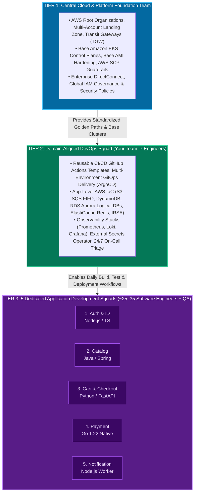

---

### 1.4 Inside the 7-Member DevOps Squad: T-Shaped Dynamics & The On-Call Shield

In an enterprise environment, 7 DevOps engineers do not work on the same task simultaneously. Work is structured using a **T-Shaped Operating Model** with **Squad Liaisons** and an **On-Call Shield**:

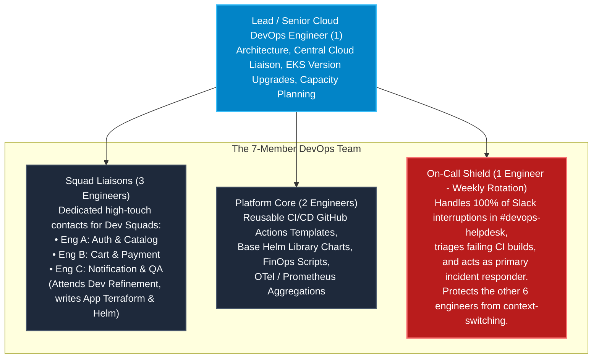

#### Ground-Level Role Breakdown:
1. **Lead / Senior Cloud DevOps Engineer (1 Headcount)**: Interfaces with the Central Cloud Platform team; plans EKS control-plane and worker-node upgrades; reviews Terraform architectures; manages capacity planning.
2. **Squad Liaisons (3 Headcount)**: Act as the dedicated points of contact for specific developer squads (e.g., You manage Cart & Payment). They attend developer backlog refinement meetings, translate product feature requirements into cloud resources, and author application-level Terraform (SQS, Redis) and Helm values.
3. **Platform Core Engineers (2 Headcount)**: Build and maintain centralized reusable GitHub Actions workflows, container build optimizations (Docker BuildKit cache), base Helm library charts, and FinOps automation scripts.
4. **On-Call Shield (1 Headcount - Weekly Rotation Across All 7)**: Acts as the dedicated operational gatekeeper. Intercepts 100% of incoming developer Slack queries in `#devops-helpdesk`, triages failing CI builds, and acts as the frontline responder for production alerts.

> [!IMPORTANT]
> **The "On-Call Shield" Operational Rationale:**  
> The number one reason DevOps teams fail sprint commitments is constant, unstructured developer interruptions (*"My build failed"*, *"Why is this pod pending in staging?"*, *"Can you give me database access?"*). The On-Call Shield absorbs all interruptions, allowing the remaining 6 engineers to focus on planned sprint epics without context-switching.

#### Redundancy and Absence Handling:
- **Zero Solo Tribal Knowledge**: No resource is created manually via the AWS Management Console or via direct `kubectl` commands from local laptops. Everything is codified in version-controlled Git repositories.
- **Mandatory Peer Reviews**: Every Terraform PR, Helm change, or GitHub Actions workflow update requires at least one peer approval from another DevOps engineer.
- **Standard Operating Runbooks**: Every deployed service, Prometheus alert, and recovery workflow has an operational runbook stored in Confluence or Git.

---

### 1.5 The 2-Week Agile SDLC Cadence: Two-Board Operating Model

The 5 Dev Squads and the DevOps Squad run separate Jira sprint boards on the same **2-week release cadence**, linked by formal dependency intake:

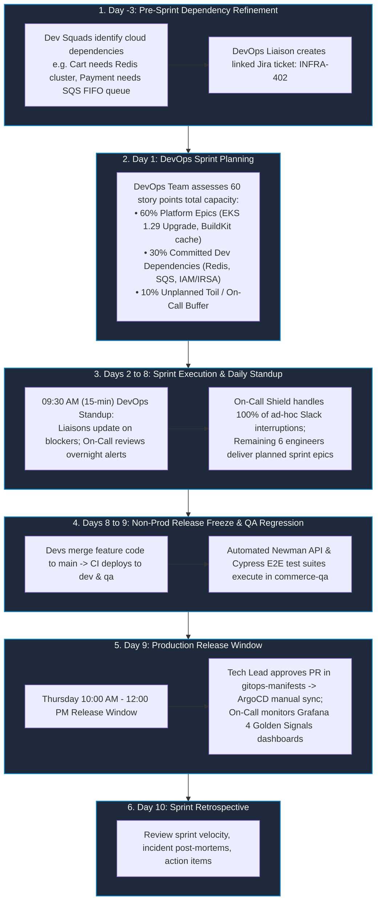

---

### 1.6 Cross-Team RACI Responsibility Matrix

| Responsibility / Deliverable | Central Cloud Foundation | Domain DevOps Squad (Your Team) | Application Dev Squads | QA / SDET Engineers |
| :--- | :---: | :---: | :---: | :---: |
| **AWS Organizations, Root VPCs, Transit Gateways** | **Accountable** | Informed | No Access | No Access |
| **Base EKS Cluster & Node Group Provisioning** | **Accountable** | Consulted | No Access | No Access |
| **App-Level AWS Infra (S3, SQS FIFO, DynamoDB, Redis)** | Governs / Audits | **Accountable** | Consulted | Informed |
| **CI/CD Reusable Workflow Automation (GitHub Actions)** | Consulted | **Accountable** | Responsible (Calls workflow) | Consulted |
| **Helm Charts, K8s Manifests, Kustomize Overlays** | No Access | **Accountable** | Responsible (Updates values) | Informed |
| **Application Business Logic & Unit Tests** | No Access | Informed | **Accountable** | Responsible |
| **API Integration & E2E Test Automation (Postman/Cypress)**| No Access | Informed | Consulted | **Accountable** |
| **Secrets Management (AWS Secrets Manager & ESO)** | Governs Policies | **Accountable** (Infra/ESO) | **Accountable** (Payloads) | No Access |
| **Observability Infrastructure (Prometheus, Loki, Grafana)**| Consulted | **Accountable** | Responsible (App metrics) | Consulted |
| **24/7 Production Incident Triage & Rollback** | Escalation | **Accountable** (Infra/GitOps) | Responsible (App Code) | Informed |

---

### 1.7 The Strategic Role of QA / SDET Engineers in Automated GitOps

In an enterprise GitOps model, QA engineers evolve into **Software Development Engineers in Test (SDETs)** with critical responsibilities:

1. **Test Automation Code Engineering**: Automated tests do not write themselves. SDETs author and maintain Postman/Newman API collections, Cypress/Playwright browser automation suites, and Pact contract tests that execute directly in CI/CD pipelines.
2. **Mocking Complex Third-Party Dependencies**: In enterprise telecom, developers cannot execute live payment authorizations against banking networks for every PR. SDETs build and maintain **WireMock** mock servers in the `commerce-qa` namespace to simulate 3D-Secure timeouts, card declines, and network latency.
3. **Exploratory & Edge-Case Testing During Sprints**: Automated suites only test known, already-written code paths. While developers write features during the sprint, SDETs perform manual exploratory testing to uncover complex edge cases (e.g., applying a discount voucher while removing items in another tab) and subsequently convert those edge cases into automated regression scripts.
4. **Shift-Left Quality in "Three Amigos"**: Before a developer writes code, the QA engineer participates in refinement sessions with the Product Owner and Developer to define boundary test conditions and Acceptance Criteria.
5. **Performance & Load Testing**: SDETs author **k6** and JMeter scripts to stress-test staging environments, establishing breaking thresholds before production deployments.

---

## 2. The 5 Core Microservices: Ground-Level Anatomy & Execution Runtimes

### 2.1 Language vs. Runtime: Low-Level Technical Differentiation

* **Programming Language**: The human-readable syntax, grammar, type system, and keywords (TypeScript, Python, Java, Go). It is static source code sitting in a repository.
* **Runtime Environment**: The actual software engine running on the CPU and operating system that executes compiled instructions, manages memory allocation and Garbage Collection (GC), provides thread scheduling, and handles OS network/disk I/O syscalls.

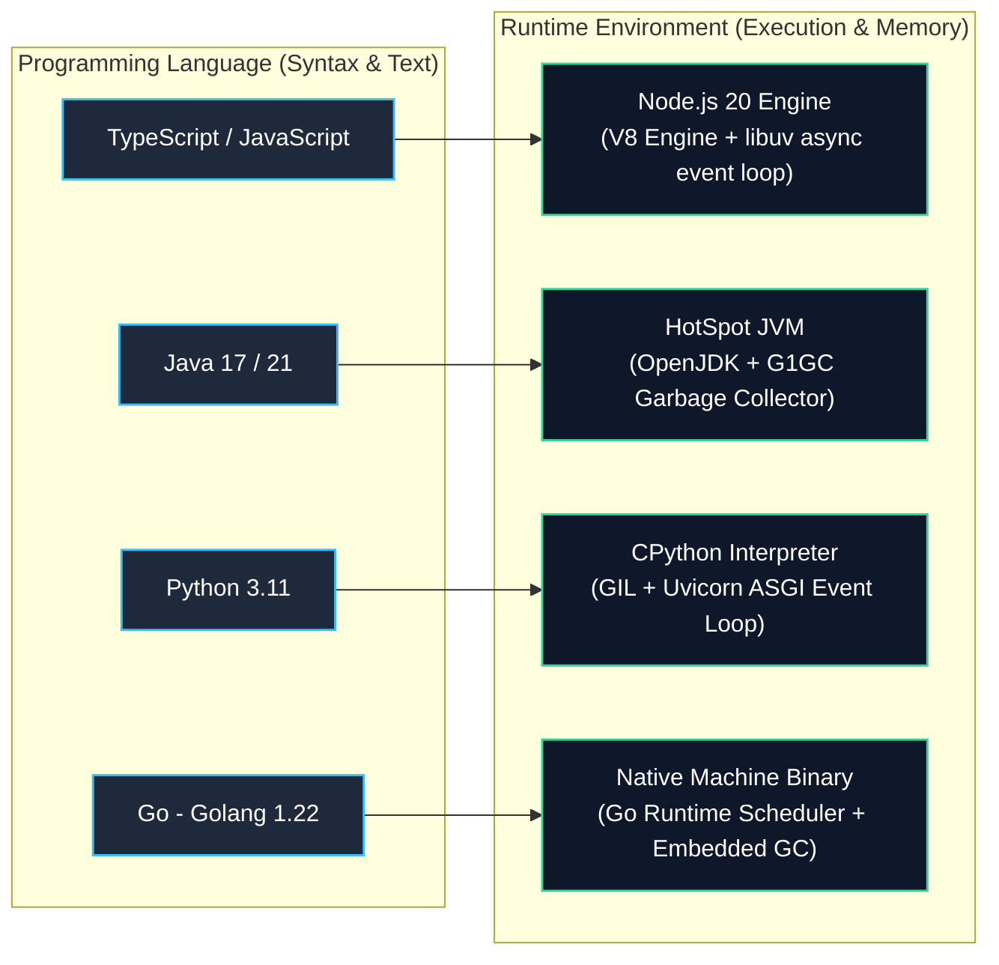

---

### 2.2 End-to-End Customer Request Flow Across the 5 Microservices

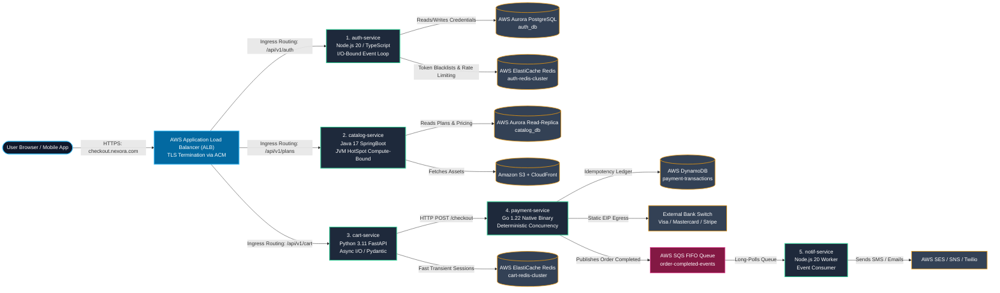

---

### 2.3 Deep-Dive Technical Specification of the 5 Services

#### 1. Auth & Identity Service (`auth-service`)
- **Functional Scope**: Handles user login, password hashing, JWT generation, and session validation.
- **Language & Runtime**: TypeScript compiled to JavaScript &rarr; **Node.js 20 (LTS)** on `node:20-alpine`.
- **Execution Characteristics**: **I/O-Bound**. The single-threaded asynchronous event loop (`libuv`) easily handles 10,000+ simultaneous login handshakes and JWT verifications with minimal RAM overhead (~40MB per container).
- **In-App Dependencies**: `fastify` (REST engine), `jsonwebtoken` (JWT signing), `argon2` / `bcryptjs` (password hashing), `ioredis` (Redis client), `pg` (PostgreSQL client pool).
- **External Cloud Dependencies**: AWS Aurora PostgreSQL (`auth_db` logical database), AWS ElastiCache Redis (token revocation blacklists, rate limiting via `INCR login_attempts:<ip>`), AWS Secrets Manager (RSA private keys).
- **Criticality & DevOps Guardrails**: **Tier-0 (Platform Blocker)**. If Auth is down, no user can log in. Deployed with 4–12 pods spread across 3 AZs via `topologySpreadConstraints`. HPA targets 60% CPU utilization.

#### 2. Product Catalog Service (`catalog-service`)
- **Functional Scope**: Serves mobile prepaid/postpaid plans, 5G add-ons, handset specs (iPhone 16), and pricing.
- **Language & Runtime**: Java 17 / 21 &rarr; **OpenJDK HotSpot JVM** on `eclipse-temurin:17-jre-alpine` with SpringBoot.
- **Execution Characteristics**: **Compute & Memory-Bound**. Maps complex nested relational telco data into JSON models using Hibernate ORM, `@Cacheable` annotations, and JVM multithreading.
- **In-App Dependencies**: `spring-boot-starter-web`, `spring-boot-starter-data-jpa`, `postgresql` JDBC driver, `caffeine` (local in-memory cache), `aws-java-sdk-s3`.
- **External Cloud Dependencies**: AWS Aurora PostgreSQL Read-Replicas (`catalog_db`), Amazon S3 + AWS CloudFront CDN (device spec sheets, plan brochure PDFs, product images).
- **Criticality & DevOps Guardrails**: **Tier-1**. Pod memory: Request `1Gi`, Limit `1.5Gi`. Explicit JVM ergonomics: `-XX:MaxRAMPercentage=75.0 -XX:+UseG1GC` to prevent heap growth from exceeding container limits (preventing Exit Code 137 OOMKilled). SpringBoot Actuator readiness probe: `/actuator/health/readiness` (`initialDelaySeconds: 25`).

#### 3. Cart & Checkout Service (`cart-service`)
- **Functional Scope**: Manages active shopping baskets, discount voucher application (`FESTIVE50`), tax calculations, and temporary inventory locks.
- **Language & Runtime**: Python 3.11 &rarr; **CPython** managed by **Uvicorn (ASGI)** on `python:3.11-slim` with FastAPI.
- **Execution Characteristics**: **Async I/O**. Asynchronous event handling (`async`/`await`) with Pydantic serialization for rapid cart calculations without compile overhead.
- **In-App Dependencies**: `fastapi`, `pydantic`, `redis-py` / `aioredis`, `httpx` (async HTTP client to query catalog pricing).
- **External Cloud Dependencies**: Dedicated AWS ElastiCache Redis Cluster (Cluster Mode Enabled). Uses Redis Hashes with TTLs (`cart:<user_id>`) for transient shopping carts without writing to relational disk DBs.
- **Criticality & DevOps Guardrails**: **Tier-1**. Connection pool tuning: 6 pods &times; 4 Uvicorn workers &times; 50 pool size = 1,200 connections. ElastiCache Parameter Group configured for `max_connections: 5000`.

#### 4. Payment Gateway Wrapper (`payment-service`)
- **Functional Scope**: Financial transactions, bank OTP validation, payment intent capture, idempotency enforcement.
- **Language & Runtime**: Go (Golang 1.22) &rarr; **Compiled Native Static Binary** on `gcr.io/distroless/static`.
- **Execution Characteristics**: **Deterministic Concurrency**. Zero GC pauses, static type safety, and explicit error handling (`if err != nil`) ensuring no dropped banking transactions.
- **In-App Dependencies**: `net/http` / `gin-gonic`, `aws-sdk-go-v2` (`dynamodb`, `sqs`), `crypto/tls` (TLS 1.3 for banking switches).
- **External Cloud Dependencies**: AWS DynamoDB (`commerce-prod-payment-transactions`), AWS SQS FIFO Queue (`prod-commerce-payment-success.fifo`), AWS NAT Gateways with static Elastic IPs (whitelisted by upstream acquiring banks).
- **Criticality & DevOps Guardrails**: **Tier-0 (PCI-DSS Scope)**. Strict pod security: `readOnlyRootFilesystem: true`, `runAsNonRoot: true`, `runAsUser: 10001`. Loki loggers enforce regex masking on card numbers/CVVs.

#### 5. Notification & Dispatch Service (`notif-service`)
- **Functional Scope**: Asynchronous background worker sending order SMS confirmations, email PDF invoices, and push notifications.
- **Language & Runtime**: TypeScript &rarr; **Node.js 20 (LTS)** running as a headless background event consumer.
- **Execution Characteristics**: **Event-Driven Polling**. Non-blocking loop long-polls AWS SQS, compiles HTML templates, and dispatches outbound alerts.
- **In-App Dependencies**: `@aws-sdk/client-sqs`, `@aws-sdk/client-ses`, `@aws-sdk/client-sns`, `twilio`, `handlebars`.
- **External Cloud Dependencies**: AWS SQS FIFO Queue + Dead Letter Queue (`notif-dlq` with 3 retries), AWS SES (Transactional Email Receipts), AWS SNS / Twilio (SMS Alerts).
- **Criticality & DevOps Guardrails**: **Tier-2 (Asynchronous / Decoupled)**. Outages do not block checkouts. Autoscaled via **KEDA (Kubernetes Event-driven Autoscaling)** based on the SQS metric `ApproximateNumberOfMessagesVisible` (scales from 2 to 10 pods when queue depth &gt; 500).

---

# 3. Enterprise Cloud & AWS Infrastructure Isolation Strategy

### 3.1 Domain-Driven Multi-Account Cloud Architecture

Enterprise architecture separates business units into dedicated AWS accounts under **AWS Organizations / Control Tower**:

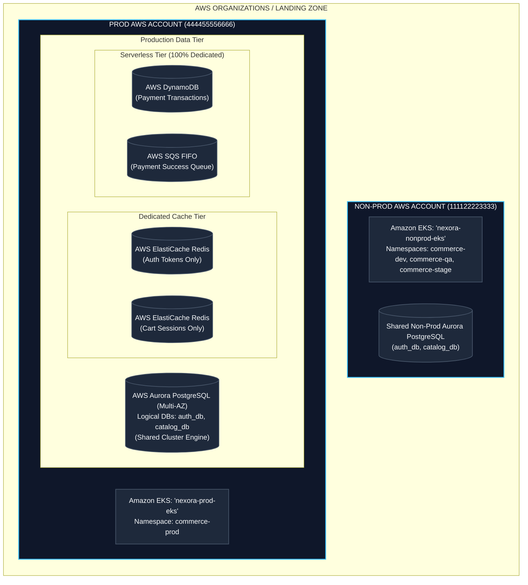

---

### 3.2 Logical vs. Physical Resource Isolation

| AWS Service | Provisioning Strategy | Ground-Level Technical Rationale |
| :--- | :--- | :--- |
| **Aurora PostgreSQL** | **Shared Cluster Engine, Logical DBs** | A multi-AZ Aurora cluster costs $1,000+/month. We provision one cluster per domain. `auth-service` connects strictly to `auth_db`; `catalog-service` connects to `catalog_db`. PostgreSQL IAM/role privileges enforce isolation. |
| **ElastiCache Redis** | **Dedicated Physical Clusters** | Redis is memory-bound. A flash sale on Cart could evict Auth tokens if shared. Therefore, `auth-redis` and `cart-redis` run on separate physical clusters. |
| **AWS SQS & DynamoDB** | **100% Dedicated per Service** | Serverless resources have no baseline idle server cost. Each service gets its own queues and tables protected by strict IRSA IAM roles. |

---

### 3.3 Blast Radius Protection & PCI-DSS Scope Containment

1. **Why Database Tables Are Never Shared Across Domains**: Sharing a single database across microservices creates tight coupling. A slow query or table lock in a reporting service could exhaust DB connections, knocking out payment processing and violating PCI-DSS isolation rules.
2. **Why Redis Clusters Are Physically Separated**: Redis executes in-memory. If memory is exhausted, its eviction policy (`allkeys-lru`) discards keys. If Auth and Cart shared a cluster, a flash sale spiking cart activity would evict user authentication tokens, logging out users across the platform.
3. **PCI-DSS Compliance Isolation for Payment Processing**: In an enterprise handling credit card transactions, Qualified Security Assessors (QSAs) require strict Cardholder Data Environment (CDE) segmentation. Placing payment pods on dedicated, tainted node groups (`commerce-payment-ng`) or inside a dedicated AWS account eliminates the risk of adjacent containers sniffing network sockets or accessing shared host memory.

---

### 3.4 Cross-Domain Synchronous & Asynchronous Communication

When services in the Commerce domain interact with the other 25+ services across Nexora:
- **Synchronous Communication (Real-Time API)**: Used when immediate confirmation is required (e.g., Cart calling eSIM Activation in the Telco OSS domain). Traffic flows privately via **AWS Transit Gateway (TGW)** and **AWS PrivateLink** without traversing the public internet.
- **Asynchronous Communication (Event-Driven)**: Used for background operations (e.g., Payment completed &rarr; Billing Invoice Generation). The Payment service publishes a `PaymentCompletedEvent` to **AWS EventBridge / SQS FIFO**, which the Billing and OSS domains consume independently.

---

# 4. Multi-Tenant Kubernetes (Amazon EKS) Architecture, Node Groups & Security

### 4.1 Multi-Tenant Cluster Namespace Architecture

In production, all 30+ services operate in a **Multi-Tenant Amazon EKS Cluster** managed by the Central Cloud Team, partitioned by domain namespaces:

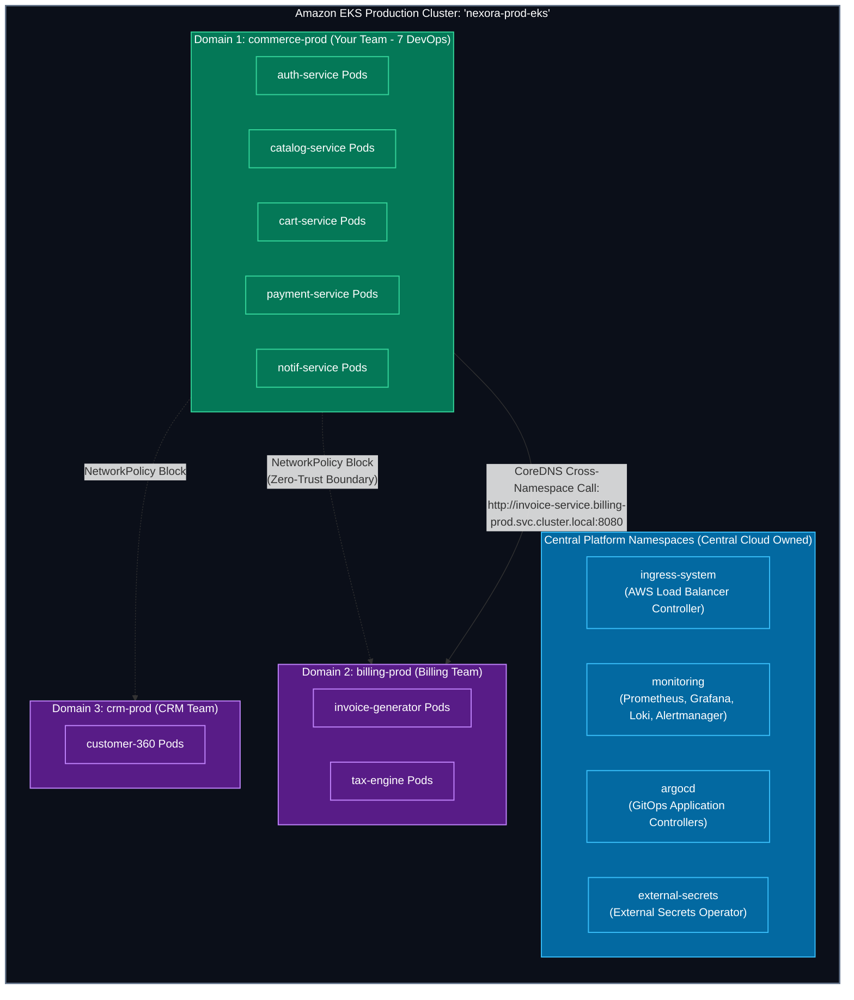

---

### 4.2 Production Node Group Topology & Hard Compute Isolation (Taints & Tolerations)

In real enterprise clusters, **namespaces are soft logical boundaries** (they share the Linux kernel, CPU cores, and memory bus). A memory leak in `crm-prod` can starve `commerce-prod` pods on the same physical host.

To enforce **hard compute isolation**, each domain runs on its own dedicated **Managed Node Group** using Kubernetes **Taints, Tolerations, and Node Affinity**:

```mermaid
flowchart TD
    subgraph EKSCluster["EKS Cluster Worker Hardware Layer"]
        direction TB
        
        subgraph NG_System["system-ng (General Cluster Services)"]
            N_Sys["Controllers, CoreDNS, Ingress, Monitoring Agents<br/>Instance: m7g.large (ARM Graviton4)"]
        end

        subgraph NG_Commerce["commerce-ng (Domain 1 Workloads)"]
            N_Com["Auth, Catalog, Cart, Notification Pods<br/>Instance: m7g.2xlarge (ARM Graviton4)<br/>Toleration: domain=commerce:NoSchedule"]
        end

        subgraph NG_Payment["commerce-payment-ng (PCI-DSS Isolated)"]
            N_Pay["Payment Gateway Pods ONLY<br/>Taint: dedicated=pci-payment:NoSchedule<br/>Instance: m7i.xlarge (Dedicated Isolated Hardware)"]
        end

        subgraph NG_Billing["billing-ng (Domain 2 Workloads)"]
            N_Bill["Billing & Invoicing Pods<br/>Instance: m7g.xlarge (ARM Graviton4)"]
        end

        subgraph NG_CRM["crm-ng (Domain 3 Workloads)"]
            N_CRM["CRM & Customer 360 Pods<br/>Instance: r7g.xlarge (Memory Optimized)"]
        end

        subgraph NG_OSS["telco-oss-ng (Domain 4 Telecom OSS)"]
            N_OSS["eSIM & Network Activation Pods (Largest Pool)<br/>Instance: m7g.4xlarge (High Concurrency)"]
        end
    end

    classDef ng fill:#1e293b,stroke:#0284c7,stroke-width:1.5px,color:#f8fafc;
    classDef pci fill:#7f1d1d,stroke:#ef4444,stroke-width:2px,color:#ffffff;
    class NG_System,NG_Commerce,NG_Billing,NG_CRM,NG_OSS ng;
    class NG_Payment pci;
```

| Node Group Name | Target Services | Instance Type & Architecture | Sizing & Isolation Rationale |
| :--- | :--- | :--- | :--- |
| **`system-ng`** | CoreDNS, AWS ALB Controller, Karpenter, Prometheus/Loki agents | `m7g.large` (Graviton4, ARM) | Dedicated system pool. Ensures platform controllers never compete for CPU during application traffic spikes. |
| **`commerce-ng`** | `auth-service`, `catalog-service`, `cart-service`, `notif-service` | `m7g.2xlarge` (8 vCPU / 32GiB) | Best price-performance for standard containerized microservices. Bin-packs commerce pods across 3 AZs. |
| **`commerce-payment-ng`** | `payment-service` ONLY | `m7i.xlarge` (4 vCPU / 16GiB Intel) | **Dedicated Tainted Hardware**: Tainted with `dedicated=pci-payment:NoSchedule`. Closes the PCI-DSS audit gap by physically preventing other containers from co-locating on the same kernel. |
| **`billing-ng`** | 6 Billing Microservices | `m7g.xlarge` (4 vCPU / 16GiB) | Sized for billing calculation workers and invoice generation pipelines. |
| **`crm-ng`** | 8 CRM Microservices | `r7g.xlarge` (Memory-Optimized) | Sized for high-memory session caches and customer lookup aggregations. |
| **`telco-oss-ng`** | 11+ Telecom OSS Services | `m7g.4xlarge` (16 vCPU / 64GiB) | Largest workload pool handling high-throughput eSIM and network provisioning events. |

---

### 4.3 Node Instance Sizing: Graviton4 (ARM) vs. Intel Decisions

1. **Graviton4 (`m7g` / `r7g` family)**: Default choice for all modern containerized microservices (Node.js, Go, Python). Delivers **~20–40% better price-performance** over x86.
2. **Intel x86 (`m7i` / `m6i` family)**: Retained specifically for services with legacy C/C++ native bindings (JNI) or unverified ARM compatibility in third-party banking/telecom SDKs.

---

### 4.4 Real-World vs. Textbook Multi-Tenancy

In an enterprise interview, demonstrating knowledge of real-world operational nuances separates seniors from junior candidates:

1. **AWS VPC CNI NetworkPolicy Support**: In AWS EKS, NetworkPolicies are not enforced out of the box unless either **AWS VPC CNI native NetworkPolicy support** is explicitly enabled or a third-party CNI (Calico / Cilium) is installed. Without this, NetworkPolicy YAMLs in Git are silently ignored by the cluster.
2. **Admission Controllers (Kyverno / OPA Gatekeeper / PSA)**: Real hardened clusters run admission controllers to enforce cluster-wide security baselines (blocking privileged containers, forbidding root execution `runAsNonRoot: true`, preventing `hostPath` mounts).
3. **EKS Provisioned Control Plane**: For predicted national telecom traffic surges (e.g., nationwide number porting day or major iPhone pre-orders), AWS offers **Provisioned Control Plane capacity** (Standard up to 8XL) to guarantee API server and etcd headroom.

---

### 4.5 Ground-Level Packet Journey: Browser to Container Worker

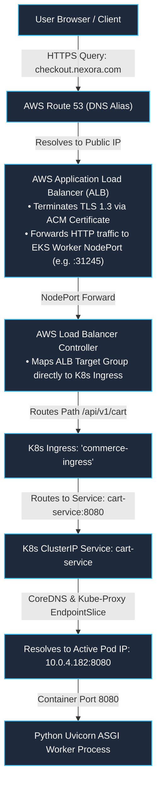

---

### 4.6 Kubernetes Developer RBAC Configuration

```yaml
# developer-readonly-rbac.yaml
apiVersion: rbac.authorization.k8s.io/v1
kind: Role
metadata:
  namespace: commerce-prod
  name: developer-readonly-role
rules:
  # 1. Allow inspecting workloads, pods, and streaming logs
  - apiGroups: ["", "apps"]
    resources: ["pods", "pods/log", "services", "deployments", "configmaps", "events"]
    verbs: ["get", "list", "watch"]
  # 2. Allow local port-forwarding for debugging
  - apiGroups: [""]
    resources: ["pods/port-forward"]
    verbs: ["create"]
  # 3. Explicit Denial: 'pods/exec' and 'secrets' are excluded.
  # (In Kubernetes RBAC, omission equals an implicit deny)
---
apiVersion: rbac.authorization.k8s.io/v1
kind: RoleBinding
metadata:
  namespace: commerce-prod
  name: developer-readonly-binding
subjects:
  - kind: Group
    name: "sso:commerce-developers-group"
    apiGroup: rbac.authorization.k8s.io
roleRef:
  kind: Role
  name: developer-readonly-role
  apiGroup: rbac.authorization.k8s.io
```

---

### 4.7 Zero-Trust Network Isolation (NetworkPolicies)

```yaml
# network-policy-payment.yaml
apiVersion: networking.k8s.io/v1
kind: NetworkPolicy
metadata:
  name: allow-cart-and-billing-to-payment
  namespace: commerce-prod
spec:
  podSelector:
    matchLabels:
      app: payment-service
  policyTypes:
    - Ingress
  ingress:
    # Rule 1: Allow cart-service within same namespace
    - from:
        - podSelector:
            matchLabels:
              app: cart-service
      ports:
        - protocol: TCP
          port: 8080
    # Rule 2: Allow billing-prod namespace for invoice reconciliation
    - from:
        - namespaceSelector:
            matchLabels:
              domain: billing-prod
      ports:
        - protocol: TCP
          port: 8080
```

---

### 4.8 IAM Roles for Service Accounts (IRSA) Deep Dive

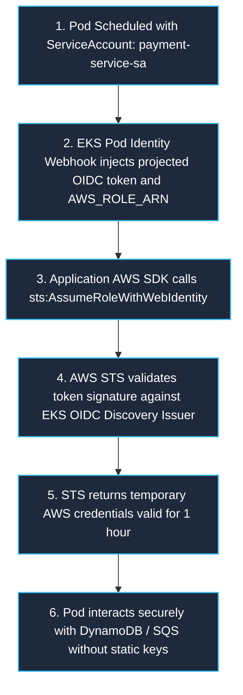

```yaml
# 1. Kubernetes ServiceAccount with IAM Role Annotation
apiVersion: v1
kind: ServiceAccount
metadata:
  name: payment-service-sa
  namespace: commerce-prod
  annotations:
    eks.amazonaws.com/role-arn: arn:aws:iam::444455556666:role/nexora-prod-payment-role
```

```json
// 2. AWS IAM Role Trust Relationship Policy (Terraform-generated)
{
  "Version": "2012-10-17",
  "Statement": [
    {
      "Effect": "Allow",
      "Principal": {
        "Federated": "arn:aws:iam::444455556666:oidc-provider/oidc.eks.eu-west-1.amazonaws.com/id/EXAMPLED3B7B2E364022D9"
      },
      "Action": "sts:AssumeRoleWithWebIdentity",
      "Condition": {
        "StringEquals": {
          "oidc.eks.eu-west-1.amazonaws.com/id/EXAMPLED3B7B2E364022D9:sub": "system:serviceaccount:commerce-prod:payment-service-sa",
          "oidc.eks.eu-west-1.amazonaws.com/id/EXAMPLED3B7B2E364022D9:aud": "sts.amazonaws.com"
        }
      }
    }
  ]
}
```

---

### 4.9 Secrets Management: External Secrets Operator (ESO)

```yaml
# 1. ClusterSecretStore (Authenticates via IRSA)
apiVersion: external-secrets.io/v1beta1
kind: ClusterSecretStore
metadata:
  name: aws-secrets-manager
spec:
  provider:
    aws:
      service: SecretsManager
      region: eu-west-1
      auth:
        jwt:
          serviceAccountRef:
            name: eso-service-account
            namespace: external-secrets
---
# 2. ExternalSecret Custom Resource
apiVersion: external-secrets.io/v1beta1
kind: ExternalSecret
metadata:
  name: payment-secrets-sync
  namespace: commerce-prod
spec:
  refreshInterval: 1h
  secretStoreRef:
    name: aws-secrets-manager
    kind: ClusterSecretStore
  target:
    name: payment-k8s-secret # Native K8s Secret created automatically in namespace
    creationPolicy: Owner
  data:
    - secretKey: STRIPE_API_KEY
      remoteRef:
        key: prod/commerce/payment
        property: stripe_secret_key
    - secretKey: DB_PASSWORD
      remoteRef:
        key: prod/commerce/database
        property: db_password
```

---

# 5. Workload Sizing, HPA Mathematics & Karpenter Autoscaling

### 5.1 The "3 Replicas Floor" vs. Peak Capacity Mathematics

A common source of confusion in interview rounds is understanding **Minimum Replicas** vs. **Maximum Capacity**:

1. **Minimum Floor (3 Replicas)**: Exists strictly for **High Availability (HA)** and **fault tolerance**, not for handling peak traffic volume. One pod is placed in each of the 3 AWS Availability Zones (`topologySpreadConstraints`). If an entire data center loses power, 2 replicas remain active. It also allows rolling deployments to replace one pod at a time without dropping below 100% capacity. Running 20+ pods 24/7 during off-peak hours (e.g. 3:00 AM) wastes thousands of dollars in compute.
2. **Maximum Ceiling (HPA Dynamic Burst)**: Absorbs daytime traffic spikes. As traffic arrives, the Horizontal Pod Autoscaler (HPA) monitors CPU/QPS metrics and scales the deployment from 3 up to 20+ replicas dynamically.

---

### 5.2 Active Users vs. Request Throughput Funnel

**50,000 active concurrent users does NOT equal 50,000 requests per second (RPS).**

In a web application:
- An active user spends 20–60 seconds reading a page, typing details, or reviewing plans. They generate roughly **1 request every 2 to 3 seconds**.
- User drop-off occurs across the e-commerce purchase funnel:
  - **100% of users** hit `auth-service` and `catalog-service` during initial browsing.
  - **~20% of users** proceed to add items and interact with `cart-service` (~2,000–3,000 RPS).
  - **~5% of users** reach the final checkout step with `payment-service` (~500–800 RPS).

```
[ 50,000 Browsing Users ] ──► [ Catalog Service: ~8,000 RPS ] (Cacheable, Needs ~25 Pods)
                                      │ (20% proceed to checkout)
                                      ▼
                             [ Cart Service: ~2,500 RPS ] (Needs ~15–18 Pods)
                                      │ (5% reach payment)
                                      ▼
                             [ Payment Service: ~600 RPS ] (Needs ~6–8 Pods)
```

At **~150 requests/sec per pod** for a Python FastAPI container, 2,500 RPS requires `2500 / 150 ≈ 17 pods`. Thus, setting `minReplicas: 3` and `maxReplicas: 20` is mathematically sound.

---

### 5.3 Per-Service Autoscaling Ceiling & Metric Configuration Matrix

| Microservice | Min Replicas (Floor) | Max Replicas (Peak) | Primary Scaling Metric | Autoscaling Engine & Rationale |
| :--- | :---: | :---: | :--- | :--- |
| **`auth-service`** | **5** | **30** | CPU &gt; 60% OR HTTP RPS &gt; 250/pod | **HPA**: Authenticates every page session; high baseline traffic. |
| **`catalog-service`** | **5** | **30** | CPU &gt; 70% OR HTTP RPS &gt; 300/pod | **HPA**: Heaviest read traffic across entire site. |
| **`cart-service`** | **3** | **20** | HTTP Requests/sec via Prometheus Adapter | **HPA**: Request-driven scaling (CPU lags behind sudden traffic bursts). |
| **`payment-service`** | **3** | **15** | CPU &gt; 50% OR Active Connections &gt; 100 | **HPA**: Isolated on dedicated tainted hardware node group. |
| **`notif-service`** | **2** | **20** | `ApproximateNumberOfMessagesVisible` &gt; 500 | **KEDA**: Queue-driven worker. CPU remains 0% while idle, so HPA fails; KEDA scales directly on SQS queue depth. |

---

### 5.4 The Nested Dual-Autoscaler Architecture (HPA + Karpenter)

Kubernetes scaling operates at two interconnected layers:

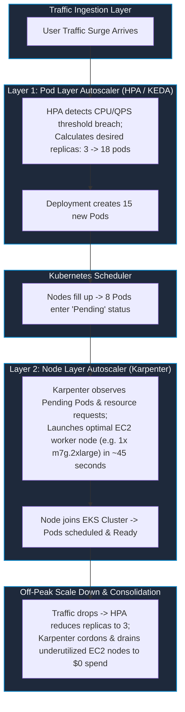

---

### 5.5 Aligning Namespace ResourceQuotas with Node Group Capacity

A `ResourceQuota` must be mathematically aligned with the underlying node group compute rather than guessed:
- If `commerce-ng` runs 4 &times; `m7g.2xlarge` nodes (8 vCPU / 32GiB RAM each = **32 vCPUs / 128GiB RAM total**):
- Setting `ResourceQuota` to `requests.cpu: "20"`, `requests.memory: "40Gi"` guarantees that baseline workloads never exceed 60% of the node group, leaving **12 vCPUs and 88GiB of RAM reserved for HPA burst scaling**.

---

# 6. Continuous Integration (CI) Pipeline Engineering

### 6.1 Shift-Left Security & Pre-Build vs. Post-Build Gates

| Stage | Security & Quality Gate Tool | Enforcement Mechanism & Failure Threshold |
| :--- | :--- | :--- |
| **Pre-Build (Code Lint & SCA)** | **Gitleaks** | Pre-commit hook & CI check: Fails build if API keys, tokens, or private keys match regex signatures. |
| **Pre-Build (Static Analysis)** | **SonarQube** | Mandatory PR Quality Gate: Fails PR merge if code coverage &lt; 80% or Security Hotspots &gt; 0. |
| **Pre-Build (Dependency Scan)** | **Trivy (fs) / Snyk** | Scans application lockfiles (`package-lock.json`, `pom.xml`, `requirements.txt`); fails on HIGH/CRITICAL CVEs. |
| **Post-Build (Container Image)**| **Trivy (image)** | Scans Linux base image layers and OS packages; breaks build on unpatched CRITICAL CVEs. |
| **Post-Build (Manifest Linting)**| **kubeconform / helm lint** | Validates Kubernetes YAML schemas against strict OpenAPI specifications. |

---

### 6.2 Production Multi-Stage Dockerfile Pattern

```dockerfile
# ========================================================
# Stage 1: Build & Dependency Compilation
# ========================================================
FROM node:20-alpine AS builder
WORKDIR /app

# Cache package dependencies
COPY package*.json ./
RUN npm ci --only=production

# Compile application assets
COPY . .
RUN npm run build

# ========================================================
# Stage 2: Minimal Hardened Production Runtime
# ========================================================
FROM node:20-alpine AS runner
WORKDIR /app

# Security: Create non-root system user and group (UID 10001)
RUN addgroup -g 10001 -S appgroup && \
    adduser -u 10001 -S appuser -G appgroup

# Copy ONLY compiled artifacts from builder stage
COPY --from=builder --chown=appuser:appgroup /app/dist ./dist
COPY --from=builder --chown=appuser:appgroup /app/node_modules ./node_modules
COPY --from=builder --chown=appuser:appgroup /app/package.json ./package.json

# Enforce Non-Root Execution
USER appuser
EXPOSE 8080
ENV NODE_ENV=production

CMD ["node", "dist/main.js"]
```

---

### 6.3 Complete Reusable GitHub Actions CI Workflow

```yaml
# .github/workflows/reusable-microservice-ci.yml
name: Reusable Microservice CI/CD
on:
  workflow_call:
    inputs:
      service_name:
        required: true
        type: string
      dockerfile_path:
        required: false
        type: string
        default: './Dockerfile'
    secrets:
      AWS_ACCOUNT_ID:
        required: true
      SONAR_TOKEN:
        required: true
      GITOPS_DEPLOY_KEY:
        required: true

jobs:
  validate-and-test:
    runs-on: ubuntu-latest
    steps:
      - name: Checkout Code
        uses: actions/checkout@v4

      - name: Setup Node.js Environment
        uses: actions/setup-node@v4
        with:
          node-version: '20'
          cache: 'npm'

      - name: Install Dependencies & Run Tests
        run: |
          npm ci
          npm test -- --coverage

      - name: SonarQube Quality Gate Check
        uses: sonarsource/sonarqube-scan-action@master
        env:
          SONAR_TOKEN: ${{ secrets.SONAR_TOKEN }}
          SONAR_HOST_URL: "https://sonar.nexora-internal.com"

      - name: Trivy Filesystem Scan (SCA)
        uses: aquasecurity/trivy-action@master
        with:
          scan-type: 'fs'
          scan-ref: '.'
          severity: 'CRITICAL,HIGH'
          exit-code: '1'

  build-and-publish:
    needs: validate-and-test
    runs-on: ubuntu-latest
    permissions:
      id-token: write # Required for AWS OIDC authentication
      contents: read
    steps:
      - name: Checkout Code
        uses: actions/checkout@v4

      - name: Authenticate to AWS via OIDC
        uses: aws-actions/configure-aws-credentials@v4
        with:
          role-to-assume: arn:aws:iam::${{ secrets.AWS_ACCOUNT_ID }}:role/github-actions-ci-role
          aws-region: eu-west-1

      - name: Log in to Amazon ECR
        id: login-ecr
        uses: aws-actions/amazon-ecr-login@v2

      - name: Set up Docker Buildx (BuildKit)
        uses: docker/setup-buildx-action@v3

      - name: Build and Push Docker Image (BuildKit Cached)
        uses: docker/build-push-action@v5
        with:
          context: .
          file: ${{ inputs.dockerfile_path }}
          push: true
          tags: ${{ steps.login-ecr.outputs.registry }}/${{ inputs.service_name }}:sha-${{ github.sha }}
          cache-from: type=gha
          cache-to: type=gha,mode=max

      - name: Trivy Container Image Scan
        uses: aquasecurity/trivy-action@master
        with:
          image-ref: ${{ steps.login-ecr.outputs.registry }}/${{ inputs.service_name }}:sha-${{ github.sha }}
          format: 'table'
          severity: 'CRITICAL'
          exit-code: '1'

      - name: Update Image Tag in GitOps Repository
        env:
          NEW_TAG: sha-${{ github.sha }}
          SERVICE: ${{ inputs.service_name }}
        run: |
          git config --global user.name "nexora-ci-bot"
          git config --global user.email "ci-bot@nexora.com"
          git clone https://x-access-token:${{ secrets.GITOPS_DEPLOY_KEY }}@github.com/nexora/gitops-manifests.git
          cd gitops-manifests/apps/$SERVICE/overlays/dev
          sed -i "s/newTag: .*/newTag: $NEW_TAG/" kustomization.yaml
          git add kustomization.yaml
          git commit -m "ci($SERVICE): promote dev image to $NEW_TAG [skip ci]"
          git push origin main
```

---

### 6.4 Build Optimization: Slashing CI Duration from 18m to 3.5m

1. **Docker BuildKit Layer Caching (`type=gha`)**: By caching intermediate Docker build stages directly in the GitHub Actions cache backend, unchanged package compilation layers are restored in seconds.
2. **Multi-Stage Build Isolation**: By separating dependency compilation (`npm ci`, Maven build) from the final minimal runner image, output images dropped from ~900MB to ~85MB.
3. **Parallel Matrix Execution**: Running static analysis, Trivy scans, and unit tests simultaneously across parallel GitHub Actions runners rather than sequentially.

---

# 7. Continuous Delivery (CD), GitOps & 4-Tier Promotion Engine

### 7.1 The 4-Tier Environment Promotion Pipeline

```mermaid
flowchart TD
    subgraph CI["Continuous Integration (GitHub Actions)"]
        Merge["Developer merges code to 'main'"]
        Build["Docker BuildKit + Trivy Scan + ECR Push"]
        UpdateDev["CI commits 'newTag: sha-9f8e7d6' to overlays/dev/"]
        Merge --> Build --> UpdateDev
    end

    subgraph DevEnv["1. DEV ENVIRONMENT (commerce-dev)"]
        ArgoDev["ArgoCD Auto-Syncs"] --> PodDev["Deploys Pods in commerce-dev"]
        PodDev --> Sanity["Developer Sanity & Feature Validation"]
    end

    subgraph QAEnv["2. QA ENVIRONMENT (commerce-qa)"]
        UpdateQA["Pipeline updates overlays/qa/"] --> ArgoQA["ArgoCD Auto-Syncs"]
        ArgoQA --> PodQA["Deploys Pods in commerce-qa"]
        PodQA --> QATests["Automated Newman API Tests<br/>+ Cypress E2E Tests + WireMock Mocks"]
    end

    subgraph StageEnv["3. STAGING ENVIRONMENT (commerce-stage)"]
        RC["100% QA Pass -> Release Candidate Cut (v2.4.0)"]
        UpdateStage["Pipeline updates overlays/stage/"] --> ArgoStage["ArgoCD Auto-Syncs"]
        ArgoStage --> PodStage["Deploys Pods in commerce-stage"]
        PodStage --> StageTests["k6 Load Testing + Security Sign-Off + Product Owner UAT"]
    end

    subgraph ProdEnv["4. PRODUCTION ENVIRONMENT (commerce-prod)"]
        PRProd["Formal Pull Request opened to overlays/prod/"]
        Approve["Mandatory Signoff by Tech Lead"]
        MergeProd["PR merged to 'main' in gitops-manifests"]
        ReleaseWindow["Scheduled Release Window (Thurs 10 AM)"]
        ManualSync["Senior DevOps clicks SYNC in ArgoCD UI"]
        PodProd["Zero-Downtime Rolling Update in commerce-prod"]
        
        PRProd --> Approve --> MergeProd --> ReleaseWindow --> ManualSync --> PodProd
    end

    UpdateDev --> ArgoDev
    Sanity --> UpdateQA
    QATests --> RC --> UpdateStage
    StageTests --> PRProd

    classDef ci fill:#0369a1,stroke:#38bdf8,stroke-width:1.5px,color:#ffffff;
    classDef dev fill:#1e293b,stroke:#0284c7,stroke-width:1.5px,color:#ffffff;
    classDef qa fill:#1e293b,stroke:#f59e0b,stroke-width:1.5px,color:#ffffff;
    classDef stage fill:#1e293b,stroke:#8b5cf6,stroke-width:1.5px,color:#ffffff;
    classDef prod fill:#1e293b,stroke:#ef4444,stroke-width:2px,color:#ffffff;
    class CI,Merge,Build,UpdateDev ci;
    class DevEnv,ArgoDev,PodDev,Sanity dev;
    class QAEnv,UpdateQA,ArgoQA,PodQA,QATests qa;
    class StageEnv,RC,UpdateStage,ArgoStage,PodStage,StageTests stage;
    class ProdEnv,PRProd,Approve,MergeProd,ReleaseWindow,ManualSync,PodProd prod;
```

---

### 7.2 GitOps Kustomize Repository Directory Layout

```
gitops-manifests/
└── apps/
    └── payment-service/
        ├── base/
        │   ├── deployment.yaml       # Core container specs, probes, securityContext
        │   ├── service.yaml          # Port 8080 ClusterIP definition
        │   ├── hpa.yaml              # HPA min: 4, max: 12, targetCPU: 60%
        │   └── kustomization.yaml    # Declares base resources
        └── overlays/
            ├── dev/
            │   ├── kustomization.yaml # newTag: sha-9f8e7d6 (Auto-synced)
            │   └── values-dev.yaml    # replicas: 1, LOG_LEVEL: debug
            ├── qa/
            │   ├── kustomization.yaml # newTag: sha-9f8e7d6 (QA test suite target)
            │   └── values-qa.yaml     # replicas: 2, MOCK_BANK_API: true
            ├── stage/
            │   ├── kustomization.yaml # newTag: sha-8a7b6c5 (Stable RC)
            │   └── values-stage.yaml  # replicas: 4, Prod-sized memory
            └── prod/
                ├── kustomization.yaml # newTag: sha-8a7b6c5 (Approved Prod Release)
                └── values-prod.yaml   # replicas: 6, LOG_LEVEL: warn
```

---

### 7.3 ArgoCD Production Application Configuration

```yaml
# argocd-payment-prod-app.yaml
apiVersion: argoproj.io/v1alpha1
kind: Application
metadata:
  name: payment-service-prod
  namespace: argocd
  finalizers:
    - resources-finalizer.argocd.argoproj.io
spec:
  project: commerce-project # Restricted by RBAC to commerce-* namespaces
  source:
    repoURL: 'https://github.com/nexora/gitops-manifests.git'
    targetRevision: main
    path: apps/payment-service/overlays/prod
  destination:
    server: 'https://kubernetes.default.svc'
    namespace: commerce-prod
  syncPolicy:
    automated: null # AUTOMATED SYNC DISABLED FOR PROD (Requires manual sync gate)
    syncOptions:
      - CreateNamespace=true
      - PrunePropagationPolicy=foreground
      - PruneLast=true
```

---

### 7.4 Zero-Downtime Pod Lifecycle & Graceful Termination

```yaml
# deployment-zero-downtime.yaml
apiVersion: apps/v1
kind: Deployment
metadata:
  name: cart-service
  namespace: commerce-prod
spec:
  replicas: 4
  strategy:
    type: RollingUpdate
    rollingUpdate:
      maxSurge: 25%        # Spawns 1 new pod before terminating an old one
      maxUnavailable: 0    # Guarantees 100% capacity is maintained throughout rollout
  selector:
    matchLabels:
      app: cart-service
  template:
    metadata:
      labels:
        app: cart-service
    spec:
      containers:
        - name: cart
          image: 444455556666.dkr.ecr.eu-west-1.amazonaws.com/cart-service:sha-9f8e7d6
          ports:
            - containerPort: 8080
          resources:
            requests:
              cpu: "250m"
              memory: "512Mi"
            limits:
              cpu: "500m"
              memory: "1Gi"
          lifecycle:
            preStop:
              exec:
                # 15s sleep allows ALB / Ingress to drain connections before SIGTERM
                command: ["/bin/sh", "-c", "sleep 15"]
          readinessProbe:
            httpGet:
              path: /healthz/ready
              port: 8080
            initialDelaySeconds: 10
            periodSeconds: 5
            failureThreshold: 3
          livenessProbe:
            httpGet:
              path: /healthz/live
              port: 8080
            initialDelaySeconds: 20
            periodSeconds: 10
            failureThreshold: 3
```

---

### 7.5 Promotion Failure Handling & Automated Rollback

1. **If QA Tests Fail in `commerce-qa`**: The pipeline terminates immediately. The image tag in `overlays/stage` and `overlays/prod` is never updated. The dev squad triages logs, fixes the regression, pushes a new commit, and restarts at DEV.
2. **If Production Throws 5xx Errors After Sync**: The on-call engineer runs `git revert <commit-sha>` on `gitops-manifests` and syncs ArgoCD. Pods roll back to the previous stable image in under 30 seconds without rebuilding or rerunning CI pipelines.

---

# 8. Production Observability, Metrics & Telemetry Deep Dive

### 8.1 The Observability Architecture Stack

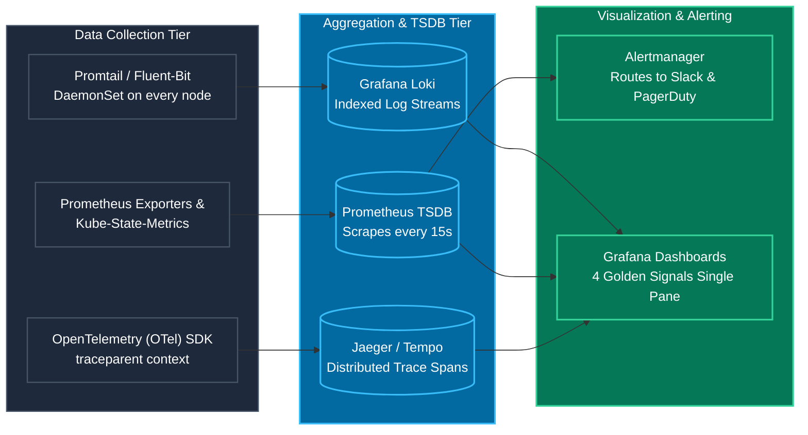

---

### 8.2 The 4 Golden Signals: Production PromQL Formulas

| Golden Signal | Technical Focus | Production PromQL Query Formula |
| :--- | :--- | :--- |
| **1. Latency** | 95th Percentile request duration across successful requests | `histogram_quantile(0.95, sum(rate(http_request_duration_seconds_bucket{service="payment-service", namespace="commerce-prod"}[5m])) by (le))` |
| **2. Traffic** | Demand placed on the service in Requests Per Second (RPS) | `sum(rate(http_requests_total{service="cart-service", namespace="commerce-prod"}[5m]))` |
| **3. Errors** | Percentage of total requests returning HTTP 5xx server errors | `(sum(rate(http_requests_total{service="payment-service", status=~"5.."}[5m])) / sum(rate(http_requests_total{service="payment-service"}[5m]))) * 100` |
| **4. Saturation** | Percentage of container memory limit actively consumed | `(sum(container_memory_working_set_bytes{container="catalog", namespace="commerce-prod"}) / sum(kube_pod_container_resource_limits{resource="memory", container="catalog", namespace="commerce-prod"})) * 100` |

---

### 8.3 Production Alertmanager Configuration

```yaml
# prometheus-rule-payment.yaml
apiVersion: monitoring.coreos.com/v1
kind: PrometheusRule
metadata:
  name: payment-service-alerts
  namespace: monitoring
spec:
  groups:
    - name: payment-critical.rules
      rules:
        - alert: PaymentGatewayHighErrorRate
          expr: |
            (sum(rate(http_requests_total{service="payment-service", status=~"5.."}[2m]))
            /
            sum(rate(http_requests_total{service="payment-service"}[2m]))) * 100 > 5
          for: 2m
          labels:
            severity: critical
            team: commerce-devops
          annotations:
            summary: "Payment Service HTTP 5xx error rate exceeds 5%"
            description: "Payment Service error rate is currently {{ $value | printf '%.2f' }}% in commerce-prod."
            runbook_url: "https://wiki.nexora-internal.com/runbooks/payment-5xx-spike"
```

---

# 9. Operational Automations, Python Scripting & FinOps

### 9.1 Non-Production Nightly Auto-Scaling Script (Python + K8s API)

```python
#!/usr/bin/env python3
"""
FinOps Scheduled Workload Scaler
Scales non-prod deployments outside business hours to eliminate idle compute costs.
"""
import os
import sys
from kubernetes import client, config

def scale_workloads(target_namespace: str, target_replicas: int):
    # Authenticate inside EKS pod or via local kubeconfig
    if os.getenv("KUBERNETES_SERVICE_HOST"):
        config.load_incluster_config()
    else:
        config.load_kube_config()

    apps_v1 = client.AppsV1Api()
    print(f"Fetching deployments in namespace: '{target_namespace}'...")
    deployments = apps_v1.list_namespaced_deployment(namespace=target_namespace)

    for dep in deployments.items:
        dep_name = dep.metadata.name

        # Protect stateful infrastructure operators and test DBs
        if dep_name.startswith("system-") or "database" in dep_name:
            print(f" -> Skipping system workload: {dep_name}")
            continue

        print(f" -> Patching {dep_name} replicas: {dep.spec.replicas} -> {target_replicas}")
        apps_v1.patch_namespaced_deployment_scale(
            name=dep_name,
            namespace=target_namespace,
            body={"spec": {"replicas": target_replicas}}
        )
    print("Scaling operation completed successfully.")

if __name__ == "__main__":
    replicas = int(sys.argv[1]) if len(sys.argv) > 1 else 0
    namespace = sys.argv[2] if len(sys.argv) > 2 else "commerce-dev"
    scale_workloads(target_namespace=namespace, target_replicas=replicas)
```

---

### 9.2 AWS ECR Image Retention Lifecycle Policy

```json
{
  "rules": [
    {
      "rulePriority": 1,
      "description": "Expire untagged intermediate images older than 14 days",
      "selection": {
        "tagStatus": "untagged",
        "countType": "sinceImagePushed",
        "countUnit": "days",
        "countNumber": 14
      },
      "action": { "type": "expire" }
    },
    {
      "rulePriority": 2,
      "description": "Retain only the last 30 tagged production releases",
      "selection": {
        "tagStatus": "tagged",
        "tagPrefixList": ["sha-", "v"],
        "countType": "imageCount",
        "countNumber": 30
      },
      "action": { "type": "expire" }
    }
  ]
}
```

---

# 10. The Production Incident Triage Playbook (5 Real-World Incidents)

| Incident | Primary Symptom | Root Cause | Immediate Mitigation | Permanent Fix |
| :--- | :--- | :--- | :--- | :--- |
| **#1: HTTP 504 Gateway Timeouts** | Ingress logs return 504 on `/api/v1/cart`. Pods remain running (0 restarts). | **Redis connection pool starvation**. FastAPI Uvicorn workers capped at 50 connections; hung waiting for sockets. | Scaled `REDIS_MAX_CONNECTIONS: 250` in Helm `values-prod.yaml` and executed rolling restart. | Enabled Redis connection multiplexing; added Prometheus alert for `redis_pool_in_use_ratio > 0.80`. |
| **#2: Pods CrashLooping (Exit 137)** | Product Catalog pods repeatedly restarting during batch catalog exports. | **JVM Heap + Native Metaspace exceeded container limit (1Gi)**, triggering Linux kernel OOM Killer. | Increased Kubernetes memory limit to `2Gi` in `values-prod.yaml`. | Configured JVM ergonomics: `-XX:MaxRAMPercentage=75.0` to reserve 25% for Metaspace/OS; set Grafana alert at 85% memory. |
| **#3: CoreDNS CPU Throttling** | All 5 microservices fail downstream calls (`payment.commerce-prod.svc...`), throwing 502s. | **CoreDNS had only 2 default replicas** handling DNS for 300+ pods; CPU limit pinned at 100%, dropping UDP packets. | Scaled CoreDNS deployment to 6 replicas: `kubectl scale deployment coredns -n kube-system --replicas=6`. | Deployed `NodeLocal DNSCache` DaemonSet to cache DNS queries locally on every worker node, reducing CoreDNS load by 80%. |
| **#4: AWS IRSA AccessDenied on Boot** | Pods restarting after EKS maintenance fail S3/SQS calls with `AccessDenied: WebIdentityErr`. | **EKS OIDC Provider root CA thumbprint expired** on the AWS IAM side during cluster control-plane patch. | Pulled latest root CA thumbprint from OIDC discovery endpoint and patched IAM Provider via Terraform. | Automated OIDC thumbprint discovery in root Terraform modules using the AWS TLS Provider data source. |
| **#5: ArgoCD Infinite Sync Loop** | ArgoCD console rapidly flips between `Synced` and `OutOfSync` every 5s; high K8s API CPU. | Developer used `kubectl edit` in prod; mutating admission webhook was also injecting an uncommitted field. | Enabled `selfHeal: true` in ArgoCD Application spec to forcibly overwrite manual cluster edits. | Added `ignoreDifferences` block in ArgoCD for mutating webhook fields; revoked developer direct write access via RBAC. |

---

### 10.6 Ground-Level CLI Triage Commands Reference

```bash
# 1. Triage CrashLoop / OOMKilled Pods
kubectl get pods -n commerce-prod -l app=catalog-service -o wide
kubectl describe pod <catalog-pod-name> -n commerce-prod
# Inspect "Last State: Terminated", "Reason: OOMKilled", "Exit Code: 137"
kubectl logs <catalog-pod-name> -n commerce-prod --previous

# 2. Triage CoreDNS & Node Resource Saturation
kubectl top pods -n kube-system -l k8s-app=kube-dns
kubectl logs -n kube-system -l k8s-app=kube-dns --tail=100 | grep -i "plugin/errors"

# 3. Triage ArgoCD Sync Drift
argocd app get payment-service-prod
argocd app diff payment-service-prod
argocd app sync payment-service-prod --force

# 4. Triage IRSA / OIDC Configuration in AWS CLI
aws iam get-open-id-connect-provider \
  --open-id-connect-provider-arn arn:aws:iam::444455556666:oidc-provider/oidc.eks.eu-west-1.amazonaws.com/id/EXAMPLED3B7B2E364022D9
```

---

# 11. The 5 Critical Architectural Challenges & Engineering Solutions

1. **Managing Configuration Drift Across Environments**:
   * *Problem*: Applications ran fine in Dev but crashed in Production due to divergent Helm values and manual console hotfixes.
   * *Solution*: Implemented Kustomize Base (`base/`) + Overlay (`overlays/dev`, `overlays/prod`) pattern in Git. Revoked direct manual `kubectl` write access across all non-dev clusters.
2. **Long CI/CD Pipeline Build Times (18m &rarr; 3.5m)**:
   * *Problem*: Monolithic Docker builds and sequential test executions caused 18-minute feedback loops.
   * *Solution*: Multi-stage Docker builds + Docker BuildKit cache integration with GitHub Actions (`cache-from: type=gha`) + parallel matrix jobs for testing, SonarQube, and Trivy.
3. **Eliminating Hardcoded Secrets in Code Repositories**:
   * *Problem*: Developers committed sandbox API credentials and database passwords to Git.
   * *Solution*: Pre-commit `gitleaks` git hooks + Trivy secret scanning in CI PR gates + runtime secret injection from AWS Secrets Manager using External Secrets Operator (ESO).
4. **Safe, Zero-Downtime Database Schema Migrations**:
   * *Problem*: Applying `ALTER TABLE` DDL migrations during pod boot locked relational tables and crashed active pods running older code.
   * *Solution*: Adopted the **Expand/Contract Pattern** (expand schema first with nullable fields &rarr; deploy pods &rarr; contract old columns). Ran schema migrations via Kubernetes Pre-Upgrade Helm Hooks.
5. **Managing "Noisy Neighbors" in Multi-Tenant Kubernetes**:
   * *Problem*: Memory leaks or CPU spikes in Catalog starved adjacent Payment pods on shared worker nodes.
   * *Solution*: Enforced namespace-level `ResourceQuotas` and `LimitRanges` + set explicit container `requests` and `limits` + configured `topologySpreadConstraints`, `podAntiAffinity`, and `PodDisruptionBudgets`.
