# The Master Cloud & DevOps Engineering Blueprint
### Ground-Level Enterprise Architecture, Multi-Tenant Kubernetes, Workload Sizing Math, CI/CD Pipelines, and Operational Reliability

---

## Table of Contents
1. [Enterprise Architecture & Team Operating Model](#1-enterprise-architecture--team-operating-model)
2. [The 5 Core Microservices: Ground-Level Anatomy & Execution Runtimes](#2-the-5-core-microservices-ground-level-anatomy--execution-runtimes)
3. [Enterprise Cloud & AWS Infrastructure Isolation Strategy](#3-enterprise-cloud--aws-infrastructure-isolation-strategy)
4. [Multi-Tenant Kubernetes (Amazon EKS): Real-World vs. Textbook Theory](#4-multi-tenant-kubernetes-amazon-eks-real-world-vs-textbook-theory)
5. [Workload Sizing, HPA Mathematics & Karpenter Autoscaling (The "3 Replicas" Story)](#5-workload-sizing-hpa-mathematics--karpenter-autoscaling-the-3-replicas-story)
6. [Continuous Integration (CI) Pipeline Engineering](#6-continuous-integration-ci-pipeline-engineering)
7. [Continuous Delivery (CD), GitOps & 4-Tier Promotion Engine](#7-continuous-delivery-cd-gitops--4-tier-promotion-engine)
8. [Production Observability, Metrics & Telemetry Deep Dive](#8-production-observability-metrics--telemetry-deep-dive)
9. [Operational Automations, Python Scripting & FinOps](#9-operational-automations-python-scripting--finops)
10. [The Production Incident Triage Playbook (5 Real-World Incidents)](#10-the-production-incident-triage-playbook-5-real-world-incidents)
11. [The 5 Critical Architectural Challenges & Engineering Solutions](#11-the-5-critical-architectural-challenges--engineering-solutions)

---

# 1. Enterprise Architecture & Team Operating Model

### 1.1 The Enterprise Context: Nexora Global Telecommunications
To establish an authentic, real-world foundation, all technical systems are modeled on **Nexora Global Telecommunications** (reflecting enterprise telecom environments like *Vodafone / _VOIS*). Nexora operates a platform of **30+ backend microservices** serving millions of mobile subscribers, prepaid/postpaid billing cycles, e-SIM activations, and payment transactions across multiple markets.

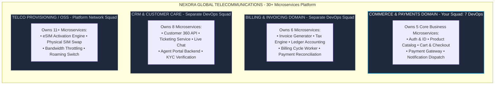

### 1.2 The 3-Tier Enterprise Structure
Centralized DevOps teams fail at scale because they become operational bottlenecks. Nexora uses a **Domain-Aligned Hybrid Model** operating across 3 tiers:

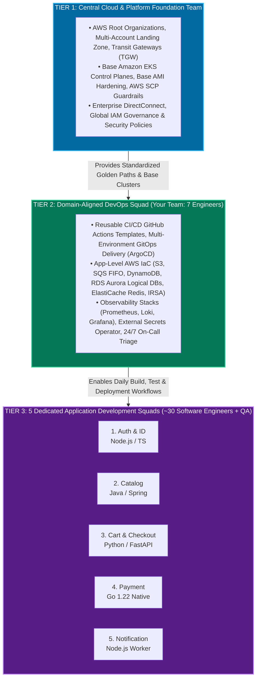

### 1.3 Inside the 7-Member DevOps Squad: The On-Call Shield Story
The number one reason DevOps teams fail sprint commitments is constant developer interruptions (*"My build failed"*, *"Can you give me database access?"*). To combat this, the squad uses an **On-Call Shield**—one engineer assigned weekly to intercept 100% of Slack interruptions and CI triage, allowing the other 6 to focus completely on deep architectural sprint epics.

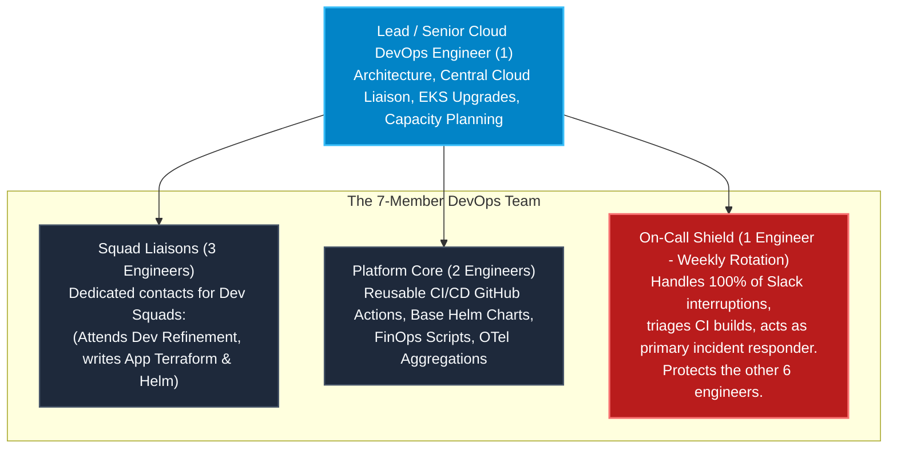

### 1.4 The 2-Week Agile SDLC Cadence

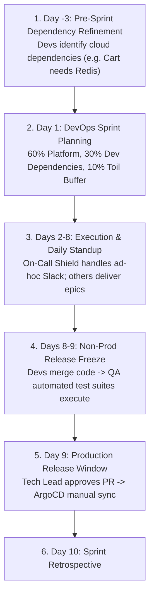

### 1.5 Cross-Team RACI Responsibility Matrix

| Responsibility / Deliverable | Central Cloud Foundation | Domain DevOps Squad | Application Dev Squads | QA / SDET Engineers |
| :--- | :---: | :---: | :---: | :---: |
| **AWS Organizations, Root VPCs, Transit Gateways** | **Accountable** | Informed | No Access | No Access |
| **Base EKS Cluster Provisioning** | **Accountable** | Consulted | No Access | No Access |
| **App-Level AWS Infra (SQS, DynamoDB, Redis)** | Governs / Audits | **Accountable** | Consulted | Informed |
| **CI/CD Reusable Workflow Automation (GitHub Actions)**| Consulted | **Accountable** | Responsible | Consulted |
| **Helm Charts & Kustomize Overlays** | No Access | **Accountable** | Responsible | Informed |
| **Secrets Management (AWS Secrets Manager & ESO)** | Governs Policies | **Accountable** | **Accountable** | No Access |
| **API Integration & E2E Test Automation (Cypress)** | No Access | Informed | Consulted | **Accountable** |

---

# 2. The 5 Core Microservices: Ground-Level Anatomy & Execution Runtimes

### 2.1 The Journey of a Customer Request
Imagine a customer buying a 5G data plan. The orchestration below shows how different execution runtimes are selected based on compute profiles (I/O vs CPU vs Deterministic Reliability).

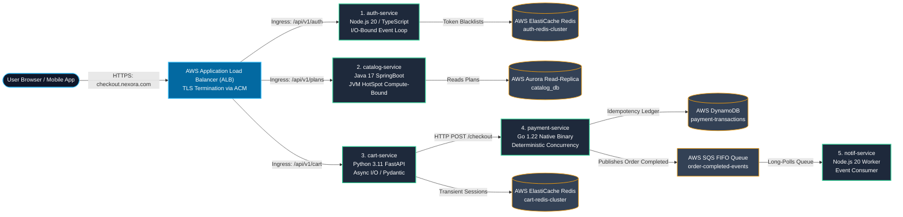

### 2.2 Microservices Technical Rationale
*   **`auth-service` (Node.js 20)**: Efficient at I/O-bound tasks. The async event loop (`libuv`) handles 10,000+ login handshakes via Redis with minimal RAM overhead.
*   **`catalog-service` (Java 17)**: Compute and memory-bound. Uses HotSpot JVM and Hibernate ORM to map complex relational Telco plans into JSON models.
*   **`cart-service` (Python 3.11 FastAPI)**: Leverages `async/await` and Pydantic for rapid payload validation, storing transient cart state directly in a dedicated Redis cluster to avoid disk-bound database locks.
*   **`payment-service` (Go 1.22)**: Chosen for its deterministic concurrency and static type safety. No unpredictable Garbage Collection pauses that might drop a banking transaction.
*   **`notif-service` (Node.js 20 Worker)**: Headless background consumer that long-polls an SQS FIFO queue to dispatch SMS receipts via Twilio.

---

# 3. Enterprise Cloud & AWS Infrastructure Isolation Strategy

### 3.1 Logical vs. Physical Resource Isolation
While Nexora uses a shared **Aurora PostgreSQL** cluster engine to save the $1,000+/month cost of running multiple physical clusters, the data is logically isolated into `auth_db` and `catalog_db`. PostgreSQL IAM privileges strictly enforce access.

However, **Redis isolation must be physical**. Redis is memory-bound with an `allkeys-lru` eviction policy. If `auth-service` and `cart-service` shared a cluster, a massive Black Friday flash sale would cause an explosion of shopping cart data, physically evicting user authentication tokens and forcing thousands of users to log out. Thus, `auth-redis` and `cart-redis` run on dedicated physical AWS ElastiCache clusters.

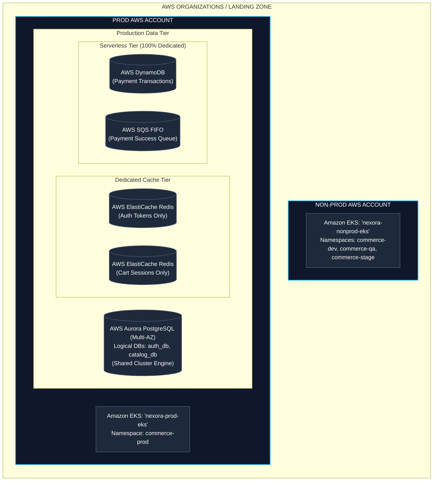

---

# 4. Multi-Tenant Kubernetes (Amazon EKS): Real-World vs. Textbook Theory

### 4.1 The Textbook Concept vs. The Real-World Gap
A common enterprise pattern is running a single shared EKS cluster per environment (`nexora-prod-eks`) partitioned by **Domain-Specific Namespaces**. 

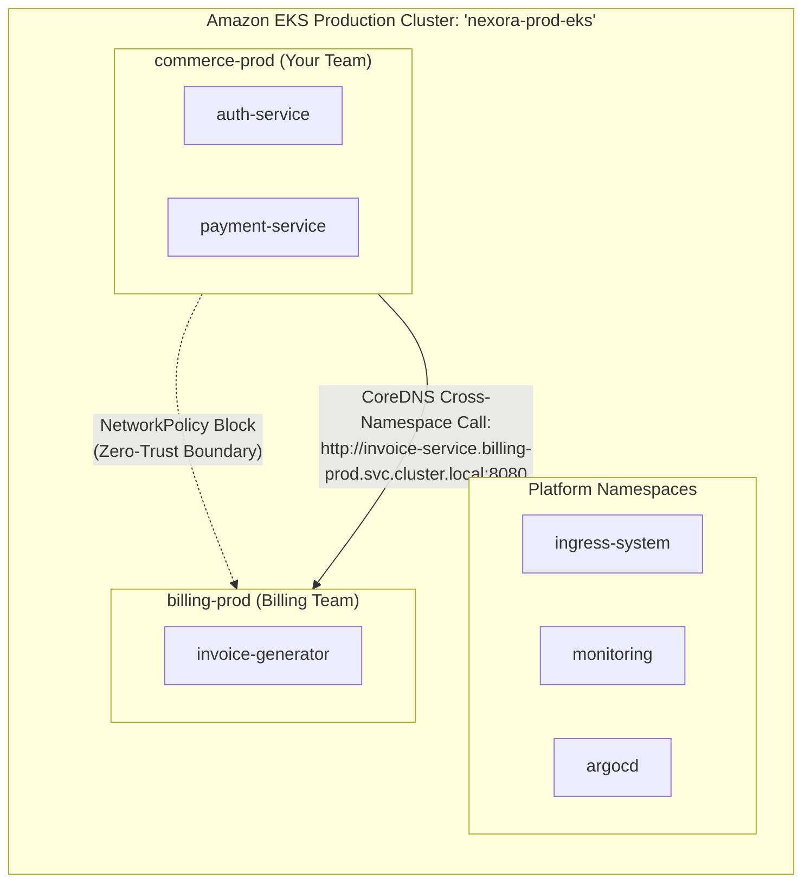

**The Real-World Gaps:**
1. **NetworkPolicy Enforcement Isn't Free**: Historically, the default AWS VPC CNI did not enforce NetworkPolicies. Without explicit CNI support or installing Calico/Cilium, NetworkPolicy YAMLs in Git are silently ignored.
2. **Namespaces are a Soft Boundary**: Namespaces share the control plane, etcd, Linux kernel, and worker nodes. A memory leak in `crm-prod` can starve neighbor pods in `commerce-prod` on the same physical instance.
3. **Missing Admission Control**: Hardened clusters run admission controllers (Pod Security Admission, OPA/Gatekeeper, Kyverno) to actively block risky pod specs cluster-wide.

### 4.2 Hard Compute Isolation & The PCI Auditor Story
Because namespaces are soft boundaries, true isolation happens at the hardware layer using **Dedicated Managed Node Groups** with Taints and Tolerations. 

The biggest red flag in textbook multi-tenancy is blindly placing a `payment-service` inside a shared node group alongside 25+ unrelated services. A Qualified Security Assessor (PCI auditor) will aggressively push for scope reduction. To avoid massive audit burdens, `payment-service` is placed on its own **tainted dedicated node group** (`commerce-payment-ng`).

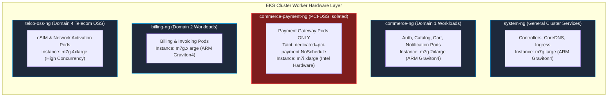

*   **Graviton4 (`m7g`)**: Default choice for 20-40% better price-performance for containerized workloads.
*   **Intel x86 (`m7i`)**: Retained for the payment gateway due to unverified ARM compatibility in older third-party banking SDKs.

### 4.3 Ground-Level Packet Journey: Browser to Container Worker
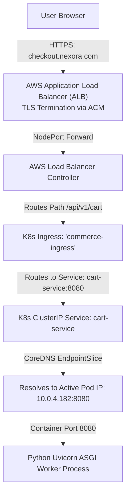

### 4.4 Guardrail 1: Kubernetes Developer RBAC
```yaml
# developer-readonly-rbac.yaml
apiVersion: rbac.authorization.k8s.io/v1
kind: Role
metadata:
  namespace: commerce-prod
  name: developer-readonly-role
rules:
  - apiGroups: ["", "apps"]
    resources: ["pods", "pods/log", "services", "deployments", "configmaps", "events"]
    verbs: ["get", "list", "watch"]
  - apiGroups: [""]
    resources: ["pods/port-forward"]
    verbs: ["create"]
  # Explicit Denial: 'pods/exec' and 'secrets' are excluded.
```

### 4.5 Guardrail 2: Zero-Trust Network Isolation
```yaml
# network-policy-payment.yaml
apiVersion: networking.k8s.io/v1
kind: NetworkPolicy
metadata:
  name: allow-cart-and-billing-to-payment
  namespace: commerce-prod
spec:
  podSelector:
    matchLabels:
      app: payment-service
  policyTypes: ["Ingress"]
  ingress:
    - from:
        - podSelector:
            matchLabels:
              app: cart-service
      ports:
        - protocol: TCP
          port: 8080
    - from:
        - namespaceSelector:
            matchLabels:
              domain: billing-prod
      ports:
        - protocol: TCP
          port: 8080
```

### 4.6 Guardrail 3: IAM Roles for Service Accounts (IRSA)
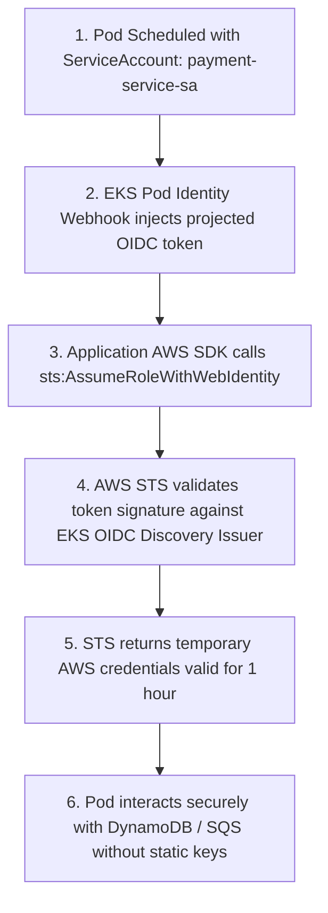

**Kubernetes ServiceAccount**:
```yaml
apiVersion: v1
kind: ServiceAccount
metadata:
  name: payment-service-sa
  namespace: commerce-prod
  annotations:
    eks.amazonaws.com/role-arn: arn:aws:iam::444455556666:role/nexora-prod-payment-role
```

**AWS IAM Trust Policy**:
```json
{
  "Version": "2012-10-17",
  "Statement": [
    {
      "Effect": "Allow",
      "Principal": { "Federated": "arn:aws:iam::444455556666:oidc-provider/oidc.eks..." },
      "Action": "sts:AssumeRoleWithWebIdentity",
      "Condition": {
        "StringEquals": {
          "oidc.eks...:sub": "system:serviceaccount:commerce-prod:payment-service-sa"
        }
      }
    }
  ]
}
```

### 4.7 Guardrail 4: External Secrets Operator (ESO)
```yaml
apiVersion: external-secrets.io/v1beta1
kind: ClusterSecretStore
metadata:
  name: aws-secrets-manager
spec:
  provider:
    aws:
      service: SecretsManager
      region: eu-west-1
      auth:
        jwt:
          serviceAccountRef:
            name: eso-service-account
            namespace: external-secrets
---
apiVersion: external-secrets.io/v1beta1
kind: ExternalSecret
metadata:
  name: payment-secrets-sync
  namespace: commerce-prod
spec:
  refreshInterval: 1h
  secretStoreRef:
    name: aws-secrets-manager
    kind: ClusterSecretStore
  target:
    name: payment-k8s-secret # Native K8s Secret created automatically
  data:
    - secretKey: STRIPE_API_KEY
      remoteRef:
        key: prod/commerce/payment
        property: stripe_secret_key
```

---

# 5. Workload Sizing, HPA Mathematics & Karpenter Autoscaling (The "3 Replicas" Story)

### 5.1 The "3 Replicas" Confusion: Floor vs. Peak Capacity
A common confusion is how `replicas: 3` can handle tens of thousands of users. **3 is the floor, not the total capacity.**
1. **Minimum Replicas (e.g., 3)**: Exists strictly for Availability. One replica per AZ ensures that if an entire data center loses power, the other two keep serving. It stays low because running 20 pods around the clock at 3:00 AM wastes compute.
2. **Maximum Replicas (HPA Ceiling)**: This absorbs the daytime traffic spikes. The Horizontal Pod Autoscaler (HPA) dynamically adds pods up to a ceiling (e.g., 20). 

### 5.2 Active Users vs. Request Throughput Funnel
50,000 active concurrent users does *not* equal 50,000 requests per second (RPS). A browsing user issues a request every 2-3 seconds.
Consider the purchase funnel drop-off:
*   Most users browse the **Catalog** (High RPS).
*   Fewer add items to their **Cart** (2,000–3,000 RPS).
*   Even fewer reach **Payment** (600 RPS).

At ~150 requests/sec per pod, 3,000 RPS on Cart requires roughly 15–20 pods. Thus, setting `minReplicas: 3` and `maxReplicas: 20` is mathematically sound.

### 5.3 Per-Service Autoscaling Matrix

| Microservice | Min | Max | Primary Scaling Metric | Autoscaling Engine & Rationale |
| :--- | :-: | :-: | :--- | :--- |
| **`auth-service`** | **5** | **30** | CPU &gt; 60% OR HTTP RPS &gt; 250/pod | **HPA**: Authenticates every page session; high baseline traffic. |
| **`catalog-service`** | **5** | **30** | CPU &gt; 70% OR HTTP RPS &gt; 300/pod | **HPA**: Heaviest read traffic across entire site. |
| **`cart-service`** | **3** | **20** | HTTP Requests/sec via Prom Adapter | **HPA**: Request-driven scaling (CPU lags behind sudden traffic bursts). |
| **`payment-service`** | **3** | **15** | CPU &gt; 50% OR Active Conn &gt; 100 | **HPA**: Isolated on dedicated tainted hardware node group. |
| **`notif-service`** | **2** | **20** | `ApproximateNumberOfMessages` &gt; 500 | **KEDA**: Queue-driven worker. Scales directly on SQS queue depth, not CPU. |

### 5.4 The Nested Dual-Autoscaler
**Cluster → Node Group → Node → Pod → Replica**

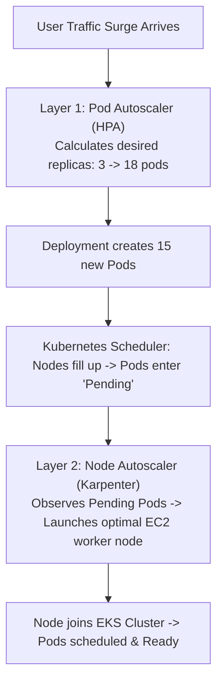
*Note: A `ResourceQuota` applied to a namespace must be mathematically aligned with the underlying Node Group's capacity to leave headroom for this HPA burst.*

---

# 6. Continuous Integration (CI) Pipeline Engineering

Waiting 18 minutes for a CI build destroys developer flow. Nexora slashed this to **3.5 minutes** using Docker BuildKit Layer Caching (`cache-from: type=gha`), Multi-Stage Build Isolation, and parallel matrix execution.

### 6.1 Shift-Left Security Gates

| Stage | Tool | Enforcement Mechanism |
| :--- | :--- | :--- |
| **Pre-Build (Code Lint)** | **Gitleaks** | Fails build if API keys match regex signatures. |
| **Pre-Build (Static Analysis)** | **SonarQube** | Fails PR merge if code coverage &lt; 80% or Security Hotspots &gt; 0. |
| **Pre-Build (Dependency)** | **Trivy (fs)** | Scans lockfiles; fails on HIGH/CRITICAL CVEs. |
| **Post-Build (Container)** | **Trivy (image)**| Scans compiled Docker image for OS-level vulnerabilities. |

### 6.2 Production Multi-Stage Dockerfile (Non-Root UID 10001)
```dockerfile
FROM node:20-alpine AS builder
WORKDIR /app
COPY package*.json ./
RUN npm ci --only=production
COPY . .
RUN npm run build

FROM node:20-alpine AS runner
WORKDIR /app
# Security: Create non-root system user and group (UID 10001)
RUN addgroup -g 10001 -S appgroup && adduser -u 10001 -S appuser -G appgroup
COPY --from=builder --chown=appuser:appgroup /app/dist ./dist
COPY --from=builder --chown=appuser:appgroup /app/node_modules ./node_modules
COPY --from=builder --chown=appuser:appgroup /app/package.json ./package.json

USER appuser
EXPOSE 8080
ENV NODE_ENV=production
CMD ["node", "dist/main.js"]
```

### 6.3 Reusable GitHub Actions Workflow
```yaml
# .github/workflows/reusable-microservice-ci.yml
name: Reusable Microservice CI/CD
on:
  workflow_call:
    inputs:
      service_name: { required: true, type: string }
jobs:
  validate-and-test:
    runs-on: ubuntu-latest
    steps:
      - uses: actions/checkout@v4
      - run: npm ci && npm test -- --coverage
      - uses: sonarsource/sonarqube-scan-action@master
      - uses: aquasecurity/trivy-action@master
        with: { scan-type: 'fs', severity: 'CRITICAL,HIGH', exit-code: '1' }
  build-and-publish:
    needs: validate-and-test
    runs-on: ubuntu-latest
    steps:
      - uses: aws-actions/configure-aws-credentials@v4
        with: { role-to-assume: "arn:aws:iam::ACCOUNT:role/gh-role", aws-region: "eu-west-1" }
      - uses: aws-actions/amazon-ecr-login@v2
        id: login-ecr
      - uses: docker/setup-buildx-action@v3
      - uses: docker/build-push-action@v5
        with:
          context: .
          push: true
          tags: ${{ steps.login-ecr.outputs.registry }}/${{ inputs.service_name }}:sha-${{ github.sha }}
          cache-from: type=gha
          cache-to: type=gha,mode=max
      - name: Update Image Tag in GitOps Repository
        run: |
          sed -i "s/newTag: .*/newTag: sha-${{ github.sha }}/" kustomization.yaml
          git commit -am "ci: promote dev image [skip ci]" && git push
```

---

# 7. Continuous Delivery (CD), GitOps & 4-Tier Promotion Engine

### 7.1 The 4-Tier Promotion Pipeline
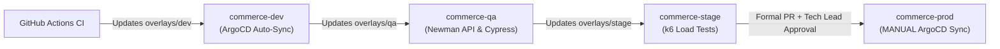

### 7.2 GitOps Directory Layout
```
gitops-manifests/
└── apps/
    └── payment-service/
        ├── base/ (deployment.yaml, service.yaml, hpa.yaml, kustomization.yaml)
        └── overlays/
            ├── dev/   (kustomization.yaml: newTag sha-9f8e7d6, values-dev.yaml)
            ├── qa/    (kustomization.yaml, values-qa.yaml)
            ├── stage/ (kustomization.yaml, values-stage.yaml)
            └── prod/  (kustomization.yaml, values-prod.yaml)
```

### 7.3 ArgoCD Production Configuration (Manual Sync Gate)
```yaml
apiVersion: argoproj.io/v1alpha1
kind: Application
metadata:
  name: payment-service-prod
  namespace: argocd
spec:
  project: commerce-project # Restricted by RBAC to commerce-* namespaces
  source:
    repoURL: 'https://github.com/nexora/gitops-manifests.git'
    path: apps/payment-service/overlays/prod
  destination:
    server: 'https://kubernetes.default.svc'
    namespace: commerce-prod
  syncPolicy:
    automated: null # AUTOMATED SYNC DISABLED FOR PROD (Requires manual sync gate)
```

### 7.4 Zero-Downtime Deployment
To prevent dropping in-flight customer checkouts, a `preStop` hook pauses pod termination for 15s to allow ALB/Ingress connection draining.
```yaml
apiVersion: apps/v1
kind: Deployment
spec:
  strategy:
    type: RollingUpdate
    rollingUpdate:
      maxSurge: 25%
      maxUnavailable: 0
  template:
    spec:
      containers:
        - name: cart
          lifecycle:
            preStop:
              exec:
                command: ["/bin/sh", "-c", "sleep 15"]
```

---

# 8. Production Observability, Metrics & Telemetry Deep Dive

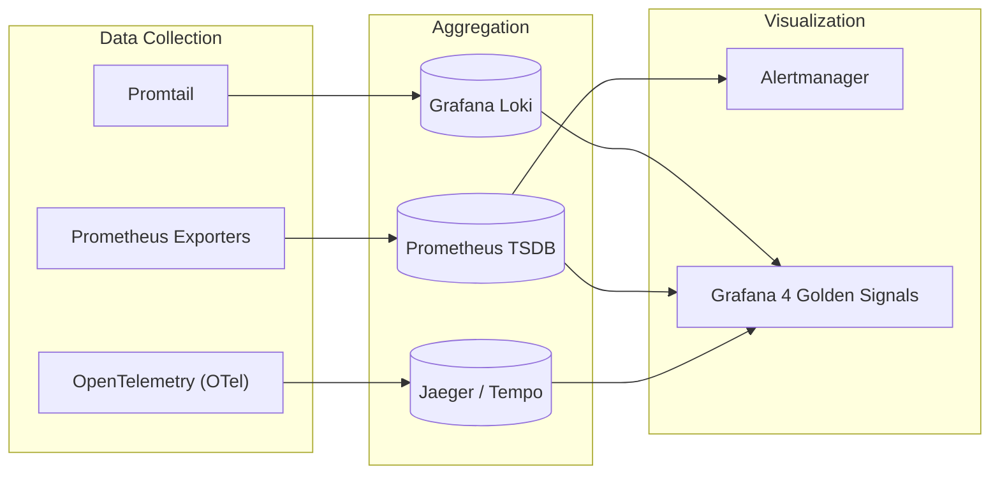

### 8.1 The 4 Golden Signals: PromQL Formulas

| Signal | PromQL Query Formula |
| :--- | :--- |
| **1. Latency** | `histogram_quantile(0.95, sum(rate(http_request_duration_seconds_bucket{service="payment"}[5m])) by (le))` |
| **2. Traffic** | `sum(rate(http_requests_total{service="cart"}[5m]))` |
| **3. Errors** | `(sum(rate(http_requests_total{status=~"5.."}[5m])) / sum(rate(http_requests_total[5m]))) * 100` |
| **4. Saturation** | `(sum(container_memory_working_set_bytes) / sum(kube_pod_container_resource_limits)) * 100` |

### 8.2 PrometheusRule for 5xx Alerts
```yaml
apiVersion: monitoring.coreos.com/v1
kind: PrometheusRule
metadata:
  name: payment-service-alerts
spec:
  groups:
    - name: payment-critical.rules
      rules:
        - alert: PaymentGatewayHighErrorRate
          expr: (sum(rate(http_requests_total{status=~"5.."}[2m])) / sum(rate(http_requests_total[2m]))) * 100 > 5
          for: 2m
          labels: { severity: critical }
```

---

# 9. Operational Automations, Python Scripting & FinOps

### 9.1 Non-Production Nightly Auto-Scaling (Python)
Scales non-prod deployments to 0 at night to eliminate idle EC2 costs.
```python
import os, sys
from kubernetes import client, config

def scale_workloads(target_namespace: str, target_replicas: int):
    config.load_kube_config()
    apps_v1 = client.AppsV1Api()
    deployments = apps_v1.list_namespaced_deployment(namespace=target_namespace)

    for dep in deployments.items:
        dep_name = dep.metadata.name
        if dep_name.startswith("system-") or "database" in dep_name: continue
        
        apps_v1.patch_namespaced_deployment_scale(
            name=dep_name, namespace=target_namespace,
            body={"spec": {"replicas": target_replicas}}
        )

if __name__ == "__main__":
    scale_workloads(sys.argv[2], int(sys.argv[1]))
```

### 9.2 AWS ECR Image Retention Lifecycle Policy
```json
{
  "rules": [
    {
      "rulePriority": 1,
      "description": "Expire untagged images older than 14 days",
      "selection": { "tagStatus": "untagged", "countType": "sinceImagePushed", "countUnit": "days", "countNumber": 14 },
      "action": { "type": "expire" }
    },
    {
      "rulePriority": 2,
      "description": "Retain only the last 30 tagged releases",
      "selection": { "tagStatus": "tagged", "tagPrefixList": ["sha-", "v"], "countType": "imageCount", "countNumber": 30 },
      "action": { "type": "expire" }
    }
  ]
}
```

---

# 10. The Production Incident Triage Playbook (5 Real-World Incidents)

| Incident | Primary Symptom | Root Cause | Immediate Mitigation | Permanent Fix |
| :--- | :--- | :--- | :--- | :--- |
| **#1: HTTP 504 Timeouts** | Ingress 504 on Cart. Pods running. | **Redis pool starvation**. Uvicorn workers capped at 50 connections, hung on sockets. | Scaled `REDIS_MAX_CONNECTIONS: 250` and rolling restart. | Enabled Redis connection multiplexing. |
| **#2: CrashLooping (Exit 137)** | Catalog pods restarting. | **JVM Heap + Metaspace exceeded container limit (1Gi)**, triggering Linux OOM Killer. | Increased memory limit to `2Gi`. | Configured JVM `-XX:MaxRAMPercentage=75.0` to reserve 25% for OS. |
| **#3: CoreDNS CPU Throttling** | All microservices fail downstream calls with 502s. | **CoreDNS had only 2 default replicas** for 300+ pods; CPU pinned at 100%. | Scaled CoreDNS to 6 replicas. | Deployed `NodeLocal DNSCache` DaemonSet. |
| **#4: AWS IRSA AccessDenied** | Pods fail S3/SQS calls on boot. | **EKS OIDC root CA thumbprint expired** in AWS IAM during cluster patch. | Patched IAM Provider thumbprint. | Automated OIDC thumbprint discovery in Terraform. |
| **#5: ArgoCD Infinite Sync Loop** | ArgoCD rapidly flips `Synced` and `OutOfSync`; K8s API CPU high. | Mutating webhook injected uncommitted field + Dev used `kubectl edit`. | Enabled `selfHeal: true` to overwrite manual edits. | Added `ignoreDifferences` for webhook fields in ArgoCD. |

### Ground-Level CLI Triage Commands
```bash
# 1. Triage CrashLoop / OOMKilled Pods
kubectl describe pod <catalog-pod-name> -n commerce-prod
kubectl logs <catalog-pod-name> -n commerce-prod --previous

# 2. Triage CoreDNS Saturation
kubectl top pods -n kube-system -l k8s-app=kube-dns

# 3. Triage ArgoCD Sync Drift
argocd app diff payment-service-prod
argocd app sync payment-service-prod --force
```

---

# 11. The 5 Critical Architectural Challenges & Engineering Solutions

1. **Managing Configuration Drift**: Implemented Kustomize Base/Overlays. Revoked direct manual `kubectl` write access across all non-dev clusters, forcing changes through Git PRs.
2. **Long CI/CD Pipeline Build Times**: Slashed from 18m to 3.5m via Docker BuildKit caching, Multi-Stage builds, and parallel matrix test jobs.
3. **Eliminating Hardcoded Secrets**: Implemented `gitleaks` pre-commit hooks and migrated to injecting secrets at runtime using the **External Secrets Operator (ESO)** via IRSA.
4. **Zero-Downtime Database Schema Migrations**: Adopted the **Expand/Contract Pattern** (expand schema with nullable fields &rarr; deploy code &rarr; contract old columns). Migrations run via Kubernetes Pre-Upgrade Helm Hooks.
5. **Managing "Noisy Neighbors" in Multi-Tenant EKS**: Enforced namespace-level `ResourceQuotas`, explicit container limits, and implemented **Dedicated Managed Node Groups** using Taints and Tolerations for true hardware isolation.
