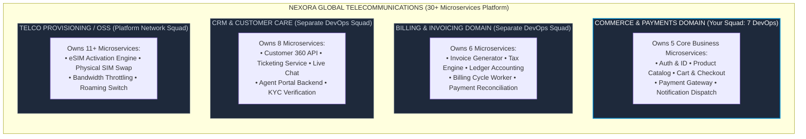
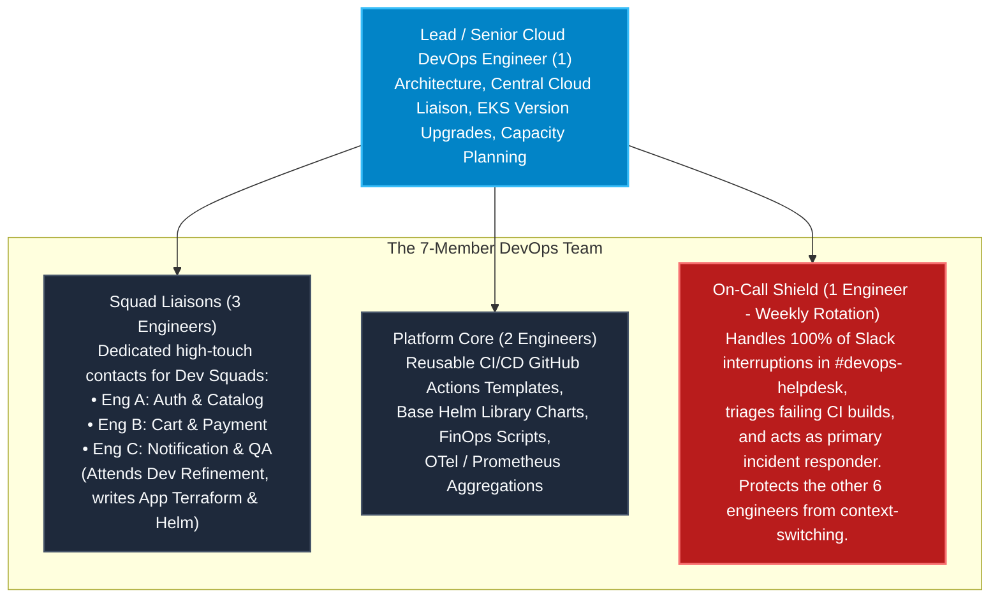
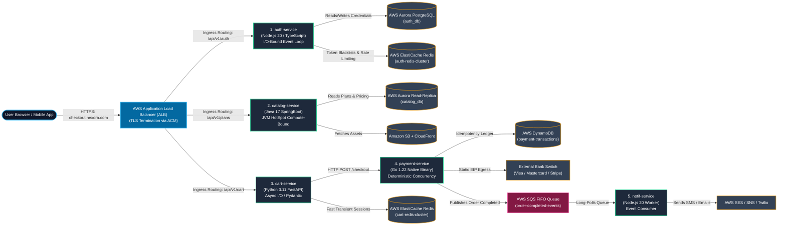
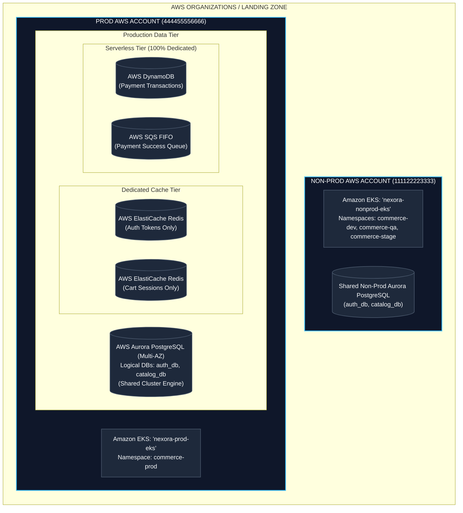
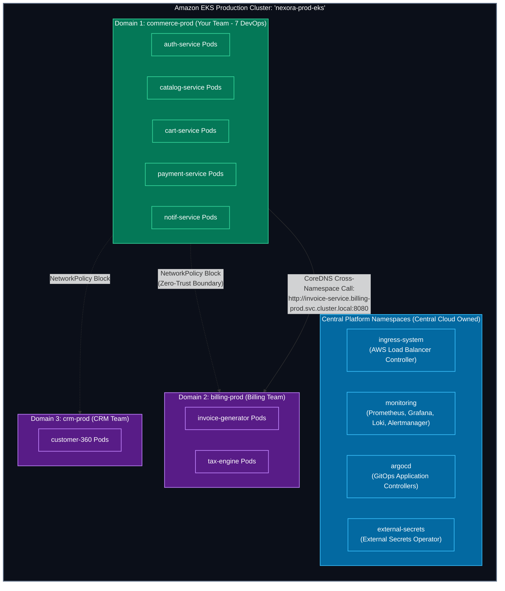
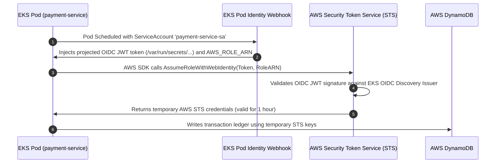
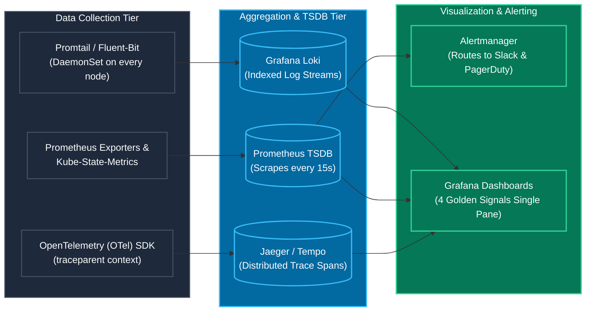
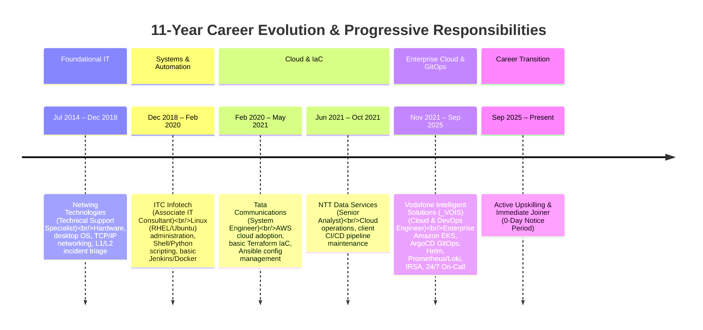

# The Complete Cloud & DevOps Engineering Blueprint
### Ground-Level Enterprise Architecture, Multi-Tenant Kubernetes, CI/CD Pipelines, and Interview Playbook

---

## Table of Contents
1. [Enterprise Architecture & Team Operating Model](#1-enterprise-architecture--team-operating-model)
2. [The 5 Core Microservices: Ground-Level Anatomy & Execution Runtimes](#2-the-5-core-microservices-ground-level-anatomy--execution-runtimes)
3. [Enterprise Cloud & AWS Infrastructure Isolation Strategy](#3-enterprise-cloud--aws-infrastructure-isolation-strategy)
4. [Multi-Tenant Kubernetes (Amazon EKS) Architecture & Network Flow](#4-multi-tenant-kubernetes-amazon-eks-architecture--network-flow)
5. [Continuous Integration (CI) Pipeline Engineering](#5-continuous-integration-ci-pipeline-engineering)
6. [Continuous Delivery (CD), GitOps & 4-Tier Promotion Engine](#6-continuous-delivery-cd-gitops--4-tier-promotion-engine)
7. [Production Observability, Metrics & Telemetry Deep Dive](#7-production-observability-metrics--telemetry-deep-dive)
8. [Operational Automations, Python Scripting & FinOps](#8-operational-automations-python-scripting--finops)
9. [The Production Incident Triage Playbook (5 Real-World Incidents)](#9-the-production-incident-triage-playbook-5-real-world-incidents)
10. [The 5 Critical Architectural Challenges & Engineering Solutions](#10-the-5-critical-architectural-challenges--engineering-solutions)
11. [Resume Translation, Career Positioning & Interview Playbook](#11-resume-translation-career-positioning--interview-playbook)

---

# 1. Enterprise Architecture & Team Operating Model

### 1.1 The Enterprise Model: Nexora Global Telecommunications
To establish a realistic, interview-defensible foundation, all technical concepts are structured around **Nexora Global Telecommunications** (modeled directly on enterprise telecom GCC environments like *Vodafone / _VOIS*).

Nexora operates a platform of **30+ microservices** structured into 4 business domains:



---

### 1.2 The 3-Tier Enterprise Organizational Model

Infrastructure and application delivery operate across three distinct tiers with strict separation of responsibilities:


---

### 1.3 Inside the 7-Member DevOps Team: Functional Allocation & T-Shaped Dynamics

To prevent context-switching chaos, the DevOps squad uses a **T-Shaped Operating Model** with **Squad Liaisons** and a rotating **On-Call Shield**:



| Role | Headcount | Core Functional Focus | Daily Ground-Level Responsibility |
| :--- | :--- | :--- | :--- |
| **Lead Cloud DevOps** | 1 | Architecture & Central Governance | Interfaces with Central Cloud team, plans EKS control-plane upgrades (1.28 &rarr; 1.29), reviews Terraform PRs, capacity planning. |
| **Squad Liaisons** | 3 | High-Touch Developer Enablement | Assigned to specific dev squads (e.g., You manage Cart & Payment). Attends dev backlog refinements, writes application-level Terraform (SQS, Redis), assists with Helm values. |
| **Platform & Automation** | 2 | Core Tooling & Platform Hygiene | Develops centralized GitHub Actions reusable workflows, base Helm library charts, Prometheus alerting rules, and FinOps automated cleanup scripts. |
| **On-Call Shield** | 1 | Production Reliability & Interruption Shield | **Rotates weekly across all 7 engineers.** Intercepts 100% of Slack interruptions in `#devops-helpdesk`, triages failing CI builds, and acts as primary incident responder. |

---

### 1.4 Cross-Team RACI Matrix

| Responsibility / Deliverable | Central Cloud Foundation | Domain DevOps Squad (Your Team) | Application Dev Squads | QA / SDET Engineers |
| :--- | :---: | :---: | :---: | :---: |
| **AWS Organizations, Root VPCs, Transit Gateways** | **Accountable** | Informed | No Access | No Access |
| **Base EKS Cluster & Node Group Provisioning** | **Accountable** | Consulted | No Access | No Access |
| **App-Level AWS Infra (S3, SQS FIFO, DynamoDB, Redis)** | Governs / Audits | **Accountable** | Consulted | Informed |
| **CI/CD Reusable Workflow Automation (GitHub Actions)** | Consulted | **Accountable** | Responsible (Calls workflow) | Consulted |
| **Helm Charts, K8s Manifests, Kustomize Overlays** | No Access | **Accountable** | Responsible (Updates values) | Informed |
| **Application Business Logic & Unit Tests** | No Access | Informed | **Accountable** | Responsible |
| **API Integration & E2E Test Automation (Postman/Cypress)**| No Access | Informed | Consulted | **Accountable** |
| **Secrets Management (AWS Secrets Manager & ESO)** | Governs Policies | **Accountable** (Infra/ESO) | **Accountable** (Payloads) | No Access |
| **Observability Infrastructure (Prometheus, Loki, Grafana)**| Consulted | **Accountable** | Responsible (App metrics) | Consulted |
| **24/7 Production Incident Triage & Rollback** | Escalation | **Accountable** (Infra/GitOps) | Responsible (App Code) | Informed |

---

### 1.5 The 2-Week Agile SDLC Cadence (Two-Board Operating Model)

```mermaid
sequenceDiagram
    autonumber
    participant Dev as Dev Squads (5 Teams)
    participant QA as QA / SDETs
    participant Liaison as DevOps Squad Liaison
    participant Core as DevOps Platform Core
    participant OnCall as DevOps On-Call Shield

    Note over Dev,Liaison: Day -3: Pre-Sprint Backlog Refinement
    Dev->>Liaison: Flags infra needs (e.g. Cart needs Redis, Payment needs SQS FIFO)
    Liaison->>Dev: Slices into linked Jira tickets [INFRA-402]

    Note over Liaison,Core: Day 1: DevOps Sprint Planning
    Note over Liaison,Core: Capacity: 60% Platform Epics | 30% Dev Dependencies | 10% Toil Buffer

    Note over Dev,OnCall: Days 2 to 8: Sprint Execution & Daily Standups (09:30 AM)
    Dev->>Dev: Writes feature code on branches
    Liaison->>Liaison: Authors Terraform modules & Helm values
    Dev->>OnCall: Interruptions/Build failures sent to #devops-helpdesk
    OnCall->>Dev: Unblocks developers; shields remaining 6 DevOps

    Note over Dev,QA: Days 8 to 9: Non-Prod Release Freeze & QA Regression
    Dev->>QA: Merges to main -> Deploys to commerce-dev & commerce-qa
    QA->>QA: Runs automated Postman/Newman & Cypress test suites

    Note over Liaison,OnCall: Day 9 (Thursday 10 AM - 12 PM): Production Release Window
    Liaison->>OnCall: Tech Lead approves PR in gitops-manifests
    OnCall->>OnCall: Syncs ArgoCD to commerce-prod & monitors 4 Golden Signals

    Note over Dev,OnCall: Day 10: Sprint Retrospective
```

---

### 1.6 The Role of QA / SDET Engineers in Automated GitOps

In an enterprise GitOps workflow, automated testing does not eliminate QA engineers; it elevates them into **Software Development Engineers in Test (SDETs)** who author and manage test automation code:
1. **API Integration Testing**: Writing automated Postman/Newman collections and PyTest suites that validate API response payloads, HTTP status codes, and latency SLAs.
2. **End-to-End (E2E) UI Automation**: Authoring Cypress/Playwright scripts simulating full user journeys (*Login &rarr; Select Plan &rarr; Add to Cart &rarr; Checkout &rarr; Payment Authorization*).
3. **Mocking External Dependencies**: Building and maintaining **WireMock** servers in `commerce-qa` to simulate external bank endpoints and core telco switches.
4. **Shift-Left Quality in "Three Amigos"**: Participating in pre-coding sessions with Product Owners and Developers to define Acceptance Criteria and boundary edge cases before code is written.

---

# 2. The 5 Core Microservices: Ground-Level Anatomy & Execution Runtimes

### 2.1 Language vs. Runtime: Low-Level Technical Differentiation

| Dimension | Programming Language | Runtime Environment |
| :--- | :--- | :--- |
| **Definition** | The human-readable syntax, grammar, type system, and keywords used by developers. | The underlying execution engine, memory manager, thread scheduler, and OS interface. |
| **Artifact State** | Static text sitting in `.ts`, `.java`, `.py`, or `.go` files in Git. | Compiled bytecode or native machine instructions running on CPU registers and RAM. |
| **Core Function** | Expresses business logic, data structures, and functional flow. | Allocates heap/stack memory, executes Garbage Collection (GC), manages event loops or thread pools, and issues OS/network syscalls. |

---

### 2.2 Customer Request Flow Across the 5 Microservices



---

### 2.3 Deep-Dive Specification Matrix

| Microservice | Runtime & Base Image | Execution Characteristics | Key Libraries & Frameworks | External Cloud Resources | Criticality & DevOps Guardrails |
| :--- | :--- | :--- | :--- | :--- | :--- |
| **1. Auth & ID (`auth-service`)** | **Node.js 20 (LTS)** on `node:20-alpine` | **I/O-Bound**: Single-threaded event loop (`libuv`) handles 10,000+ simultaneous login handshakes at ~40MB RAM/pod. | `fastify`, `jsonwebtoken`, `argon2`, `ioredis`, `pg` | AWS Aurora PostgreSQL (`auth_db`), ElastiCache Redis (token blacklist), AWS Secrets Manager | **Tier-0 (Platform Blocker)**. 4–12 pods across 3 AZs via `topologySpreadConstraints`. HPA on 60% CPU. |
| **2. Catalog (`catalog-service`)** | **OpenJDK HotSpot JVM** on `eclipse-temurin:17-jre-alpine` | **Compute/Memory-Bound**: Multithreaded JVM + Hibernate ORM maps complex nested telco plans and bundles. | `spring-boot-starter-web`, `spring-boot-starter-data-jpa`, `postgresql` JDBC, `caffeine` | AWS Aurora Read-Replicas (`catalog_db`), Amazon S3, AWS CloudFront CDN | **Tier-1**. Requests `1Gi`, Limits `1.5Gi`. JVM ergonomics: `-XX:MaxRAMPercentage=75.0` to eliminate OOMKilled (Exit 137). |
| **3. Cart & Checkout (`cart-service`)** | **CPython 3.11** managed by **Uvicorn** on `python:3.11-slim` | **Async I/O**: `async`/`await` with Pydantic serialization for rapid basket updates and dynamic tax calculation. | `fastapi`, `pydantic`, `redis-py` / `aioredis`, `httpx` | Dedicated AWS ElastiCache Redis Cluster (Cluster Mode Enabled) | **Tier-1**. Connection pool tuning: 6 pods &times; 4 workers &times; 50 = 1,200 connections; Redis `max_connections: 5000`. |
| **4. Payment Gateway (`payment-service`)** | **Native Static Binary** on `gcr.io/distroless/static` | **Deterministic Concurrency**: Zero GC pauses, strict `if err != nil` prevents dropped banking transactions. | `net/http`, `aws-sdk-go-v2` (`dynamodb`, `sqs`), `crypto/tls` | AWS DynamoDB, AWS SQS FIFO, AWS NAT Gateways with static Elastic IPs | **Tier-0 (PCI-DSS Scope)**. `readOnlyRootFilesystem: true`, `runAsNonRoot: true`, Loki regex log masking on card numbers. |
| **5. Notification (`notif-service`)** | **Node.js 20 (LTS)** headless background worker | **Event-Driven Polling**: Non-blocking loop long-polls SQS, compiles HTML templates, calls SES/SNS. | `@aws-sdk/client-sqs`, `@aws-sdk/client-ses`, `@aws-sdk/client-sns`, `handlebars` | AWS SQS FIFO Queue, Dead Letter Queue (`notif-dlq`), AWS SES, AWS SNS | **Tier-2 (Decoupled)**. Autoscaled via **KEDA** based on SQS `ApproximateNumberOfMessagesVisible` (&gt; 500 triggers 2 &rarr; 10 pods). |

---

# 3. Enterprise Cloud & AWS Infrastructure Isolation Strategy

### 3.1 Logical vs. Physical Isolation across 30+ Microservices

Enterprise architecture avoids two extreme anti-patterns:
1. **The Anti-Pattern (One Giant Shared Database)**: A single database shared across 30 microservices creates catastrophic blast radius—a bad reporting query could crash payment processing, violating PCI-DSS isolation.
2. **The FinOps Disaster (30 Separate Dedicated Aurora Clusters)**: Running 30 standalone multi-AZ Aurora clusters across Dev, QA, Stage, and Prod costs over **$100,000/month** in idle CPU baselines.



| AWS Service | Provisioning Strategy | Ground-Level Technical Rationale |
| :--- | :--- | :--- |
| **Aurora PostgreSQL** | **Shared Cluster Engine, Logical DBs** | A multi-AZ Aurora cluster costs $1,000+/month. We provision one cluster per domain. `auth-service` connects strictly to `auth_db`; `catalog-service` connects to `catalog_db`. PostgreSQL IAM/role privileges enforce isolation. |
| **ElastiCache Redis** | **Dedicated Physical Clusters** | Redis is memory-bound. A flash sale on Cart could evict Auth tokens if shared. Therefore, `auth-redis` and `cart-redis` run on separate physical clusters. |
| **AWS SQS & DynamoDB** | **100% Dedicated per Service** | Serverless resources have no baseline idle server cost. Each service gets its own queues and tables protected by strict IRSA IAM roles. |

---

# 4. Multi-Tenant Kubernetes (Amazon EKS) Architecture & Network Flow

### 4.1 Multi-Tenant Cluster Namespace Architecture



---

### 4.2 Kubernetes Developer RBAC Configuration

```yaml
# developer-readonly-rbac.yaml
apiVersion: rbac.authorization.k8s.io/v1
kind: Role
metadata:
  namespace: commerce-prod
  name: developer-readonly-role
rules:
  # 1. Allow inspecting workloads, pods, and streaming logs
  - apiGroups: ["", "apps"]
    resources: ["pods", "pods/log", "services", "deployments", "configmaps", "events"]
    verbs: ["get", "list", "watch"]
  # 2. Allow local port-forwarding for debugging
  - apiGroups: [""]
    resources: ["pods/port-forward"]
    verbs: ["create"]
  # 3. Explicit Denial: 'pods/exec' and 'secrets' are excluded.
  # (In Kubernetes RBAC, omission equals an implicit deny)
---
apiVersion: rbac.authorization.k8s.io/v1
kind: RoleBinding
metadata:
  namespace: commerce-prod
  name: developer-readonly-binding
subjects:
  - kind: Group
    name: "sso:commerce-developers-group"
    apiGroup: rbac.authorization.k8s.io
roleRef:
  kind: Role
  name: developer-readonly-role
  apiGroup: rbac.authorization.k8s.io
```

---

### 4.3 IAM Roles for Service Accounts (IRSA) Deep Dive



```yaml
# 1. Kubernetes ServiceAccount with IAM Role Annotation
apiVersion: v1
kind: ServiceAccount
metadata:
  name: payment-service-sa
  namespace: commerce-prod
  annotations:
    eks.amazonaws.com/role-arn: arn:aws:iam::444455556666:role/nexora-prod-payment-role
```

```json
// 2. AWS IAM Role Trust Relationship Policy (Terraform-generated)
{
  "Version": "2012-10-17",
  "Statement": [
    {
      "Effect": "Allow",
      "Principal": {
        "Federated": "arn:aws:iam::444455556666:oidc-provider/oidc.eks.eu-west-1.amazonaws.com/id/EXAMPLED3B7B2E364022D9"
      },
      "Action": "sts:AssumeRoleWithWebIdentity",
      "Condition": {
        "StringEquals": {
          "oidc.eks.eu-west-1.amazonaws.com/id/EXAMPLED3B7B2E364022D9:sub": "system:serviceaccount:commerce-prod:payment-service-sa",
          "oidc.eks.eu-west-1.amazonaws.com/id/EXAMPLED3B7B2E364022D9:aud": "sts.amazonaws.com"
        }
      }
    }
  ]
}
```

---

### 4.4 Secrets Management: External Secrets Operator (ESO)

```yaml
# 1. ClusterSecretStore (Authenticates via IRSA)
apiVersion: external-secrets.io/v1beta1
kind: ClusterSecretStore
metadata:
  name: aws-secrets-manager
spec:
  provider:
    aws:
      service: SecretsManager
      region: eu-west-1
      auth:
        jwt:
          serviceAccountRef:
            name: eso-service-account
            namespace: external-secrets
---
# 2. ExternalSecret Custom Resource
apiVersion: external-secrets.io/v1beta1
kind: ExternalSecret
metadata:
  name: payment-secrets-sync
  namespace: commerce-prod
spec:
  refreshInterval: 1h
  secretStoreRef:
    name: aws-secrets-manager
    kind: ClusterSecretStore
  target:
    name: payment-k8s-secret # Native K8s Secret created automatically in namespace
    creationPolicy: Owner
  data:
    - secretKey: STRIPE_API_KEY
      remoteRef:
        key: prod/commerce/payment
        property: stripe_secret_key
    - secretKey: DB_PASSWORD
      remoteRef:
        key: prod/commerce/database
        property: db_password
```

---

# 5. Continuous Integration (CI) Pipeline Engineering

### 5.1 Reusable GitHub Actions CI Workflow

```yaml
# .github/workflows/reusable-microservice-ci.yml
name: Reusable Microservice CI/CD
on:
  workflow_call:
    inputs:
      service_name:
        required: true
        type: string
      dockerfile_path:
        required: false
        type: string
        default: './Dockerfile'
    secrets:
      AWS_ACCOUNT_ID:
        required: true
      SONAR_TOKEN:
        required: true
      GITOPS_DEPLOY_KEY:
        required: true

jobs:
  validate-and-test:
    runs-on: ubuntu-latest
    steps:
      - name: Checkout Code
        uses: actions/checkout@v4

      - name: Setup Node.js Environment
        uses: actions/setup-node@v4
        with:
          node-version: '20'
          cache: 'npm'

      - name: Install Dependencies & Run Tests
        run: |
          npm ci
          npm test -- --coverage

      - name: SonarQube Quality Gate Check
        uses: sonarsource/sonarqube-scan-action@master
        env:
          SONAR_TOKEN: ${{ secrets.SONAR_TOKEN }}
          SONAR_HOST_URL: "https://sonar.nexora-internal.com"

      - name: Trivy Filesystem Scan (SCA)
        uses: aquasecurity/trivy-action@master
        with:
          scan-type: 'fs'
          scan-ref: '.'
          severity: 'CRITICAL,HIGH'
          exit-code: '1'

  build-and-publish:
    needs: validate-and-test
    runs-on: ubuntu-latest
    permissions:
      id-token: write # Required for AWS OIDC authentication
      contents: read
    steps:
      - name: Checkout Code
        uses: actions/checkout@v4

      - name: Authenticate to AWS via OIDC
        uses: aws-actions/configure-aws-credentials@v4
        with:
          role-to-assume: arn:aws:iam::${{ secrets.AWS_ACCOUNT_ID }}:role/github-actions-ci-role
          aws-region: eu-west-1

      - name: Log in to Amazon ECR
        id: login-ecr
        uses: aws-actions/amazon-ecr-login@v2

      - name: Set up Docker Buildx (BuildKit)
        uses: docker/setup-buildx-action@v3

      - name: Build and Push Docker Image (BuildKit Cached)
        uses: docker/build-push-action@v5
        with:
          context: .
          file: ${{ inputs.dockerfile_path }}
          push: true
          tags: ${{ steps.login-ecr.outputs.registry }}/${{ inputs.service_name }}:sha-${{ github.sha }}
          cache-from: type=gha
          cache-to: type=gha,mode=max

      - name: Trivy Container Image Scan
        uses: aquasecurity/trivy-action@master
        with:
          image-ref: ${{ steps.login-ecr.outputs.registry }}/${{ inputs.service_name }}:sha-${{ github.sha }}
          format: 'table'
          severity: 'CRITICAL'
          exit-code: '1'

      - name: Update Image Tag in GitOps Repository
        env:
          NEW_TAG: sha-${{ github.sha }}
          SERVICE: ${{ inputs.service_name }}
        run: |
          git config --global user.name "nexora-ci-bot"
          git config --global user.email "ci-bot@nexora.com"
          git clone https://x-access-token:${{ secrets.GITOPS_DEPLOY_KEY }}@github.com/nexora/gitops-manifests.git
          cd gitops-manifests/apps/$SERVICE/overlays/dev
          sed -i "s/newTag: .*/newTag: $NEW_TAG/" kustomization.yaml
          git add kustomization.yaml
          git commit -m "ci($SERVICE): promote dev image to $NEW_TAG [skip ci]"
          git push origin main
```

---

# 6. Continuous Delivery (CD), GitOps & 4-Tier Promotion Engine

### 6.1 The 4-Tier Promotion Pipeline

```mermaid
flowchart TD
    subgraph CI["Continuous Integration (GitHub Actions)"]
        Merge["Developer merges code to 'main'"]
        Build["Docker BuildKit + Trivy Scan + ECR Push"]
        UpdateDev["CI commits 'newTag: sha-9f8e7d6' to overlays/dev/"]
        Merge --> Build --> UpdateDev
    end

    subgraph DevEnv["1. DEV ENVIRONMENT (commerce-dev)"]
        ArgoDev["ArgoCD Auto-Syncs"] --> PodDev["Deploys Pods in commerce-dev"]
        PodDev --> Sanity["Developer Sanity & Feature Validation"]
    end

    subgraph QAEnv["2. QA ENVIRONMENT (commerce-qa)"]
        UpdateQA["Pipeline updates overlays/qa/"] --> ArgoQA["ArgoCD Auto-Syncs"]
        ArgoQA --> PodQA["Deploys Pods in commerce-qa"]
        PodQA --> QATests["Automated Newman API Tests<br/>+ Cypress E2E Tests + WireMock Mocks"]
    end

    subgraph StageEnv["3. STAGING ENVIRONMENT (commerce-stage)"]
        RC["100% QA Pass -> Release Candidate Cut (v2.4.0)"]
        UpdateStage["Pipeline updates overlays/stage/"] --> ArgoStage["ArgoCD Auto-Syncs"]
        ArgoStage --> PodStage["Deploys Pods in commerce-stage"]
        PodStage --> StageTests["k6 Load Testing + Security Sign-Off + Product Owner UAT"]
    end

    subgraph ProdEnv["4. PRODUCTION ENVIRONMENT (commerce-prod)"]
        PRProd["Formal Pull Request opened to overlays/prod/"]
        Approve["Mandatory Signoff by Tech Lead"]
        MergeProd["PR merged to 'main' in gitops-manifests"]
        ReleaseWindow["Scheduled Release Window (Thurs 10 AM)"]
        ManualSync["Senior DevOps clicks SYNC in ArgoCD UI"]
        PodProd["Zero-Downtime Rolling Update in commerce-prod"]
        
        PRProd --> Approve --> MergeProd --> ReleaseWindow --> ManualSync --> PodProd
    end

    UpdateDev --> ArgoDev
    Sanity --> UpdateQA
    QATests --> RC --> UpdateStage
    StageTests --> PRProd

    classDef ci fill:#0369a1,stroke:#38bdf8,stroke-width:1.5px,color:#ffffff;
    classDef dev fill:#1e293b,stroke:#0284c7,stroke-width:1.5px,color:#ffffff;
    classDef qa fill:#1e293b,stroke:#f59e0b,stroke-width:1.5px,color:#ffffff;
    classDef stage fill:#1e293b,stroke:#8b5cf6,stroke-width:1.5px,color:#ffffff;
    classDef prod fill:#1e293b,stroke:#ef4444,stroke-width:2px,color:#ffffff;
    class CI,Merge,Build,UpdateDev ci;
    class DevEnv,ArgoDev,PodDev,Sanity dev;
    class QAEnv,UpdateQA,ArgoQA,PodQA,QATests qa;
    class StageEnv,RC,UpdateStage,ArgoStage,PodStage,StageTests stage;
    class ProdEnv,PRProd,Approve,MergeProd,ReleaseWindow,ManualSync,PodProd prod;
```



---

### 6.2 Zero-Downtime Kubernetes Pod Lifecycle Configuration

```yaml
# deployment-zero-downtime.yaml
apiVersion: apps/v1
kind: Deployment
metadata:
  name: cart-service
  namespace: commerce-prod
spec:
  replicas: 4
  strategy:
    type: RollingUpdate
    rollingUpdate:
      maxSurge: 25%        # Spawns 1 new pod before terminating an old one
      maxUnavailable: 0    # Guarantees 100% capacity is maintained throughout rollout
  selector:
    matchLabels:
      app: cart-service
  template:
    metadata:
      labels:
        app: cart-service
    spec:
      containers:
        - name: cart
          image: 444455556666.dkr.ecr.eu-west-1.amazonaws.com/cart-service:sha-9f8e7d6
          ports:
            - containerPort: 8080
          resources:
            requests:
              cpu: "250m"
              memory: "512Mi"
            limits:
              cpu: "500m"
              memory: "1Gi"
          lifecycle:
            preStop:
              exec:
                # 15s sleep allows ALB / Ingress to drain connections before SIGTERM
                command: ["/bin/sh", "-c", "sleep 15"]
          readinessProbe:
            httpGet:
              path: /healthz/ready
              port: 8080
            initialDelaySeconds: 10
            periodSeconds: 5
            failureThreshold: 3
          livenessProbe:
            httpGet:
              path: /healthz/live
              port: 8080
            initialDelaySeconds: 20
            periodSeconds: 10
            failureThreshold: 3
```

---

# 7. Production Observability: The 4 Golden Signals



| Golden Signal | Technical Focus | Production PromQL Query Formula |
| :--- | :--- | :--- |
| **1. Latency** | 95th Percentile request duration across successful requests | `histogram_quantile(0.95, sum(rate(http_request_duration_seconds_bucket{service="payment-service", namespace="commerce-prod"}[5m])) by (le))` |
| **2. Traffic** | Demand placed on the service in Requests Per Second (RPS) | `sum(rate(http_requests_total{service="cart-service", namespace="commerce-prod"}[5m]))` |
| **3. Errors** | Percentage of total requests returning HTTP 5xx server errors | `(sum(rate(http_requests_total{service="payment-service", status=~"5.."}[5m])) / sum(rate(http_requests_total{service="payment-service"}[5m]))) * 100` |
| **4. Saturation** | Percentage of container memory limit actively consumed | `(sum(container_memory_working_set_bytes{container="catalog", namespace="commerce-prod"}) / sum(kube_pod_container_resource_limits{resource="memory", container="catalog", namespace="commerce-prod"})) * 100` |

---

# 8. Operational Automations & FinOps

### 8.1 Non-Production Nightly Auto-Scaling Script (Python + K8s API)

```python
#!/usr/bin/env python3
"""
FinOps Scheduled Workload Scaler
Scales non-prod deployments outside business hours to eliminate idle compute costs.
"""
import os
import sys
from kubernetes import client, config

def scale_workloads(target_namespace: str, target_replicas: int):
    if os.getenv("KUBERNETES_SERVICE_HOST"):
        config.load_incluster_config()
    else:
        config.load_kube_config()

    apps_v1 = client.AppsV1Api()
    print(f"Fetching deployments in namespace: '{target_namespace}'...")
    deployments = apps_v1.list_namespaced_deployment(namespace=target_namespace)

    for dep in deployments.items:
        dep_name = dep.metadata.name

        # Protect stateful infrastructure operators and test DBs
        if dep_name.startswith("system-") or "database" in dep_name:
            print(f" -> Skipping system workload: {dep_name}")
            continue

        print(f" -> Patching {dep_name} replicas: {dep.spec.replicas} -> {target_replicas}")
        apps_v1.patch_namespaced_deployment_scale(
            name=dep_name,
            namespace=target_namespace,
            body={"spec": {"replicas": target_replicas}}
        )
    print("Scaling operation completed successfully.")

if __name__ == "__main__":
    replicas = int(sys.argv[1]) if len(sys.argv) > 1 else 0
    namespace = sys.argv[2] if len(sys.argv) > 2 else "commerce-dev"
    scale_workloads(target_namespace=namespace, target_replicas=replicas)
```

---

# 9. The Production Incident Triage Playbook (5 Real-World Incidents)

| Incident | Primary Symptom | Root Cause | Immediate Mitigation | Permanent Fix |
| :--- | :--- | :--- | :--- | :--- |
| **#1: HTTP 504 Gateway Timeouts** | Ingress logs return 504 on `/api/v1/cart`. Pods remain running (0 restarts). | **Redis connection pool starvation**. FastAPI Uvicorn workers capped at 50 connections; hung waiting for sockets. | Scaled `REDIS_MAX_CONNECTIONS: 250` in Helm `values-prod.yaml` and executed rolling restart. | Enabled Redis connection multiplexing; added Prometheus alert for `redis_pool_in_use_ratio > 0.80`. |
| **#2: Pods CrashLooping (Exit 137)** | Product Catalog pods repeatedly restarting during batch catalog exports. | **JVM Heap + Native Metaspace exceeded container limit (1Gi)**, triggering Linux kernel OOM Killer. | Increased Kubernetes memory limit to `2Gi` in `values-prod.yaml`. | Configured JVM ergonomics: `-XX:MaxRAMPercentage=75.0` to reserve 25% for Metaspace/OS; set Grafana alert at 85% memory. |
| **#3: CoreDNS CPU Throttling** | All 5 microservices fail downstream calls (`payment.commerce-prod.svc...`), throwing 502s. | **CoreDNS had only 2 default replicas** handling DNS for 300+ pods; CPU limit pinned at 100%, dropping UDP packets. | Scaled CoreDNS deployment to 6 replicas: `kubectl scale deployment coredns -n kube-system --replicas=6`. | Deployed `NodeLocal DNSCache` DaemonSet to cache DNS queries locally on every worker node, reducing CoreDNS load by 80%. |
| **#4: AWS IRSA AccessDenied on Boot** | Pods restarting after EKS maintenance fail S3/SQS calls with `AccessDenied: WebIdentityErr`. | **EKS OIDC Provider root CA thumbprint expired** on the AWS IAM side during cluster control-plane patch. | Pulled latest root CA thumbprint from OIDC discovery endpoint and patched IAM Provider via Terraform. | Automated OIDC thumbprint discovery in root Terraform modules using the AWS TLS Provider data source. |
| **#5: ArgoCD Infinite Sync Loop** | ArgoCD console rapidly flips between `Synced` and `OutOfSync` every 5s; high K8s API CPU. | Developer used `kubectl edit` in prod; mutating admission webhook was also injecting an uncommitted field. | Enabled `selfHeal: true` in ArgoCD Application spec to forcibly overwrite manual cluster edits. | Added `ignoreDifferences` block in ArgoCD for mutating webhook fields; revoked developer direct write access via RBAC. |

---

# 10. The 5 Critical Architectural Challenges & Engineering Solutions

1. **Managing Configuration Drift Across Environments**:
   * *Solution*: Implemented Kustomize Base (`base/`) + Overlay (`overlays/dev`, `overlays/prod`) pattern in Git. Revoked direct manual `kubectl` cluster write permissions.
2. **Long CI/CD Pipeline Build Times (18m &rarr; 3.5m)**:
   * *Solution*: Multi-stage Docker builds + Docker BuildKit cache integration with GitHub Actions (`cache-from: type=gha`) + parallel matrix jobs for testing, SonarQube, and Trivy.
3. **Eliminating Hardcoded Secrets in Code Repositories**:
   * *Solution*: Pre-commit `gitleaks` git hooks + Trivy secret scanning in CI PR gates + runtime secret injection from AWS Secrets Manager using External Secrets Operator (ESO).
4. **Safe, Zero-Downtime Database Schema Migrations**:
   * *Solution*: Adopted the **Expand/Contract Pattern** (expand schema first with nullable fields &rarr; deploy pods &rarr; contract old columns). Ran schema migrations via Kubernetes Pre-Upgrade Helm Hooks.
5. **Managing "Noisy Neighbors" in Multi-Tenant Kubernetes**:
   * *Solution*: Enforced namespace-level `ResourceQuotas` and `LimitRanges` + set explicit container `requests` and `limits` + configured `topologySpreadConstraints`, `podAntiAffinity`, and `PodDisruptionBudgets`.

---

# 11. Resume Translation, Career Positioning & Interview Playbook

### 11.1 The 11-Year Career Trajectory Breakdown



---

### 11.2 Key Interview Positioning Scripts

* **Positioning 11 Total YOE vs. 6.5 Core DevOps YOE**:
  > *"I have 11 years of total IT experience, built on a solid 4.4-year foundation in systems administration, Linux, and technical troubleshooting. For the past 6.5+ years, I have worked full-time in Cloud & DevOps Engineering—managing Amazon EKS clusters, writing modular Terraform, building GitHub Actions workflows, and operating GitOps delivery with ArgoCD across enterprise telecom and consulting environments."*

* **Addressing the Career Gap (Since Sep 2025)**:
  > *"After nearly 4 years of continuous enterprise delivery at _VOIS (and 11 years of continuous IT employment), I took dedicated time off to handle planned personal priorities. During this period, I kept my hands-on technical skills sharp by diving deep into Kubernetes internals, advanced Terraform module architecture, and GitOps workflows. Those commitments are fully wrapped up, and I am actively interviewing and available to join immediately."*

* **Indian Market Compensation Benchmarks (Based on ₹22.44L Fixed Base)**:
  * **Tier-1 GCCs & Global Banks** (*JPMorgan, Barclays, Target, Cisco, Wells Fargo*): **₹28.0 LPA – ₹35.0 LPA Fixed Base** (30%–50% hike on fixed).
  * **Tier-1 Product & SaaS** (*Razorpay, Swiggy, Atlassian, Postman*): **₹32.0 LPA – ₹42.0+ LPA Total CTC** (Base + Stocks).
  * **Mid-Market & Consultancies** (*Deloitte, Accenture, LTIMindtree*): **₹25.0 LPA – ₹28.0 LPA Fixed Base**.

---

### 11.3 Final Interview Rules of Thumb
1. **Always bound your scope**: You owned **5 core microservices** in the **Commerce domain**, not all 30 across the enterprise.
2. **Never claim root cloud ownership**: Central Cloud owns VPCs, Transit Gateways, and EKS base clusters; Domain DevOps owns **App-level AWS, Helm, CI/CD, and Observability**.
3. **Strictly decouple CI from CD**: GitHub Actions = **CI** (Build, Test, Scan, ECR Push, Git commit); ArgoCD = **CD** (GitOps Sync, Deployment, Self-Healing).
4. **Anchor on real incident triage**: Defend your experience with the 5 concrete failure modes (Redis pool exhaustion, JVM memory limits, CoreDNS throttling, IRSA OIDC rotation, ArgoCD drift).
