# The Master Cloud & DevOps Engineering Blueprint
### Ground-Level Enterprise Architecture, Multi-Tenant Kubernetes, Workload Sizing Math, CI/CD Pipelines, and Operational Reliability

---

## Table of Contents
1. [Enterprise Architecture & Team Operating Model](#1-enterprise-architecture--team-operating-model)
2. [The 5 Core Microservices: Ground-Level Anatomy & Execution Runtimes](#2-the-5-core-microservices-ground-level-anatomy--execution-runtimes)
3. [Enterprise Cloud & AWS Infrastructure Isolation Strategy](#3-enterprise-cloud--aws-infrastructure-isolation-strategy)
4. [Multi-Tenant Kubernetes (Amazon EKS): Real-World vs. Textbook Theory](#4-multi-tenant-kubernetes-amazon-eks-real-world-vs-textbook-theory)
5. [Workload Sizing, HPA Mathematics & Karpenter Autoscaling](#5-workload-sizing-hpa-mathematics--karpenter-autoscaling)
6. [Continuous Integration (CI) Pipeline Engineering](#6-continuous-integration-ci-pipeline-engineering)
7. [Continuous Delivery (CD), GitOps & 4-Tier Promotion Engine](#7-continuous-delivery-cd-gitops--4-tier-promotion-engine)
8. [Production Observability, Metrics & Telemetry Deep Dive](#8-production-observability-metrics--telemetry-deep-dive)
9. [Operational Automations, Python Scripting & FinOps](#9-operational-automations-python-scripting--finops)
10. [The Production Incident Triage Playbook (5 Real-World Incidents)](#10-the-production-incident-triage-playbook-5-real-world-incidents)
11. [The 5 Critical Architectural Challenges & Engineering Solutions](#11-the-5-critical-architectural-challenges--engineering-solutions)
12. [Terraform / Infrastructure as Code (IaC) Deep Dive](#12-terraform--infrastructure-as-code-iac-deep-dive)
13. [Helm Chart Architecture & Templating](#13-helm-chart-architecture--templating)
14. [VPC & Networking Architecture (Consumer Perspective)](#14-vpc--networking-architecture-consumer-perspective)
15. [EKS Cluster Upgrades (The App-DevOps Partnership)](#15-eks-cluster-upgrades-the-app-devops-partnership)
16. [Disaster Recovery, Backup & High Availability Strategy](#16-disaster-recovery-backup--high-availability-strategy)
17. [Git Branching Strategy & Code Review Culture](#17-git-branching-strategy--code-review-culture)
18. [Interview Preparation: Day-to-Day, Key Numbers & Anticipated Follow-Up Questions](#18-interview-preparation-day-to-day-key-numbers--anticipated-follow-up-questions)
19. [The Master Whiteboard: X-Ray Vision of AWS, EKS, and Microservices](#19-the-master-whiteboard-x-ray-vision-of-aws-eks-and-microservices)

---

# 1. Enterprise Architecture & Team Operating Model

## 1.1 The Enterprise Context: Nexora Global Telecommunications

To establish an authentic, real-world foundation, all technical systems are modeled on **Nexora Global Telecommunications** (reflecting enterprise telecom GCC environments like *Vodafone / _VOIS*). Nexora operates a platform of **30+ backend microservices** serving millions of mobile subscribers, prepaid/postpaid billing cycles, e-SIM activations, and payment transactions across multiple European and Asian markets.

In a massive enterprise like this, you do not have one monolithic tech team. The organization is split logically into **Domains**, each representing a core business function. Your DevOps squad owns the **Commerce & Payments** domain—5 core microservices—while 3 other domain squads (Billing, CRM, and Telco OSS) independently own the other 25+ services.

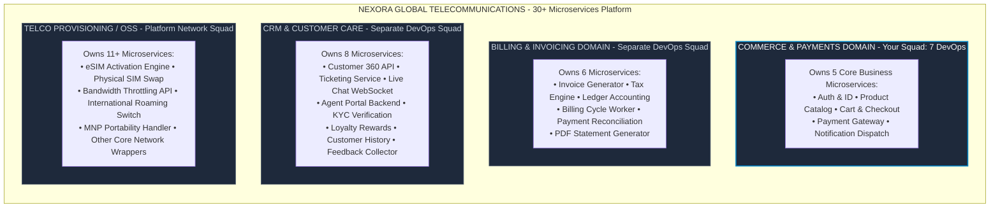

---

## 1.2 The 4 Organizational DevOps Archetypes in Modern Tech

Before understanding Nexora's structure, it is important to know the 4 common models for how companies organize DevOps work:

1. **Centralized DevOps / Shared Services Team**: A single pool of 5–10 DevOps engineers manages infrastructure and pipelines for 20+ product teams. Devs submit Jira tickets for every S3 bucket, IAM role, or pipeline fix. *Where seen*: Traditional enterprises and early-stage cloud migrations. *Major drawback*: DevOps becomes a severe operational bottleneck. Teams wait weeks for basic resources.

2. **Embedded DevOps Engineers (Cross-Functional Squads)**: 1–2 DevOps engineers sit directly inside a single feature team (e.g., the Checkout Squad). *Where seen*: High-growth startups. *Major drawback*: Causes architectural divergence and tooling silos across teams—every squad builds a slightly different pipeline.

3. **Platform Engineering / Internal Developer Platform (IDP)**: A central platform team treats internal developers as "customers" and builds self-service "Golden Paths" (automated Terraform modules, Backstage service portals, standardized Helm charts). *Where seen*: Cloud-native scale-ups. The mantra is: *"You build it, you run it."*

4. **Site Reliability Engineering (SRE)**: Product teams write their own infrastructure; dedicated SREs partner with critical services to govern Service Level Objectives (SLOs), error budgets, incident response, and chaos testing. *Where seen*: Big Tech (Google, Netflix, Uber).

Nexora uses a **Domain-Aligned Hybrid Model** that blends elements of #2 and #3—dedicated squad liaison engineers embedded with dev teams, backed by a shared platform core and a centralized cloud foundation.

---

## 1.3 The 3-Tier Enterprise Structure

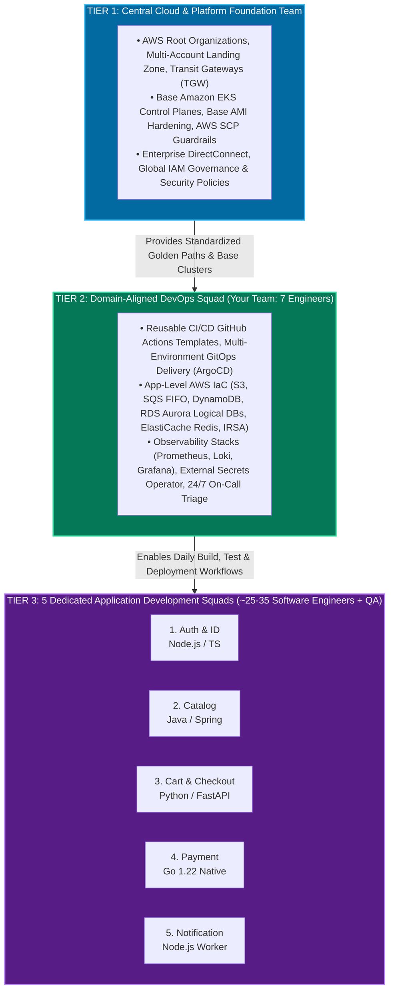

The Central Cloud team (Tier 1) provisions the bare-metal AWS accounts and the base Kubernetes clusters. Your team—the **Domain DevOps Squad** (Tier 2)—sits directly between the cloud foundation and the software developers. You are the enablers. You own the CI/CD pipelines, the application-level infrastructure (like Redis and SQS), and the multi-environment GitOps delivery for your specific Commerce domain.

---

## 1.4 Inside the 7-Member DevOps Squad: T-Shaped Dynamics & The On-Call Shield

In an enterprise environment, 7 DevOps engineers do not work on the same task simultaneously. Work is structured using a **T-Shaped Operating Model** with **Squad Liaisons** and an **On-Call Shield**.

The number one reason DevOps teams fail sprint commitments is constant, unstructured developer interruptions (*"My build failed"*, *"Why is this pod pending in staging?"*, *"Can you give me database access?"*). The On-Call Shield absorbs all interruptions, allowing the remaining 6 engineers to focus on planned sprint epics without context-switching.

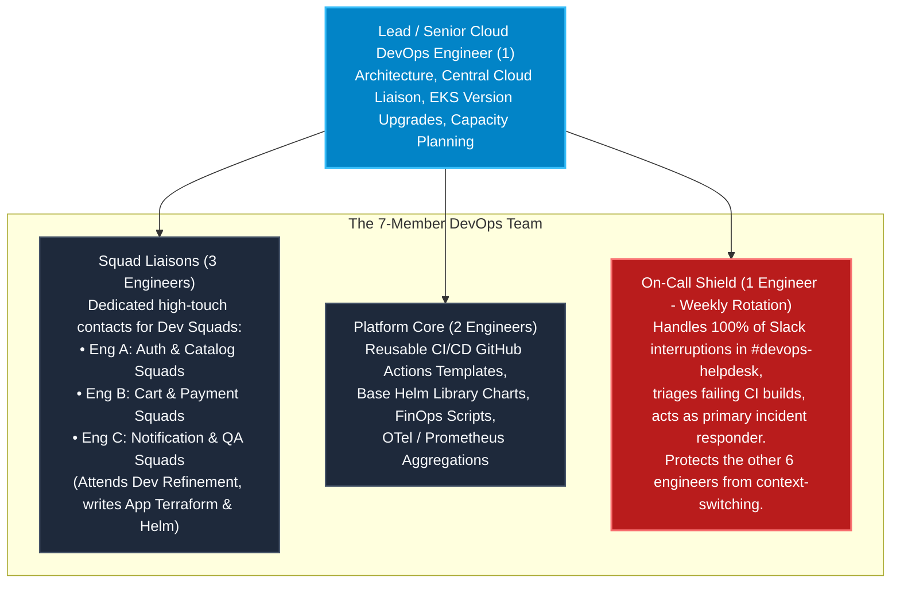

**Redundancy and Absence Handling:**
- **Zero Solo Tribal Knowledge**: No resource is created manually via the AWS Console or `kubectl` from local laptops. Everything is codified in version-controlled Git repositories.
- **Mandatory Peer Reviews**: Every Terraform PR, Helm change, or GitHub Actions workflow update requires at least one peer approval.
- **Standard Operating Runbooks**: Every deployed service, Prometheus alert, and recovery workflow has an operational runbook stored in Confluence or Git.

---

## 1.5 The 2-Week Agile SDLC Cadence: Two-Board Operating Model

The 5 Dev Squads and the DevOps Squad run separate Jira sprint boards on the same **2-week release cadence**, linked by formal dependency intake:

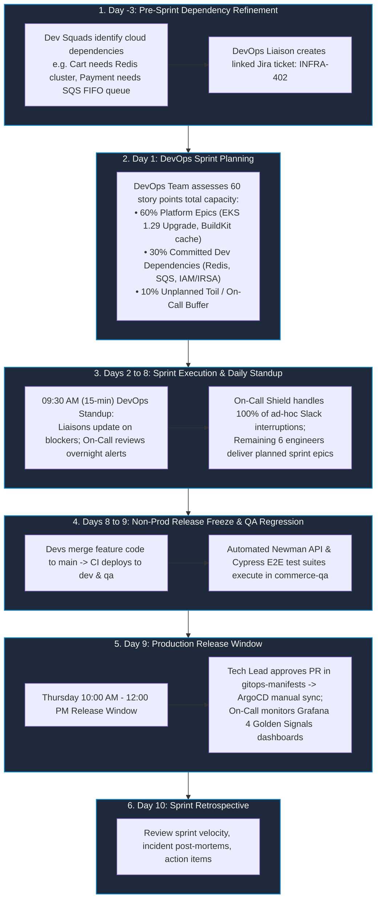

---

## 1.6 Cross-Team RACI Responsibility Matrix

| Responsibility / Deliverable | Central Cloud Foundation | Domain DevOps Squad (Your Team) | Application Dev Squads | QA / SDET Engineers |
| :--- | :---: | :---: | :---: | :---: |
| **AWS Organizations, Root VPCs, Transit Gateways** | **Accountable** | Informed | No Access | No Access |
| **Base EKS Cluster & Node Group Provisioning** | **Accountable** | Consulted | No Access | No Access |
| **App-Level AWS Infra (S3, SQS FIFO, DynamoDB, Redis)** | Governs / Audits | **Accountable** | Consulted | Informed |
| **CI/CD Reusable Workflow Automation (GitHub Actions)** | Consulted | **Accountable** | Responsible (Calls workflow) | Consulted |
| **Helm Charts, K8s Manifests, Kustomize Overlays** | No Access | **Accountable** | Responsible (Updates values) | Informed |
| **Application Business Logic & Unit Tests** | No Access | Informed | **Accountable** | Responsible |
| **API Integration & E2E Test Automation (Postman/Cypress)** | No Access | Informed | Consulted | **Accountable** |
| **Secrets Management (AWS Secrets Manager & ESO)** | Governs Policies | **Accountable** (Infra/ESO) | **Accountable** (Payloads) | No Access |
| **Observability Infrastructure (Prometheus, Loki, Grafana)** | Consulted | **Accountable** | Responsible (App metrics) | Consulted |
| **24/7 Production Incident Triage & Rollback** | Escalation | **Accountable** (Infra/GitOps) | Responsible (App Code) | Informed |

---

## 1.7 The Strategic Role of QA / SDET Engineers in Automated GitOps

A common question is: *"If everything is automated via GitOps, why do you need 2–3 QA engineers?"* The answer is that QA engineers evolve into **Software Development Engineers in Test (SDETs)** with critical, irreplaceable responsibilities:

1. **Test Automation Code Engineering**: Automated tests do not write themselves. SDETs author and maintain Postman/Newman API collections, Cypress/Playwright browser automation suites, and Pact contract tests that execute directly in CI/CD pipelines.
2. **Mocking Complex Third-Party Dependencies**: Developers cannot execute live payment authorizations against banking networks for every PR. SDETs build and maintain **WireMock** mock servers in the `commerce-qa` namespace to simulate 3D-Secure timeouts, card declines, and network latency.
3. **Exploratory & Edge-Case Testing During Sprints**: Automated suites only test known, already-written code paths. SDETs perform manual exploratory testing to uncover complex edge cases (e.g., applying a discount voucher while removing items in another browser tab) and subsequently convert those discoveries into automated regression scripts.
4. **Shift-Left Quality in "Three Amigos" Sessions**: Before a developer writes code, the QA engineer participates in refinement sessions with the Product Owner and Developer to define boundary test conditions and acceptance criteria upfront.
5. **Performance & Load Testing**: SDETs author **k6** and JMeter scripts to stress-test staging environments, establishing breaking thresholds before production deployments.

---

# 2. The 5 Core Microservices: Ground-Level Anatomy & Execution Runtimes

## 2.1 Language vs. Runtime: Low-Level Technical Differentiation

It is critical to distinguish between two fundamentally different things:
* **Programming Language**: The human-readable syntax, grammar, type system, and keywords (TypeScript, Python, Java, Go). It is static source code sitting in a repository.
* **Runtime Environment**: The actual software engine running on the CPU and operating system that executes compiled instructions, manages memory allocation and Garbage Collection (GC), provides thread scheduling, and handles OS network/disk I/O syscalls.

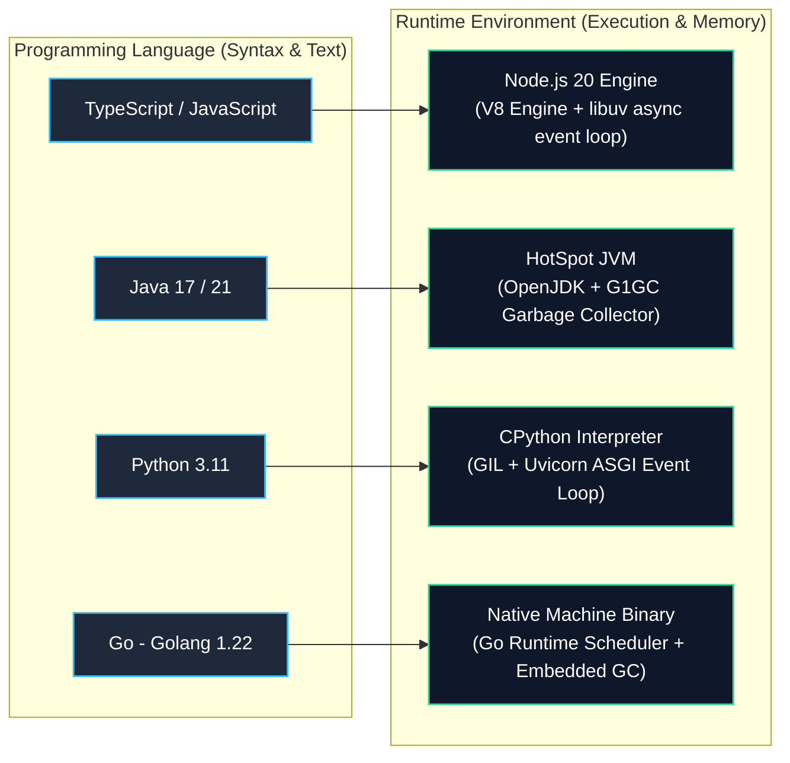

---

## 2.2 End-to-End Customer Request Flow

Imagine a customer on their mobile phone buying a new 5G data plan. This diagram shows how different execution runtimes are selected based on the exact compute profile (I/O vs CPU vs Deterministic Reliability) of the business capability:

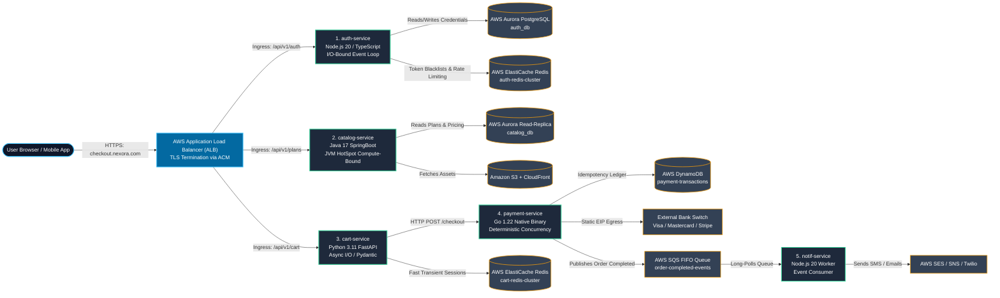

---

## 2.3 Deep-Dive Technical Specification of the 5 Services

### 1. Auth & Identity Service (`auth-service`)
- **Language & Runtime**: TypeScript compiled to JavaScript → **Node.js 20 (LTS)** on `node:20-alpine`.
- **Why Node.js?**: Auth is **I/O-bound**. The single-threaded async event loop (`libuv`) efficiently handles 10,000+ simultaneous login handshakes and JWT verifications with minimal RAM (~40MB per container). It spends most of its time *waiting* for Redis and PostgreSQL responses, not crunching numbers.
- **In-App Dependencies**: `fastify` (REST engine), `jsonwebtoken` (JWT signing), `argon2` / `bcryptjs` (password hashing), `ioredis` (Redis client), `pg` (PostgreSQL client pool).
- **External Cloud Dependencies**: AWS Aurora PostgreSQL (`auth_db`), AWS ElastiCache Redis (token revocation blacklists, rate limiting via `INCR login_attempts:<ip>`), AWS Secrets Manager (RSA private keys).
- **Criticality**: **Tier-0 (Platform Blocker)**. If Auth is down, no user can log in. Deployed with 5–30 pods spread across 3 AZs via `topologySpreadConstraints`.

### 2. Product Catalog Service (`catalog-service`)
- **Language & Runtime**: Java 17 → **OpenJDK HotSpot JVM** on `eclipse-temurin:17-jre-alpine` with SpringBoot.
- **Why Java?**: Catalog is **Compute & Memory-Bound**. It maps complex nested relational telco data (plans, pricing tiers, handset specs) into JSON models using Hibernate ORM, `@Cacheable` annotations, and JVM multithreading. The JVM's ability to efficiently handle concurrent processing of large result sets makes it ideal.
- **In-App Dependencies**: `spring-boot-starter-web`, `spring-boot-starter-data-jpa`, `postgresql` JDBC, `caffeine` (local in-memory cache), `aws-java-sdk-s3`.
- **External Cloud Dependencies**: AWS Aurora PostgreSQL Read-Replicas (`catalog_db`), Amazon S3 + CloudFront CDN (device spec sheets, plan brochure PDFs, product images).
- **Criticality & DevOps Guardrails**: **Tier-1**. Pod memory: Request `1Gi`, Limit `1.5Gi`. Explicit JVM ergonomics: `-XX:MaxRAMPercentage=75.0 -XX:+UseG1GC` to prevent heap growth from exceeding container limits (preventing Exit Code 137 OOMKilled).

### 3. Cart & Checkout Service (`cart-service`)
- **Language & Runtime**: Python 3.11 → **CPython** managed by **Uvicorn (ASGI)** on `python:3.11-slim` with FastAPI.
- **Why Python/FastAPI?**: Cart is **Async I/O**. `async/await` with Pydantic serialization enables rapid cart calculations. Shopping carts are highly transient—storing them in Redis Hashes with TTLs (`cart:<user_id>`) avoids heavy disk-based database writes entirely.
- **In-App Dependencies**: `fastapi`, `pydantic`, `redis-py` / `aioredis`, `httpx` (async HTTP client to query catalog pricing).
- **External Cloud Dependencies**: Dedicated AWS ElastiCache Redis Cluster (Cluster Mode Enabled).
- **DevOps Guardrails**: Connection pool tuning: 6 pods × 4 Uvicorn workers × 50 pool size = 1,200 connections. ElastiCache Parameter Group: `max_connections: 5000`.

### 4. Payment Gateway Wrapper (`payment-service`)
- **Language & Runtime**: Go (Golang 1.22) → **Compiled Native Static Binary** on `gcr.io/distroless/static`.
- **Why Go?**: Payment is **Deterministic Concurrency**. Zero GC pauses, static type safety, and explicit error handling (`if err != nil`) ensure no dropped banking transactions. The binary is compiled statically with no OS dependencies—the smallest possible attack surface.
- **In-App Dependencies**: `net/http` / `gin-gonic`, `aws-sdk-go-v2` (`dynamodb`, `sqs`), `crypto/tls` (TLS 1.3 for banking switches).
- **External Cloud Dependencies**: AWS DynamoDB (idempotency ledger), AWS SQS FIFO Queue, AWS NAT Gateways with static Elastic IPs (whitelisted by upstream acquiring banks).
- **Criticality**: **Tier-0 (PCI-DSS Scope)**. Strict pod security: `readOnlyRootFilesystem: true`, `runAsNonRoot: true`, `runAsUser: 10001`. Loki loggers enforce regex masking on card numbers and CVVs.

### 5. Notification & Dispatch Service (`notif-service`)
- **Language & Runtime**: TypeScript → **Node.js 20 (LTS)** running as a headless background event consumer (no HTTP server).
- **Why Node.js Worker?**: Notification is **Event-Driven Polling**. The non-blocking loop long-polls AWS SQS, compiles HTML templates, and dispatches outbound alerts. It is fundamentally asynchronous—ideal for Node's event loop.
- **In-App Dependencies**: `@aws-sdk/client-sqs`, `@aws-sdk/client-ses`, `@aws-sdk/client-sns`, `twilio`, `handlebars`.
- **External Cloud Dependencies**: AWS SQS FIFO Queue + Dead Letter Queue (`notif-dlq` with 3 retries), AWS SES, AWS SNS / Twilio.
- **Criticality**: **Tier-2 (Asynchronous / Decoupled)**. Outages do not block checkouts. Autoscaled via **KEDA** based on `ApproximateNumberOfMessagesVisible` (scales from 2 to 10 pods when queue depth > 500).

---

# 3. Enterprise Cloud & AWS Infrastructure Isolation Strategy

## 3.1 Logical vs. Physical Resource Isolation

| AWS Service | Provisioning Strategy | Ground-Level Technical Rationale |
| :--- | :--- | :--- |
| **Aurora PostgreSQL** | **Shared Cluster Engine, Logical DBs** | A multi-AZ Aurora cluster costs $1,000+/month. We provision one cluster. `auth-service` connects to `auth_db`; `catalog-service` connects to `catalog_db`. PostgreSQL IAM/role privileges enforce isolation. |
| **ElastiCache Redis** | **Dedicated Physical Clusters** | Redis is memory-bound. A flash sale on Cart could evict Auth tokens if shared. Therefore, `auth-redis` and `cart-redis` run on separate physical clusters. |
| **AWS SQS & DynamoDB** | **100% Dedicated per Service** | Serverless resources have no baseline idle server cost. Each service gets its own queues and tables protected by strict IRSA IAM roles. |

## 3.2 The Redis Blast Radius Story

Redis executes entirely in-memory. When memory is exhausted, its eviction policy (`allkeys-lru`) discards the oldest keys. If `auth-service` and `cart-service` shared a single Redis cluster, imagine a Black Friday flash sale: an explosion of cart data (`cart:<user_id>` hashes) would physically evict the user authentication tokens (`session:<token>` keys). Thousands of users across the platform would be forcibly logged out mid-purchase. This is why Redis clusters are **physically separated**—`auth-redis` and `cart-redis` are entirely different ElastiCache instances.

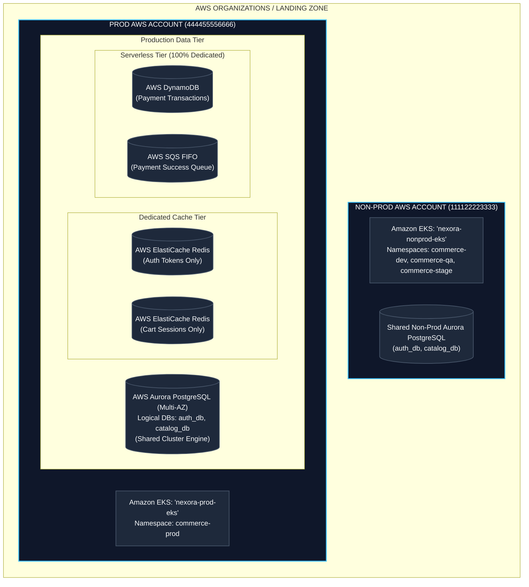

## 3.3 Cross-Domain Communication

When services in the Commerce domain interact with the other 25+ services across Nexora:
- **Synchronous (Real-Time API)**: Used when immediate confirmation is required (e.g., Cart calling eSIM Activation). Traffic flows via **AWS Transit Gateway** and **PrivateLink** without traversing the public internet.
- **Asynchronous (Event-Driven)**: Used for background operations (e.g., Payment completed → Billing Invoice Generation). Payment publishes a `PaymentCompletedEvent` to **AWS EventBridge / SQS FIFO**, which the Billing and OSS domains consume independently.

---

# 4. Multi-Tenant Kubernetes (Amazon EKS): Real-World vs. Textbook Theory

## 4.1 The Complete 30+ Service Multi-Tenant Cluster Topology

In production, all 30+ services operate in a **Multi-Tenant Amazon EKS Cluster** managed by the Central Cloud Team. Naming the namespace `commerce-prod` reflects that this is a multi-tenant platform cluster where each business domain gets dedicated, isolated namespaces:

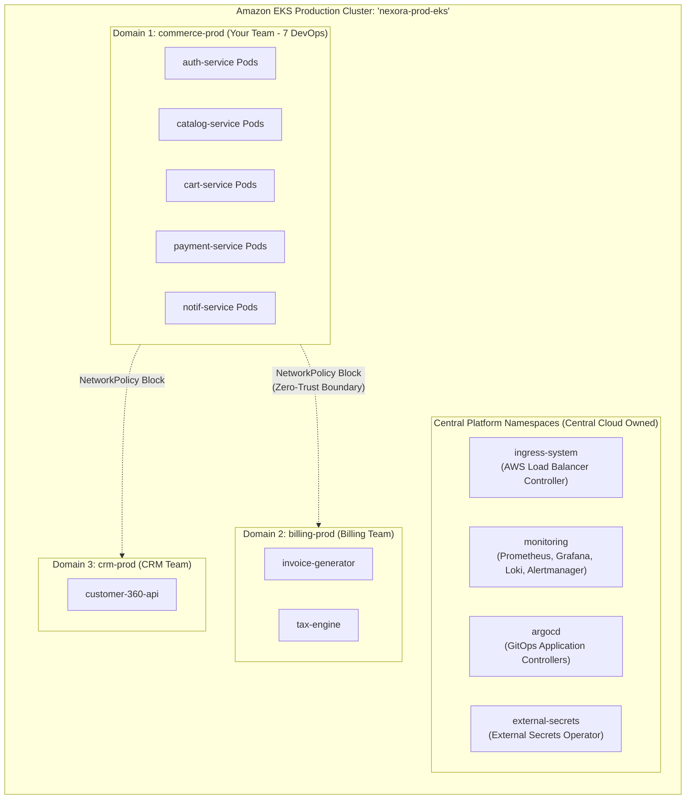

### Non-Production Namespace Layout
Non-production environments are also partitioned by domain to prevent name collisions across teams:

```
nexora-nonprod-eks:
  ├── commerce-dev      ← Your 5 services (Dev builds / continuous PR merges)
  ├── commerce-qa       ← Your 5 services (QA automated regression testing)
  ├── commerce-stage    ← Your 5 services (Pre-prod staging / release candidate)
  ├── billing-dev       ← Billing team's dev workloads
  ├── billing-stage     ← Billing team's staging workloads
  ├── crm-dev           ← CRM team's dev workloads
  ├── crm-stage         ← CRM team's staging workloads
  ├── telco-oss-dev     ← Telco OSS dev workloads
  └── telco-oss-stage   ← Telco OSS staging workloads
```

---

## 4.2 The 4 Isolation Guardrails Between Domains

Running 30+ services from different teams inside one EKS cluster requires strict boundary enforcement across 4 layers:

### Guardrail 1: RBAC (Role-Based Access Control)
Your DevOps team and your ~30 commerce developers have permissions scoped exclusively to `commerce-dev`, `commerce-stage`, and `commerce-prod`. If a Commerce developer attempts to run `kubectl get pods -n billing-prod`, the Kubernetes API server returns:
```
Error from server (Forbidden): pods is forbidden: User "..." cannot list resource "pods" in API group "" in the namespace "billing-prod"
```

```yaml
# developer-readonly-rbac.yaml
apiVersion: rbac.authorization.k8s.io/v1
kind: Role
metadata:
  namespace: commerce-prod
  name: developer-readonly-role
rules:
  # Allow inspecting workloads, pods, and streaming logs
  - apiGroups: ["", "apps"]
    resources: ["pods", "pods/log", "services", "deployments", "configmaps", "events"]
    verbs: ["get", "list", "watch"]
  # Allow local port-forwarding for debugging
  - apiGroups: [""]
    resources: ["pods/port-forward"]
    verbs: ["create"]
  # Explicit Denial: 'pods/exec' and 'secrets' are excluded.
  # (In Kubernetes RBAC, omission equals an implicit deny)
---
apiVersion: rbac.authorization.k8s.io/v1
kind: RoleBinding
metadata:
  namespace: commerce-prod
  name: developer-readonly-binding
subjects:
  - kind: Group
    name: "sso:commerce-developers-group"
    apiGroup: rbac.authorization.k8s.io
roleRef:
  kind: Role
  name: developer-readonly-role
  apiGroup: rbac.authorization.k8s.io
```

### Guardrail 2: Resource Isolation (ResourceQuotas)
Every domain namespace receives strict CPU and Memory budgets. If the `crm-prod` namespace suffers a memory leak, it can only consume up to its own defined quota, preventing it from starving `commerce-prod` pods:

```yaml
apiVersion: v1
kind: ResourceQuota
metadata:
  name: commerce-quota
  namespace: commerce-prod
spec:
  hard:
    requests.cpu: "20"
    requests.memory: 40Gi
    limits.cpu: "40"
    limits.memory: 80Gi
```

### Guardrail 3: Zero-Trust Network Isolation (NetworkPolicies)
By default, Kubernetes allows open pod-to-pod networking. An enterprise enforces Zero-Trust NetworkPolicies to block arbitrary cross-namespace traffic unless explicitly whitelisted:

```yaml
# network-policy-payment.yaml
apiVersion: networking.k8s.io/v1
kind: NetworkPolicy
metadata:
  name: allow-cart-and-billing-to-payment
  namespace: commerce-prod
spec:
  podSelector:
    matchLabels:
      app: payment-service
  policyTypes: ["Ingress"]
  ingress:
    # Rule 1: Allow cart-service within same namespace
    - from:
        - podSelector:
            matchLabels:
              app: cart-service
      ports:
        - protocol: TCP
          port: 8080
    # Rule 2: Allow billing-prod namespace for invoice reconciliation
    - from:
        - namespaceSelector:
            matchLabels:
              domain: billing-prod
      ports:
        - protocol: TCP
          port: 8080
```

> **Important nuance**: `namespaceSelector` matches on namespace *labels*, not namespace *names*. The namespace `billing-prod` must actually be labeled `domain: billing-prod` for this policy to work. It is not automatic.

### Guardrail 4: Dedicated GitOps Control via ArgoCD Projects
ArgoCD organizes deployments using **AppProjects**:
- **`commerce-project`**: Restricts your ArgoCD sync permissions exclusively to target namespaces matching `commerce-*`.
- **`billing-project`**: Restricts the Billing team's ArgoCD pipelines to `billing-*`.

---

## 4.3 Cross-Namespace Service Discovery

When `payment-service` in `commerce-prod` needs to notify the `invoice-generator` in `billing-prod`, it uses internal Kubernetes DNS resolution:

**Format**: `http://<service-name>.<namespace>.svc.cluster.local:<port>`

```
http://invoice-service.billing-prod.svc.cluster.local:8080/api/v1/invoices
```

CoreDNS resolves the service name directly across namespaces within the cluster network without routing out to the public internet or incurring NAT gateway charges.

---

## 4.4 Real-World vs. Textbook Multi-Tenancy

In an enterprise setting, it is critical to know where the textbook version diverges from reality:

1. **NetworkPolicy Enforcement Isn't Free on EKS**: The default AWS VPC CNI historically did *not* enforce NetworkPolicies at all. You could write all the NetworkPolicy YAML you wanted, and Kubernetes would silently ignore it. To make them work, you must either install Calico/Cilium as an add-on, or explicitly enable AWS VPC CNI's native NetworkPolicy support (added later). Many real clusters have NetworkPolicy YAML in Git that is never actually enforced.

2. **Namespaces are NOT a Hard Security Boundary**: They share the control plane, etcd, the Linux kernel, and often worker nodes. A container escape or node compromise in `crm-prod` can affect neighbors regardless of RBAC/NetworkPolicy. Security-serious enterprises layer on node-level isolation (dedicated node groups + taints/tolerations per domain) or a service mesh (Istio/Linkerd for mTLS).

3. **Missing Admission Control**: Real hardened clusters run admission controllers (Pod Security Admission, OPA/Gatekeeper, or Kyverno) to actively block risky pod specs cluster-wide—blocking privileged containers, forbidding root execution (`runAsNonRoot: true`), preventing `hostPath` mounts.

4. **EKS Provisioned Control Plane**: For predicted national telecom traffic surges (e.g., nationwide number porting day or major iPhone pre-orders), AWS offers **Provisioned Control Plane capacity** (Standard up to 8XL) to guarantee API server and etcd headroom.

---

## 4.5 Hard Compute Isolation: The Node Group Topology & PCI Auditor Story

Because namespaces are only soft boundaries, true isolation happens at the hardware layer using **Dedicated Managed Node Groups** with Taints and Tolerations.

The biggest red flag in textbook multi-tenancy is blindly placing `payment-service` inside a shared node group alongside 25+ unrelated services. A Qualified Security Assessor (QSA—the PCI auditor) will aggressively push for scope reduction. If your Cardholder Data Environment (CDE) shares infrastructure with non-CDE workloads, proving segmentation with just namespaces is an incredibly painful audit conversation. Enterprises solve this by placing payment pods on their own dedicated, tainted node group (`commerce-payment-ng`).

```mermaid
flowchart TD
    subgraph EKSCluster["EKS Cluster Worker Hardware Layer"]
        direction TB
        subgraph NG_System["system-ng (General Cluster Services)"]
            N_Sys["Controllers, CoreDNS, Ingress, Monitoring Agents<br/>Instance: m7g.large (ARM Graviton4)"]
        end
        subgraph NG_Commerce["commerce-ng (Domain 1 Workloads)"]
            N_Com["Auth, Catalog, Cart, Notification Pods<br/>Instance: m7g.2xlarge (ARM Graviton4)<br/>Toleration: domain=commerce:NoSchedule"]
        end
        subgraph NG_Payment["commerce-payment-ng (PCI-DSS Isolated)"]
            N_Pay["Payment Gateway Pods ONLY<br/>Taint: dedicated=pci-payment:NoSchedule<br/>Instance: m7i.xlarge (Dedicated Intel Hardware)"]
        end
        subgraph NG_Billing["billing-ng (Domain 2 Workloads)"]
            N_Bill["Billing & Invoicing Pods<br/>Instance: m7g.xlarge (ARM Graviton4)"]
        end
        subgraph NG_CRM["crm-ng (Domain 3 Workloads)"]
            N_CRM["CRM & Customer 360 Pods<br/>Instance: r7g.xlarge (Memory Optimized)"]
        end
        subgraph NG_OSS["telco-oss-ng (Domain 4 Telecom OSS)"]
            N_OSS["eSIM & Network Activation Pods (Largest Pool)<br/>Instance: m7g.4xlarge (High Concurrency)"]
        end
    end
    classDef ng fill:#1e293b,stroke:#0284c7,stroke-width:1.5px,color:#f8fafc;
    classDef pci fill:#7f1d1d,stroke:#ef4444,stroke-width:2px,color:#ffffff;
    class NG_System,NG_Commerce,NG_Billing,NG_CRM,NG_OSS ng; class NG_Payment pci;
```

| Node Group | Target Services | Instance Type | Sizing & Isolation Rationale |
| :--- | :--- | :--- | :--- |
| **`system-ng`** | CoreDNS, ALB Controller, Karpenter, Prometheus agents | `m7g.large` (Graviton4 ARM) | Dedicated. Ensures platform controllers never compete with app scaling events. |
| **`commerce-ng`** | auth, catalog, cart, notif | `m7g.2xlarge` (8 vCPU / 32GiB) | Best price-performance for standard containerized microservices. |
| **`commerce-payment-ng`** | payment-service ONLY | `m7i.xlarge` (4 vCPU / 16GiB Intel) | **Dedicated Tainted Hardware**: Tainted with `dedicated=pci-payment:NoSchedule`. Physically prevents other containers from co-locating on the same kernel. |
| **`billing-ng`** | 6 Billing Microservices | `m7g.xlarge` (4 vCPU / 16GiB) | Sized for billing calculation workers and invoice generation. |
| **`crm-ng`** | 8 CRM Microservices | `r7g.xlarge` (Memory-Optimized) | Sized for customer lookup aggregations and session caches. |
| **`telco-oss-ng`** | 11+ Telecom OSS Services | `m7g.4xlarge` (16 vCPU / 64GiB) | Largest pool for high-throughput eSIM and network provisioning events. |

**Instance Selection Rationale:**
- **Graviton4 (`m7g` / `r7g`)**: Default choice for all modern containerized workloads. Delivers ~20–40% better price-performance over x86.
- **Intel x86 (`m7i`)**: Retained specifically for services with legacy C/C++ native bindings (JNI) or unverified ARM compatibility in third-party banking SDKs.

---

## 4.6 Ground-Level Packet Journey: Browser to Container Worker

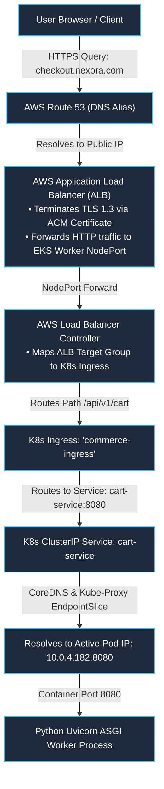

---

## 4.7 IAM Roles for Service Accounts (IRSA) Deep Dive

IRSA eliminates the need for static AWS access keys inside containers. Instead, each pod receives temporary credentials through an OIDC token exchange:

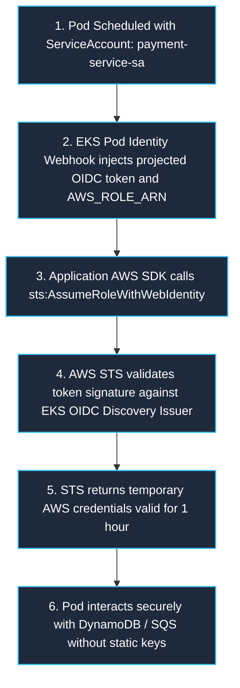

**Kubernetes ServiceAccount:**
```yaml
apiVersion: v1
kind: ServiceAccount
metadata:
  name: payment-service-sa
  namespace: commerce-prod
  annotations:
    eks.amazonaws.com/role-arn: arn:aws:iam::444455556666:role/nexora-prod-payment-role
```

**AWS IAM Trust Relationship Policy (Terraform-generated):**
```json
{
  "Version": "2012-10-17",
  "Statement": [
    {
      "Effect": "Allow",
      "Principal": {
        "Federated": "arn:aws:iam::444455556666:oidc-provider/oidc.eks.eu-west-1.amazonaws.com/id/EXAMPLED3B7B2E364022D9"
      },
      "Action": "sts:AssumeRoleWithWebIdentity",
      "Condition": {
        "StringEquals": {
          "oidc.eks.eu-west-1.amazonaws.com/id/EXAMPLED3B7B2E364022D9:sub": "system:serviceaccount:commerce-prod:payment-service-sa",
          "oidc.eks.eu-west-1.amazonaws.com/id/EXAMPLED3B7B2E364022D9:aud": "sts.amazonaws.com"
        }
      }
    }
  ]
}
```

---

## 4.8 Secrets Management: External Secrets Operator (ESO)

Secrets are never hardcoded in Git or baked into Docker images. ESO automatically syncs secrets from AWS Secrets Manager into native Kubernetes Secrets:

```yaml
# 1. ClusterSecretStore (Authenticates via IRSA)
apiVersion: external-secrets.io/v1beta1
kind: ClusterSecretStore
metadata:
  name: aws-secrets-manager
spec:
  provider:
    aws:
      service: SecretsManager
      region: eu-west-1
      auth:
        jwt:
          serviceAccountRef:
            name: eso-service-account
            namespace: external-secrets
---
# 2. ExternalSecret Custom Resource
apiVersion: external-secrets.io/v1beta1
kind: ExternalSecret
metadata:
  name: payment-secrets-sync
  namespace: commerce-prod
spec:
  refreshInterval: 1h
  secretStoreRef:
    name: aws-secrets-manager
    kind: ClusterSecretStore
  target:
    name: payment-k8s-secret  # Native K8s Secret created automatically in namespace
    creationPolicy: Owner
  data:
    - secretKey: STRIPE_API_KEY
      remoteRef:
        key: prod/commerce/payment
        property: stripe_secret_key
    - secretKey: DB_PASSWORD
      remoteRef:
        key: prod/commerce/database
        property: db_password
```

---

# 5. Workload Sizing, HPA Mathematics & Karpenter Autoscaling

## 5.1 The "3 Replicas" Confusion: Floor vs. Peak Capacity

A common source of confusion: how can `replicas: 3` handle tens of thousands of users?

**3 is the floor, not the total capacity.** Two entirely different things determine how many pods run:

1. **Minimum Replicas (e.g., 3)**: Exists purely for **High Availability (HA)**, not traffic volume. One replica per AZ means if an entire data center loses power, the other two keep serving. It also allows rolling deployments to replace one pod at a time without dropping below 100% capacity. Running 20 pods 24/7 at 3:00 AM when nobody is using the app is wasted spend—thousands of dollars monthly.

2. **Maximum Replicas (HPA Dynamic Burst)**: This is what actually absorbs daytime traffic. The Horizontal Pod Autoscaler (HPA) watches real-time load (CPU, memory, or requests/sec) and dynamically adds pods, up to a configured ceiling (e.g., 20 or 30).

## 5.2 Active Users vs. Request Throughput Funnel

**50,000 active concurrent users does NOT equal 50,000 requests per second (RPS).**

A browsing user spends 20–60 seconds reading a page. They generate roughly 1 request every 2–3 seconds. And the purchase funnel has natural drop-off:

- **100% of users** hit `auth-service` and `catalog-service` during initial browsing.
- **~20% of users** proceed to add items → interact with `cart-service` (~2,000–3,000 RPS).
- **~5% of users** reach final checkout → hit `payment-service` (~500–800 RPS).

At ~150 requests/sec per pod for a Python FastAPI container, 2,500 RPS requires `2500 / 150 ≈ 17 pods`. Setting `minReplicas: 3` and `maxReplicas: 20` is mathematically sound.

## 5.3 Per-Service Autoscaling Matrix

| Microservice | Min (Floor) | Max (Peak) | Primary Scaling Metric | Autoscaling Engine & Rationale |
| :--- | :---: | :---: | :--- | :--- |
| **`auth-service`** | **5** | **30** | CPU > 60% OR HTTP RPS > 250/pod | **HPA**: Authenticates every page session; highest baseline traffic. |
| **`catalog-service`** | **5** | **30** | CPU > 70% OR HTTP RPS > 300/pod | **HPA**: Heaviest browsing traffic, cacheable. |
| **`cart-service`** | **3** | **20** | HTTP Requests/sec via Prometheus Adapter | **HPA**: Request-driven scaling (CPU lags behind sudden traffic bursts). |
| **`payment-service`** | **3** | **15** | CPU > 50% OR Active Connections > 100 | **HPA**: Isolated on dedicated tainted hardware node group. |
| **`notif-service`** | **2** | **20** | `ApproximateNumberOfMessagesVisible` > 500 | **KEDA**: Queue-driven worker. CPU remains 0% while idle, so HPA fails; KEDA scales directly on SQS queue depth. |

## 5.4 The Nested Dual-Autoscaler Architecture (HPA + Karpenter)

Kubernetes scaling operates at two interconnected layers. **HPA decides how many pods; Karpenter decides how many nodes to run those pods on.** Neither is a fixed number—both breathe with real traffic.

**Cluster → Node Group → Node → Pod → Replica**

Your one shared EKS cluster contains `commerce-ng`, a node group made of a handful of physical EC2 nodes spread across 3 AZs. Kubernetes bin-packs pods from all 5 Commerce services onto whichever node has room—Cart's pods do not get their own dedicated node, they share space with Auth, Catalog, and Notification on the same underlying machines (except Payment, which is pinned to its own tainted nodes for PCI isolation).

As traffic climbs, HPA adds pods. When nodes run out of room, new pods enter `"Pending"` status. Karpenter watches for Pending pods and provisions new EC2 nodes into `commerce-ng` on demand (~45 seconds). When traffic drops, HPA removes pods, and Karpenter cordons and terminates empty nodes to save money.

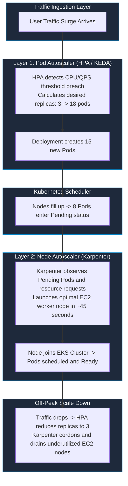

## 5.5 Aligning Namespace ResourceQuotas with Node Group Capacity

A `ResourceQuota` must be mathematically aligned with the underlying node group compute rather than guessed:
- If `commerce-ng` runs 4 × `m7g.2xlarge` nodes (8 vCPU / 32GiB RAM each = **32 vCPUs / 128GiB RAM total**):
- Setting `ResourceQuota` to `requests.cpu: "20"`, `requests.memory: "40Gi"` guarantees that baseline workloads never exceed ~60% of the node group, leaving **12 vCPUs and 88GiB of RAM reserved for HPA burst scaling**.
- If the quota is undersized relative to the node group, quota becomes the actual bottleneck before nodes ever fill up.

---

# 6. Continuous Integration (CI) Pipeline Engineering

Waiting 18 minutes for a CI build destroys developer flow. Nexora slashed this to **3.5 minutes** using three techniques:

1. **Docker BuildKit Layer Caching (`type=gha`)**: By caching intermediate Docker build stages in the GitHub Actions cache backend, unchanged `npm ci` dependency layers are restored in seconds.
2. **Multi-Stage Build Isolation**: Separating the bloated compilation environment from the final runtime image dropped container sizes from ~900MB to ~85MB.
3. **Parallel Matrix Execution**: Running SonarQube analysis, Trivy scans, and unit tests simultaneously across parallel runners instead of sequentially.

## 6.1 Shift-Left Security & Pre-Build vs. Post-Build Gates

| Stage | Security & Quality Gate Tool | Enforcement Mechanism & Failure Threshold |
| :--- | :--- | :--- |
| **Pre-Build (Code Lint & SCA)** | **Gitleaks** | Pre-commit hook & CI check: Fails build if API keys, tokens, or private keys match regex signatures. |
| **Pre-Build (Static Analysis)** | **SonarQube** | Mandatory PR Quality Gate: Fails PR merge if code coverage < 80% or Security Hotspots > 0. |
| **Pre-Build (Dependency Scan)** | **Trivy (fs) / Snyk** | Scans lockfiles (`package-lock.json`, `pom.xml`, `requirements.txt`); fails on HIGH/CRITICAL CVEs. |
| **Post-Build (Container Image)** | **Trivy (image)** | Scans Linux base image layers and OS packages; breaks build on unpatched CRITICAL CVEs. |
| **Post-Build (Manifest Linting)** | **kubeconform / helm lint** | Validates Kubernetes YAML schemas against strict OpenAPI specifications. |

## 6.2 Production Multi-Stage Dockerfile Pattern

```dockerfile
# ========================================================
# Stage 1: Build & Dependency Compilation
# ========================================================
FROM node:20-alpine AS builder
WORKDIR /app

# Cache package dependencies
COPY package*.json ./
RUN npm ci --only=production

# Compile application assets
COPY . .
RUN npm run build

# ========================================================
# Stage 2: Minimal Hardened Production Runtime
# ========================================================
FROM node:20-alpine AS runner
WORKDIR /app

# Security: Create non-root system user and group (UID 10001)
RUN addgroup -g 10001 -S appgroup && \
    adduser -u 10001 -S appuser -G appgroup

# Copy ONLY compiled artifacts from builder stage
COPY --from=builder --chown=appuser:appgroup /app/dist ./dist
COPY --from=builder --chown=appuser:appgroup /app/node_modules ./node_modules
COPY --from=builder --chown=appuser:appgroup /app/package.json ./package.json

# Enforce Non-Root Execution
USER appuser
EXPOSE 8080
ENV NODE_ENV=production

CMD ["node", "dist/main.js"]
```

## 6.3 Complete Reusable GitHub Actions CI Workflow

```yaml
# .github/workflows/reusable-microservice-ci.yml
name: Reusable Microservice CI/CD
on:
  workflow_call:
    inputs:
      service_name:
        required: true
        type: string
      dockerfile_path:
        required: false
        type: string
        default: './Dockerfile'
    secrets:
      AWS_ACCOUNT_ID:
        required: true
      SONAR_TOKEN:
        required: true
      GITOPS_DEPLOY_KEY:
        required: true

jobs:
  validate-and-test:
    runs-on: ubuntu-latest
    steps:
      - name: Checkout Code
        uses: actions/checkout@v4

      - name: Install Dependencies & Run Tests
        run: |
          npm ci
          npm test -- --coverage

      - name: SonarQube Quality Gate Check
        uses: sonarsource/sonarqube-scan-action@master
        env:
          SONAR_TOKEN: ${{ secrets.SONAR_TOKEN }}

      - name: Trivy Filesystem Scan (SCA)
        uses: aquasecurity/trivy-action@master
        with:
          scan-type: 'fs'
          scan-ref: '.'
          severity: 'CRITICAL,HIGH'
          exit-code: '1'

  build-and-publish:
    needs: validate-and-test
    runs-on: ubuntu-latest
    permissions:
      id-token: write  # Required for AWS OIDC authentication
      contents: read
    steps:
      - name: Checkout Code
        uses: actions/checkout@v4

      - name: Authenticate to AWS via OIDC
        uses: aws-actions/configure-aws-credentials@v4
        with:
          role-to-assume: arn:aws:iam::${{ secrets.AWS_ACCOUNT_ID }}:role/github-actions-ci-role
          aws-region: eu-west-1

      - name: Log in to Amazon ECR
        id: login-ecr
        uses: aws-actions/amazon-ecr-login@v2

      - name: Set up Docker Buildx (BuildKit)
        uses: docker/setup-buildx-action@v3

      - name: Build and Push Docker Image (BuildKit Cached)
        uses: docker/build-push-action@v5
        with:
          context: .
          file: ${{ inputs.dockerfile_path }}
          push: true
          tags: ${{ steps.login-ecr.outputs.registry }}/${{ inputs.service_name }}:sha-${{ github.sha }}
          cache-from: type=gha
          cache-to: type=gha,mode=max

      - name: Trivy Container Image Scan
        uses: aquasecurity/trivy-action@master
        with:
          image-ref: ${{ steps.login-ecr.outputs.registry }}/${{ inputs.service_name }}:sha-${{ github.sha }}
          severity: 'CRITICAL'
          exit-code: '1'

      - name: Update Image Tag in GitOps Repository
        env:
          NEW_TAG: sha-${{ github.sha }}
          SERVICE: ${{ inputs.service_name }}
        run: |
          git clone https://x-access-token:${{ secrets.GITOPS_DEPLOY_KEY }}@github.com/nexora/gitops-manifests.git
          cd gitops-manifests/apps/$SERVICE/overlays/dev
          sed -i "s/newTag: .*/newTag: $NEW_TAG/" kustomization.yaml
          git add kustomization.yaml
          git commit -m "ci($SERVICE): promote dev image to $NEW_TAG [skip ci]"
          git push origin main
```

---

# 7. Continuous Delivery (CD), GitOps & 4-Tier Promotion Engine

## 7.1 The 4-Tier Environment Promotion Pipeline

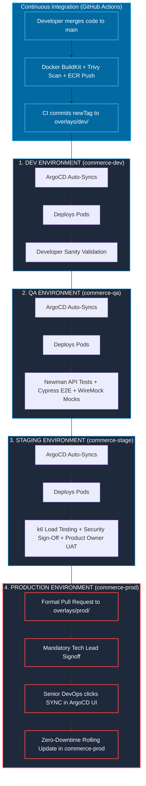

## 7.2 GitOps Kustomize Repository Directory Layout

```
gitops-manifests/
└── apps/
    └── payment-service/
        ├── base/
        │   ├── deployment.yaml       # Core container specs, probes, securityContext
        │   ├── service.yaml          # Port 8080 ClusterIP definition
        │   ├── hpa.yaml              # HPA min: 4, max: 12, targetCPU: 60%
        │   └── kustomization.yaml    # Declares base resources
        └── overlays/
            ├── dev/
            │   ├── kustomization.yaml # newTag: sha-9f8e7d6 (Auto-synced)
            │   └── values-dev.yaml    # replicas: 1, LOG_LEVEL: debug
            ├── qa/
            │   ├── kustomization.yaml
            │   └── values-qa.yaml     # replicas: 2, MOCK_BANK_API: true
            ├── stage/
            │   ├── kustomization.yaml # newTag: sha-8a7b6c5 (Stable RC)
            │   └── values-stage.yaml  # replicas: 4, Prod-sized memory
            └── prod/
                ├── kustomization.yaml # newTag: sha-8a7b6c5 (Approved Prod Release)
                └── values-prod.yaml   # replicas: 6, LOG_LEVEL: warn
```

## 7.3 ArgoCD Production Application Configuration

```yaml
# argocd-payment-prod-app.yaml
apiVersion: argoproj.io/v1alpha1
kind: Application
metadata:
  name: payment-service-prod
  namespace: argocd
  finalizers:
    - resources-finalizer.argocd.argoproj.io
spec:
  project: commerce-project  # Restricted by RBAC to commerce-* namespaces
  source:
    repoURL: 'https://github.com/nexora/gitops-manifests.git'
    targetRevision: main
    path: apps/payment-service/overlays/prod
  destination:
    server: 'https://kubernetes.default.svc'
    namespace: commerce-prod
  syncPolicy:
    automated: null  # AUTOMATED SYNC DISABLED FOR PROD (Requires manual sync gate)
    syncOptions:
      - CreateNamespace=true
      - PrunePropagationPolicy=foreground
      - PruneLast=true
```

## 7.4 Zero-Downtime Pod Lifecycle & Graceful Termination

To prevent dropping in-flight customer checkouts during deployments, the pod lifecycle is carefully orchestrated:

```yaml
# deployment-zero-downtime.yaml
apiVersion: apps/v1
kind: Deployment
metadata:
  name: cart-service
  namespace: commerce-prod
spec:
  replicas: 4
  strategy:
    type: RollingUpdate
    rollingUpdate:
      maxSurge: 25%        # Spawns 1 new pod before terminating an old one
      maxUnavailable: 0    # Guarantees 100% capacity maintained throughout rollout
  template:
    spec:
      containers:
        - name: cart
          image: 444455556666.dkr.ecr.eu-west-1.amazonaws.com/cart-service:sha-9f8e7d6
          ports:
            - containerPort: 8080
          resources:
            requests:
              cpu: "250m"
              memory: "512Mi"
            limits:
              cpu: "500m"
              memory: "1Gi"
          lifecycle:
            preStop:
              exec:
                # 15s sleep allows ALB / Ingress to drain connections before SIGTERM
                command: ["/bin/sh", "-c", "sleep 15"]
          readinessProbe:
            httpGet:
              path: /healthz/ready
              port: 8080
            initialDelaySeconds: 10
            periodSeconds: 5
            failureThreshold: 3
          livenessProbe:
            httpGet:
              path: /healthz/live
              port: 8080
            initialDelaySeconds: 20
            periodSeconds: 10
            failureThreshold: 3
```

## 7.5 Promotion Failure Handling & Automated Rollback

1. **If QA Tests Fail in `commerce-qa`**: The pipeline terminates immediately. The image tag in `overlays/stage` and `overlays/prod` is never updated. The dev squad triages logs, fixes the regression, and restarts at DEV.
2. **If Production Throws 5xx Errors After Sync**: The on-call engineer runs `git revert <commit-sha>` on `gitops-manifests` and syncs ArgoCD. Pods roll back to the previous stable image in under 30 seconds without rebuilding or rerunning CI pipelines.

---

# 8. Production Observability, Metrics & Telemetry Deep Dive

Without visibility, microservices are a black box. The platform relies on a 4-pillar observability stack:
1. **Prometheus**: Scrapes numerical time-series metrics (CPU, Memory, Requests/sec) every 15 seconds from pod exporters and kube-state-metrics.
2. **Loki**: Aggregates structured JSON application logs shipped by a Promtail/Fluent-Bit DaemonSet running on every worker node.
3. **OpenTelemetry (OTel) & Jaeger**: Injects a `traceparent` HTTP header at the Ingress layer. As a request hops from Auth → Cart → Payment, Jaeger stitches the logs together into a single distributed trace waterfall, pinpointing exactly where latency occurs.
4. **Grafana**: The single pane of glass visualizing all three data sources and the 4 Golden Signals.

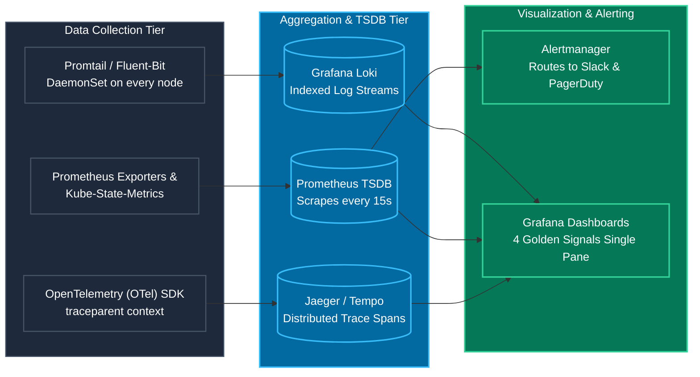

## 8.1 The 4 Golden Signals: Production PromQL Formulas

| Golden Signal | Technical Focus | Production PromQL Query Formula |
| :--- | :--- | :--- |
| **1. Latency** | 95th Percentile request duration | `histogram_quantile(0.95, sum(rate(http_request_duration_seconds_bucket{service="payment-service", namespace="commerce-prod"}[5m])) by (le))` |
| **2. Traffic** | Requests Per Second (RPS) | `sum(rate(http_requests_total{service="cart-service", namespace="commerce-prod"}[5m]))` |
| **3. Errors** | HTTP 5xx error percentage | `(sum(rate(http_requests_total{service="payment-service", status=~"5.."}[5m])) / sum(rate(http_requests_total{service="payment-service"}[5m]))) * 100` |
| **4. Saturation** | Container memory consumption | `(sum(container_memory_working_set_bytes{container="catalog", namespace="commerce-prod"}) / sum(kube_pod_container_resource_limits{resource="memory", container="catalog", namespace="commerce-prod"})) * 100` |

## 8.2 Production Alertmanager Configuration

```yaml
# prometheus-rule-payment.yaml
apiVersion: monitoring.coreos.com/v1
kind: PrometheusRule
metadata:
  name: payment-service-alerts
  namespace: monitoring
spec:
  groups:
    - name: payment-critical.rules
      rules:
        - alert: PaymentGatewayHighErrorRate
          expr: |
            (sum(rate(http_requests_total{service="payment-service", status=~"5.."}[2m]))
            /
            sum(rate(http_requests_total{service="payment-service"}[2m]))) * 100 > 5
          for: 2m
          labels:
            severity: critical
            team: commerce-devops
          annotations:
            summary: "Payment Service HTTP 5xx error rate exceeds 5 percent"
            description: "Payment Service error rate is currently {{ $value }} percent in commerce-prod."
            runbook_url: "https://wiki.nexora-internal.com/runbooks/payment-5xx-spike"
```

---

# 9. Operational Automations, Python Scripting & FinOps

DevOps is not just deploying code; it is about automating toil and saving the enterprise money (FinOps).

## 9.1 Non-Production Nightly Auto-Scaling Script (Python + K8s API)

A Python script using the `kubernetes` client library (`AppsV1Api`) runs as a CronJob at 8:00 PM nightly, scaling `commerce-dev` and `commerce-qa` deployments to 0 replicas. At 7:00 AM, it scales them back to 2. This eliminates idle EC2 compute costs overnight and on weekends.

```python
#!/usr/bin/env python3
"""
FinOps Scheduled Workload Scaler
Scales non-prod deployments outside business hours to eliminate idle compute costs.
"""
import os
import sys
from kubernetes import client, config

def scale_workloads(target_namespace: str, target_replicas: int):
    # Authenticate inside EKS pod or via local kubeconfig
    if os.getenv("KUBERNETES_SERVICE_HOST"):
        config.load_incluster_config()
    else:
        config.load_kube_config()

    apps_v1 = client.AppsV1Api()
    print(f"Fetching deployments in namespace: '{target_namespace}'...")
    deployments = apps_v1.list_namespaced_deployment(namespace=target_namespace)

    for dep in deployments.items:
        dep_name = dep.metadata.name

        # Protect stateful infrastructure operators and test DBs
        if dep_name.startswith("system-") or "database" in dep_name:
            print(f" -> Skipping system workload: {dep_name}")
            continue

        print(f" -> Patching {dep_name} replicas: {dep.spec.replicas} -> {target_replicas}")
        apps_v1.patch_namespaced_deployment_scale(
            name=dep_name,
            namespace=target_namespace,
            body={"spec": {"replicas": target_replicas}}
        )
    print("Scaling operation completed successfully.")

if __name__ == "__main__":
    replicas = int(sys.argv[1]) if len(sys.argv) > 1 else 0
    namespace = sys.argv[2] if len(sys.argv) > 2 else "commerce-dev"
    scale_workloads(target_namespace=namespace, target_replicas=replicas)
```

## 9.2 AWS ECR Image Retention Lifecycle Policy

Docker images accumulate rapidly. An automated JSON lifecycle policy purges stale images:

```json
{
  "rules": [
    {
      "rulePriority": 1,
      "description": "Expire untagged intermediate images older than 14 days",
      "selection": {
        "tagStatus": "untagged",
        "countType": "sinceImagePushed",
        "countUnit": "days",
        "countNumber": 14
      },
      "action": { "type": "expire" }
    },
    {
      "rulePriority": 2,
      "description": "Retain only the last 30 tagged production releases",
      "selection": {
        "tagStatus": "tagged",
        "tagPrefixList": ["sha-", "v"],
        "countType": "imageCount",
        "countNumber": 30
      },
      "action": { "type": "expire" }
    }
  ]
}
```

## 9.3 Orphaned EBS Volume & Snapshot Cleanup

When StatefulSets or PersistentVolumeClaims are deleted, the underlying AWS Elastic Block Store (EBS) volumes are often left behind in an `available` state, silently accumulating storage costs. Automated scripts periodically identify and delete these orphaned volumes and their associated snapshots.

---

# 10. The Production Incident Triage Playbook (5 Real-World Incidents)

When pagers go off at 2:00 AM, the On-Call Shield relies on standardized triage playbooks. Each incident below documents the ground-level symptoms, CLI commands used for diagnosis, the root cause, the immediate mitigation, and the permanent engineering fix.

| Incident | Primary Symptom | Root Cause | Immediate Mitigation | Permanent Fix |
| :--- | :--- | :--- | :--- | :--- |
| **#1: HTTP 504 Gateway Timeouts** | Ingress logs return 504 on `/api/v1/cart`. Pods remain running (0 restarts). | **Redis connection pool starvation**. FastAPI Uvicorn workers capped at 50 connections; hung waiting for sockets. | Scaled `REDIS_MAX_CONNECTIONS: 250` in Helm `values-prod.yaml` and executed rolling restart. | Enabled Redis connection multiplexing; added Prometheus alert for `redis_pool_in_use_ratio > 0.80`. |
| **#2: Pods CrashLooping (Exit 137)** | Product Catalog pods repeatedly restarting during batch catalog exports. | **JVM Heap + Native Metaspace exceeded container limit (1Gi)**, triggering Linux kernel OOM Killer. | Increased Kubernetes memory limit to `2Gi` in `values-prod.yaml`. | Configured JVM ergonomics: `-XX:MaxRAMPercentage=75.0` to reserve 25% for Metaspace/OS; set Grafana alert at 85% memory. |
| **#3: CoreDNS CPU Throttling** | All 5 microservices fail downstream calls (`payment.commerce-prod.svc...`), throwing 502s. | **CoreDNS had only 2 default replicas** handling DNS for 300+ pods; CPU limit pinned at 100%, dropping UDP packets. | Scaled CoreDNS deployment to 6 replicas: `kubectl scale deployment coredns -n kube-system --replicas=6`. | Deployed `NodeLocal DNSCache` DaemonSet to cache DNS queries locally on every worker node, reducing CoreDNS load by 80%. |
| **#4: AWS IRSA AccessDenied on Boot** | Pods restarting after EKS maintenance fail S3/SQS calls with `AccessDenied: WebIdentityErr`. | **EKS OIDC Provider root CA thumbprint expired** on the AWS IAM side during cluster control-plane patch. | Pulled latest root CA thumbprint from OIDC discovery endpoint and patched IAM Provider via Terraform. | Automated OIDC thumbprint discovery in root Terraform modules using the AWS TLS Provider data source. |
| **#5: ArgoCD Infinite Sync Loop** | ArgoCD console rapidly flips between `Synced` and `OutOfSync` every 5s; high K8s API CPU. | Developer used `kubectl edit` in prod; mutating admission webhook was also injecting an uncommitted field. | Enabled `selfHeal: true` in ArgoCD Application spec to forcibly overwrite manual cluster edits. | Added `ignoreDifferences` block in ArgoCD for mutating webhook fields; revoked developer direct write access via RBAC. |

## Ground-Level CLI Triage Commands Reference

```bash
# 1. Triage CrashLoop / OOMKilled Pods
kubectl get pods -n commerce-prod -l app=catalog-service -o wide
kubectl describe pod <catalog-pod-name> -n commerce-prod
# Inspect "Last State: Terminated", "Reason: OOMKilled", "Exit Code: 137"
kubectl logs <catalog-pod-name> -n commerce-prod --previous

# 2. Triage CoreDNS & Node Resource Saturation
kubectl top pods -n kube-system -l k8s-app=kube-dns
kubectl logs -n kube-system -l k8s-app=kube-dns --tail=100 | grep -i "plugin/errors"

# 3. Triage ArgoCD Sync Drift
argocd app get payment-service-prod
argocd app diff payment-service-prod
argocd app sync payment-service-prod --force

# 4. Triage IRSA / OIDC Configuration
aws iam get-open-id-connect-provider \
  --open-id-connect-provider-arn arn:aws:iam::444455556666:oidc-provider/oidc.eks.eu-west-1.amazonaws.com/id/EXAMPLED3B7B2E364022D9
```

---

# 11. The 5 Critical Architectural Challenges & Engineering Solutions

1. **Managing Configuration Drift Across Environments**:
   - *Problem*: Applications ran fine in Dev but crashed in Production due to divergent Helm values and manual console hotfixes.
   - *Solution*: Implemented Kustomize Base (`base/`) + Overlay (`overlays/dev`, `overlays/prod`) pattern in Git. Revoked direct manual `kubectl` write access across all non-dev clusters, forcing all changes through code review.

2. **Long CI/CD Pipeline Build Times (18m → 3.5m)**:
   - *Problem*: Monolithic Docker builds and sequential test executions caused 18-minute feedback loops, destroying developer flow.
   - *Solution*: Multi-stage Docker builds + Docker BuildKit cache integration with GitHub Actions (`cache-from: type=gha`) + parallel matrix jobs for testing, SonarQube, and Trivy.

3. **Eliminating Hardcoded Secrets in Code Repositories**:
   - *Problem*: Developers committed sandbox API credentials and database passwords to Git.
   - *Solution*: Pre-commit `gitleaks` git hooks + Trivy secret scanning in CI PR gates + runtime secret injection from AWS Secrets Manager using External Secrets Operator (ESO).

4. **Safe, Zero-Downtime Database Schema Migrations**:
   - *Problem*: Applying `ALTER TABLE` DDL migrations during pod boot locked relational tables and crashed active pods running older code.
   - *Solution*: Adopted the **Expand/Contract Pattern** (expand schema first with nullable fields → deploy pods → contract old columns in a subsequent release). Ran schema migrations via Kubernetes Pre-Upgrade Helm Hooks.

5. **Managing "Noisy Neighbors" in Multi-Tenant Kubernetes**:
   - *Problem*: Memory leaks or CPU spikes in one team's namespace starved adjacent pods on shared worker nodes.
   - *Solution*: Enforced namespace-level `ResourceQuotas` and `LimitRanges` + set explicit container `requests` and `limits` + configured `topologySpreadConstraints`, `podAntiAffinity`, and `PodDisruptionBudgets` + implemented **Dedicated Managed Node Groups** with Taints and Tolerations for hardware-level blast radius containment.

---

# 12. Terraform / Infrastructure as Code (IaC) Deep Dive

An interviewer will almost certainly ask: *"How do you manage your infrastructure?"* and follow up with *"Show me your Terraform structure"* or *"How do you handle state?"*. Having zero Terraform in your story is a red flag for a 7-year DevOps engineer.

## 12.1 Terraform Repository & Module Structure

The DevOps squad maintains a separate `infra-terraform` repository, completely decoupled from both the application source code and the GitOps manifests repo. This is critical—mixing Terraform with app code causes accidental `terraform apply` triggers on unrelated PRs.

```
infra-terraform/
├── environments/
│   ├── dev/
│   │   ├── main.tf          # Calls reusable modules with dev-specific vars
│   │   ├── variables.tf
│   │   ├── terraform.tfvars  # dev-specific values (instance sizes, replica counts)
│   │   └── backend.tf        # S3 state backend: s3://nexora-tf-state/commerce/dev/
│   ├── staging/
│   │   ├── main.tf
│   │   └── backend.tf        # s3://nexora-tf-state/commerce/staging/
│   └── prod/
│       ├── main.tf
│       └── backend.tf        # s3://nexora-tf-state/commerce/prod/
├── modules/                   # Reusable child modules (DRY principle)
│   ├── aurora-postgres/
│   │   ├── main.tf            # aws_rds_cluster, aws_rds_cluster_instance
│   │   ├── variables.tf       # instance_class, db_name, backup_retention
│   │   └── outputs.tf         # cluster_endpoint, reader_endpoint
│   ├── elasticache-redis/
│   │   ├── main.tf
│   │   ├── variables.tf
│   │   └── outputs.tf
│   ├── sqs-fifo-queue/
│   │   ├── main.tf
│   │   ├── variables.tf       # queue_name, dlq_max_retries
│   │   └── outputs.tf         # queue_url, queue_arn
│   ├── irsa-role/
│   │   ├── main.tf            # aws_iam_role, aws_iam_role_policy_attachment
│   │   ├── variables.tf       # service_account_name, namespace, policy_arns
│   │   └── outputs.tf         # role_arn
│   └── ecr-repository/
│       ├── main.tf
│       └── outputs.tf
└── global/
    ├── ecr.tf                 # Shared ECR repositories for all 5 services
    └── secrets-manager.tf     # Secret path structures
```

## 12.2 Terraform State Management (S3 + DynamoDB Locking)

Terraform state is the single most critical file in your infrastructure. It maps what Terraform "knows" to what actually exists in AWS. Losing or corrupting it means Terraform loses track of all your resources.

```hcl
# backend.tf (Production)
terraform {
  backend "s3" {
    bucket         = "nexora-terraform-state-prod"
    key            = "commerce/prod/terraform.tfstate"
    region         = "eu-west-1"
    encrypt        = true                              # AES-256 encryption at rest
    dynamodb_table = "nexora-terraform-locks"          # Prevents concurrent applies
  }
}
```

**Why DynamoDB locking matters**: If two engineers run `terraform apply` simultaneously (e.g., during an incident), one could overwrite the other's state, orphaning resources in AWS. DynamoDB provides a distributed lock: the first apply acquires the lock, and the second is blocked until it completes.

**The `terraform plan` → PR Review → `terraform apply` Workflow**:
1. Engineer makes changes in a feature branch.
2. CI runs `terraform plan` automatically on PR and posts the diff as a PR comment.
3. A peer reviews the plan output (checking for unexpected destroys or recreates).
4. After approval and merge to `main`, a separate CI job runs `terraform apply -auto-approve`.
5. For production, `terraform apply` requires manual approval in GitHub Actions (environment protection rules).

## 12.3 Reusable Terraform Module Example: SQS FIFO Queue with DLQ

```hcl
# modules/sqs-fifo-queue/main.tf
resource "aws_sqs_queue" "dead_letter" {
  name                        = "${var.queue_name}-dlq.fifo"
  fifo_queue                  = true
  content_based_deduplication = true
  message_retention_seconds   = 1209600  # 14 days retention for failed messages

  tags = var.common_tags
}

resource "aws_sqs_queue" "main" {
  name                        = "${var.queue_name}.fifo"
  fifo_queue                  = true
  content_based_deduplication = true
  visibility_timeout_seconds  = 30
  message_retention_seconds   = 345600   # 4 days

  redrive_policy = jsonencode({
    deadLetterTargetArn = aws_sqs_queue.dead_letter.arn
    maxReceiveCount     = var.dlq_max_retries  # Default: 3
  })

  tags = var.common_tags
}

# modules/sqs-fifo-queue/variables.tf
variable "queue_name"       { type = string }
variable "dlq_max_retries"  { type = number, default = 3 }
variable "common_tags"      { type = map(string), default = {} }

# modules/sqs-fifo-queue/outputs.tf
output "queue_url" { value = aws_sqs_queue.main.url }
output "queue_arn" { value = aws_sqs_queue.main.arn }
output "dlq_arn"   { value = aws_sqs_queue.dead_letter.arn }
```

**Calling the module from the environment:**
```hcl
# environments/prod/main.tf
module "payment_success_queue" {
  source         = "../../modules/sqs-fifo-queue"
  queue_name     = "prod-commerce-payment-success"
  dlq_max_retries = 3
  common_tags    = local.common_tags
}
```

---

# 13. Helm Chart Architecture & Templating

When an interviewer asks *"How do you deploy to Kubernetes?"*, they expect you to explain Helm or Kustomize (or both). Nexora uses **Kustomize for environment overlays** (dev/qa/stage/prod image tags and replica counts) and a **Helm library chart** for the base template structure of all 5 microservices.

## 13.1 Helm Chart Directory Structure

```
helm-charts/
└── microservice-base/
    ├── Chart.yaml
    ├── values.yaml              # Default values (overridden per service)
    └── templates/
        ├── deployment.yaml
        ├── service.yaml
        ├── hpa.yaml
        ├── ingress.yaml
        ├── serviceaccount.yaml
        ├── networkpolicy.yaml
        └── _helpers.tpl          # Template helper functions (labels, selectors)
```

## 13.2 Helm `values.yaml` (Default + Per-Service Override)

```yaml
# values.yaml (Base Defaults)
replicaCount: 2
image:
  repository: 444455556666.dkr.ecr.eu-west-1.amazonaws.com/auth-service
  tag: "latest"      # Overridden by Kustomize newTag in GitOps
  pullPolicy: IfNotPresent

resources:
  requests:
    cpu: 250m
    memory: 512Mi
  limits:
    cpu: 500m
    memory: 1Gi

autoscaling:
  enabled: true
  minReplicas: 3
  maxReplicas: 20
  targetCPUUtilizationPercentage: 60

serviceAccount:
  create: true
  annotations: {}
  # eks.amazonaws.com/role-arn: "arn:aws:iam::..."  # Set per environment

probes:
  readiness:
    path: /healthz/ready
    initialDelaySeconds: 10
    periodSeconds: 5
  liveness:
    path: /healthz/live
    initialDelaySeconds: 20
    periodSeconds: 10

env: []
  # - name: LOG_LEVEL
  #   value: "info"
```

**Per-service override** (`values-payment-prod.yaml`):
```yaml
replicaCount: 4
image:
  repository: 444455556666.dkr.ecr.eu-west-1.amazonaws.com/payment-service
resources:
  requests:
    cpu: 500m
    memory: 1Gi
  limits:
    cpu: "1"
    memory: 2Gi
autoscaling:
  minReplicas: 3
  maxReplicas: 15
serviceAccount:
  annotations:
    eks.amazonaws.com/role-arn: "arn:aws:iam::444455556666:role/nexora-prod-payment-role"
env:
  - name: LOG_LEVEL
    value: "warn"
  - name: PAYMENT_TIMEOUT_MS
    value: "5000"
```

---

# 14. VPC & Networking Architecture (Consumer Perspective)

In an enterprise model, the Central Cloud team (Tier 1) provisions the VPCs, Subnets, and Transit Gateways. As a Domain DevOps engineer (Tier 2), your role isn't to build the VPC from scratch, but to **consume it securely** and ensure your application infrastructure integrates flawlessly.

## 14.1 VPC Subnet Layout & Terraform Data Lookups

The enterprise VPC uses a strict **Public / Private / Isolated** tier model across 3 Availability Zones:

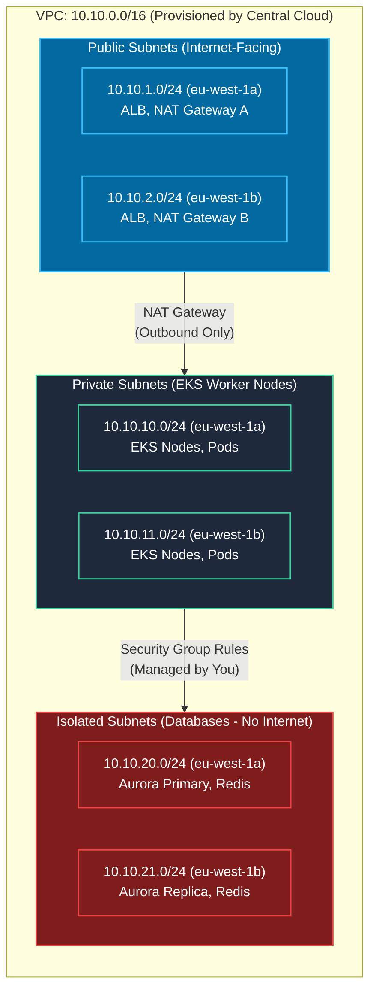

**How your team interacts with this via IaC:**
We do not hardcode subnets. Our Terraform uses `data` sources (or remote state lookups) to dynamically fetch the isolated subnets provisioned by Central Cloud to deploy our Redis and Aurora clusters:
```hcl
data "aws_subnets" "isolated" {
  filter {
    name   = "tag:Tier"
    values = ["Isolated"]
  }
}
```

## 14.2 Managing App-Level Security Groups (Your Responsibility)

While Tier 1 manages Network ACLs (stateless subnet firewalls), your team is accountable for **Security Groups** (stateful ENI firewalls). 
- We configure the RDS Security Group to only allow ingress on port `5432` originating from the EKS Node Security Group.
- We configure EKS Ingress rules to only accept traffic from the AWS Application Load Balancer.

## 14.3 How the Payment Service Reaches External Banks

The `payment-service` must call external bank APIs (Stripe, Visa) over the public internet, and banks require fixed whitelisted IPs. 
- **The Flow:** Pods in private subnets route outbound traffic through Tier 1's NAT Gateways.
- **The Solution:** We collaborated with Central Cloud to allocate **Static Elastic IPs (EIPs)** to the NAT Gateways. We then share these 3 EIPs with the acquiring banks for whitelisting.

---

# 15. EKS Cluster Upgrades (The App-DevOps Partnership)

*"How do you handle EKS upgrades?"* — Because Central Cloud owns the control plane, your answer must reflect cross-team collaboration. 

## 15.1 The Shared-Responsibility Upgrade Workflow

You cannot skip versions (e.g., 1.28 → 1.30 is not allowed). Upgrades are a coordinated dance between Tier 1 and Tier 2.

1. **Phase 1: Pre-Upgrade Compatibility Audit (Owned by Your Team)**
   - **Action:** Before Tier 1 touches the cluster, we scan our `gitops-manifests` repository for deprecated APIs (e.g., `policy/v1beta1` being removed).
   - **Tooling:** We run `pluto` or `kubeconform` in our CI pipeline to detect depreciations.
   - **Sign-off:** We upgrade our Helm charts to compatible `apiVersion`s and give Tier 1 the green light.

2. **Phase 2: Control Plane Upgrade (Owned by Central Cloud)**
   - Tier 1 updates the cluster version via their Terraform. 
   - EKS upgrades the managed control plane (API server, etcd) with zero downtime. 

3. **Phase 3: Worker Node Rolling Upgrade & Application Draining (Shared)**
   - Tier 1 updates the Managed Node Group AMI and initiates a rolling node replacement.
   - **Your Crucial Role:** We ensure every microservice has a `PodDisruptionBudget` (`minAvailable: 1` or `60%`) and proper `topologySpreadConstraints`. 
   - When Tier 1 cordons and drains a node, Kubernetes respects our PDBs, ensuring our Cart and Payment APIs never lose availability while pods are re-scheduled to the new nodes.

4. **Phase 4: Post-Upgrade Observability Validation**
   - We monitor our Grafana 4 Golden Signals dashboards to ensure latency and error rates remain stable as the new nodes take traffic.

# 16. Disaster Recovery, Backup & High Availability Strategy

*"What happens if your entire AZ goes down?"* or *"What's your DR strategy?"* — A 7-year engineer must have clear answers here.

## 16.1 HA vs. DR: The Distinction

| Concept | Scope | Mechanism | Recovery Time |
| :--- | :--- | :--- | :--- |
| **High Availability (HA)** | Survives **single AZ failure** | Multi-AZ deployments (3 replicas across 3 AZs), Aurora Multi-AZ failover | Seconds to minutes (automatic) |
| **Disaster Recovery (DR)** | Survives **full region failure** | Cross-region Aurora Global Database, S3 Cross-Region Replication, standby EKS cluster | Minutes to hours (manual failover) |

## 16.2 Per-Service Backup & Recovery

| Component | Backup Mechanism | RPO (Data Loss Tolerance) | RTO (Recovery Time) |
| :--- | :--- | :--- | :--- |
| **Aurora PostgreSQL** | Automated daily snapshots (35-day retention) + continuous backups (Point-in-Time Recovery to any second within 35 days) | ~5 minutes (PITR) | ~15 minutes |
| **ElastiCache Redis** | Daily RDB snapshots to S3 (7-day retention). Note: Redis is ephemeral cache—data loss is acceptable if the source of truth (Aurora/DynamoDB) is intact. | Hours (cache rebuild) | ~10 minutes |
| **DynamoDB** | Point-in-Time Recovery (PITR) enabled. On-demand backups before major releases. | ~5 minutes | ~30 minutes |
| **EKS Cluster State** | All manifests in Git (GitOps). Cluster can be fully reconstructed from `infra-terraform` + `gitops-manifests` repos. Velero snapshots for PersistentVolumes. | Zero (declarative Git) | ~1 hour (full rebuild) |
| **S3 Assets** | Versioning enabled + Cross-Region Replication (CRR) to `eu-central-1`. | Zero (real-time replication) | Minutes |

---

# 17. Git Branching Strategy & Code Review Culture

*"What branching model do you use?"* — A simple but important question.

## 17.1 Trunk-Based Development (Application Repos)

Dev squads use **Trunk-Based Development** with short-lived feature branches:
- **`main`** branch is always deployable. Protected with branch protection rules.
- Developers create **feature branches** (`feature/JIRA-1234-add-voucher-logic`), work for 1–3 days max, then open a PR.
- PRs require: 1 peer approval + all CI checks green (unit tests, SonarQube, Trivy, linting).
- Merge strategy: **Squash and Merge** (clean linear history, one commit per feature).
- No long-lived `develop` or `release` branches. Release candidates are tagged on `main` (e.g., `v2.4.0`).

## 17.2 GitOps Manifests Repo (Stricter Controls)

The `gitops-manifests` repository has elevated protection because merging to it directly triggers production deployments:
- PRs to `overlays/prod/` require **Tech Lead approval** + **Release Manager sign-off**.
- Branch protection: No force-push, no direct commits, mandatory CI status checks.
- Every merge to `main` generates an audit log entry linked to the Jira Change Request.

---

# 18. Interview Preparation: Day-to-Day, Key Numbers & Anticipated Follow-Up Questions

This section is the interview survival kit. It covers what textbooks and architecture documents never teach—how to *narrate* your experience convincingly.

## 18.1 "Walk Me Through Your Typical Day"

> *This is often the opening question. It sets the tone for the entire interview. A weak answer ("I deploy stuff and fix issues") kills credibility immediately.*

**Sample Narrative (adapt to your own voice):**

*"I typically start around 9:15 AM by checking our Grafana dashboards — specifically the 4 Golden Signals panels for our 5 Commerce microservices. I scan for any overnight latency spikes or error rate breaches that Alertmanager may have fired to our `#prod-alerts` Slack channel.*

*At 9:30 we have a 15-minute DevOps standup where the On-Call Shield summarizes overnight alerts and any developer tickets in the helpdesk queue. I'm currently one of the Squad Liaisons, so I share updates on infra work I'm doing for the Cart and Payment dev squads.*

*On a typical morning, I might be working on a Terraform module — say, provisioning a new SQS FIFO queue that the Payment squad needs for an upcoming retry mechanism. I write the module, run `terraform plan`, verify the diff, and raise a PR for peer review.*

*After lunch, I might review a PR from another engineer who's updating the Helm values for the Catalog service — maybe they're bumping the JVM memory limit after we saw an OOMKilled incident last week. I check that the numbers make sense relative to the node group capacity and the ResourceQuota.*

*Twice a week, I attend the Cart & Payment dev squad's backlog refinement to understand upcoming features and pre-identify cloud dependencies — like if they're planning a new webhook feature, I know I'll need to provision an API Gateway or an SQS queue ahead of time.*

*On release days (Thursdays), I'm watching the ArgoCD sync and the Grafana dashboards closely during the 10 AM release window. If something looks off — say the error rate ticks above 2% — we hold the rollout and investigate before proceeding."*

---

## 18.2 Key Numbers & Metrics to Memorize

Interviewers test depth by asking for specifics. Vague answers like "we have many services" or "we deploy often" signal surface-level experience. Have these numbers ready:

| Metric | Your Answer |
| :--- | :--- |
| **Total microservices in the platform** | 30+ across 4 domains. My squad owns 5. |
| **Team size** | 7 DevOps engineers supporting ~30 developers across 5 dev squads. |
| **Deployment frequency** | 8–12 production deployments per sprint (biweekly). Daily deploys to dev/qa. |
| **CI pipeline duration** | Optimized from 18 minutes down to ~3.5 minutes using BuildKit caching + parallel jobs. |
| **EKS cluster version** | Currently on 1.29, upgrading to 1.30 this quarter. |
| **Node count (Prod)** | ~15–25 worker nodes across 5 node groups (scales dynamically via Karpenter). |
| **Pod count (Commerce namespace)** | ~40–80 pods at steady state; bursts to ~150 during peak traffic. |
| **Uptime SLA** | 99.95% target (translates to ~22 minutes of allowed downtime/month). |
| **MTTR (Mean Time to Recovery)** | Under 15 minutes for Severity-1 incidents (thanks to GitOps rollback). |
| **Container image size** | ~80–120MB (multi-stage builds from ~900MB originals). |
| **Environments** | 4 tiers: Dev → QA → Staging → Prod. |
| **IaC coverage** | 100% of cloud infrastructure is Terraform-managed. Zero manual AWS Console resources. |

---

## 18.3 Anticipated Deep Follow-Up Questions & How to Answer Them

### On Architecture & Kubernetes:

**Q: "Why not just use one big namespace for all 30 services?"**
> Because namespaces provide RBAC isolation (my team can't accidentally delete Billing pods), ResourceQuota budgeting (one team can't starve another's CPU), NetworkPolicy boundaries, and independent ArgoCD deployment pipelines. Without namespaces, a single misconfigured `kubectl delete deployment` could wipe out another team's production service.

**Q: "If namespaces are just soft boundaries, why not use separate clusters per team?"**
> Cost and operational overhead. Each EKS cluster has a fixed control plane cost (~$73/month) and requires separate monitoring, RBAC, networking, and add-on management. With 4 domains, that's 4× the operational burden. The trade-off is to use a shared cluster with dedicated node groups (hardware isolation via Taints/Tolerations) and strict RBAC/NetworkPolicies. Only the Payment service gets extra isolation due to PCI-DSS compliance requirements.

**Q: "What happens if Karpenter provisions a node but the pod still doesn't schedule?"**
> Common causes: the pod's `nodeSelector` or `tolerations` don't match the provisioned node's labels/taints, or the pod's resource requests exceed any single node's allocatable capacity. I'd check `kubectl describe pod <name>` for the Events section — it shows the exact scheduling failure reason. If it's a taint mismatch, I fix the Karpenter `NodePool` spec. If it's oversized requests, I right-size the container resources.

### On CI/CD:

**Q: "Why separate repos for app code and GitOps manifests?"**
> To break the infinite loop. If manifests lived in the app repo, every CI run would update the manifest, which would trigger another CI run, which would update the manifest again. Separating them also gives different access controls — developers can merge app code freely, but production manifest changes require Tech Lead approval.

**Q: "What if a production deployment causes errors — how do you roll back?"**
> `git revert <commit-sha>` on the GitOps manifests repo and sync ArgoCD. Pods roll back to the previous image tag in under 30 seconds. No CI rebuild needed — the old image is still in ECR. This is the key advantage of GitOps: the cluster converges to whatever state is declared in Git.

**Q: "How do you handle database migrations during a rolling update?"**
> We use the Expand/Contract pattern. First release: schema migration adds new nullable columns (backward-compatible). Second release: new code starts writing to new columns. Third release: old columns are dropped. Migrations run as Kubernetes Helm pre-upgrade hooks (Job resources) that execute *before* the new pods start.

### On Observability:

**Q: "How do you trace a request across multiple microservices?"**
> OpenTelemetry injects a `traceparent` W3C header at the Ingress layer. Each service propagates this header downstream. Jaeger/Tempo collects spans from all services and stitches them into a single trace. In Grafana, I can see a waterfall view: Auth took 12ms, Cart took 45ms, Payment took 200ms (the bank API was slow). This immediately pinpoints where latency lives.

**Q: "Your CoreDNS incident — how did you actually diagnose it?"**
> First symptom: all 5 services started throwing 502s simultaneously. That ruled out any single service bug — it had to be shared infrastructure. I ran `kubectl top pods -n kube-system -l k8s-app=kube-dns` and saw both CoreDNS pods at 100% CPU. Then `kubectl logs` showed `plugin/errors: SERVFAIL` messages. The 2 default replicas couldn't handle DNS queries from 300+ pods. Immediate fix: scale to 6 replicas. Permanent fix: deploy NodeLocal DNSCache as a DaemonSet so every node caches DNS locally.

### On Terraform & IaC:

**Q: "What happens if someone manually changes something in the AWS Console?"**
> Configuration drift. Terraform won't know about it until the next `terraform plan`, which will show the drift as a diff. We enforce a strict policy: no manual Console changes. All changes go through Terraform PRs. We also run weekly `terraform plan` audits in CI to detect any drift and alert the team.

**Q: "How do you handle Terraform state corruption?"**
> S3 versioning is enabled on the state bucket, so we can restore a previous version. DynamoDB locking prevents concurrent corruption. For extreme cases, `terraform import` can re-associate existing resources with state entries. We've never had full corruption because of these safeguards.

### On Security:

**Q: "How do your pods authenticate to AWS services without access keys?"**
> IRSA — IAM Roles for Service Accounts. Each pod runs under a Kubernetes ServiceAccount annotated with an AWS IAM Role ARN. The EKS Pod Identity Webhook injects an OIDC token. The AWS SDK inside the container calls `sts:AssumeRoleWithWebIdentity` with this token, and AWS STS returns temporary credentials valid for 1 hour. Zero static keys anywhere.

**Q: "What if someone commits a secret to Git accidentally?"**
> Three layers of defense. First: `gitleaks` pre-commit hooks block it locally before it's even committed. Second: CI runs Trivy secret scanning on every PR — even if the pre-commit hook is bypassed, CI fails. Third: if it somehow reaches the remote, GitHub's Secret Scanning sends an automated alert, and our runbook requires immediate rotation of the compromised credential plus a `git filter-branch` or BFG Repo-Cleaner to scrub Git history.

### Behavioral / Situational:

**Q: "Tell me about a time you disagreed with a decision."**
> *(Use the STAR framework: Situation, Task, Action, Result.)*
> *"When we first designed the multi-tenant cluster, the Central Cloud team wanted to put all 30+ services on a single shared node group to simplify management. I pushed back because of the PCI-DSS scope issue with Payment. I prepared a cost comparison showing that a dedicated 2-node payment node group would cost only ~$150/month extra but would dramatically reduce PCI audit scope. The architecture review board agreed, and we implemented dedicated tainted node groups per domain."*

**Q: "Describe a production incident you handled."**
> *(Pick Incident #2 — OOMKilled — it has the richest technical depth.)*
> *"At 2 AM, PagerDuty alerted us that the Catalog service was CrashLooping. I SSHed into the context, ran `kubectl describe pod` and saw 'Last State: Terminated, Reason: OOMKilled, Exit Code: 137'. The JVM was configured with `-Xmx1024m` inside a container with a 1Gi limit — the heap plus Metaspace plus native memory exceeded the cgroup limit, and the Linux kernel's OOM Killer terminated the process. I immediately bumped the limit to 2Gi via a Helm values PR and rolling-restarted. The permanent fix was switching to `-XX:MaxRAMPercentage=75.0` so the JVM dynamically sizes its heap to 75% of the container limit, leaving 25% headroom for Metaspace and OS overhead."*

---

## 18.4 General Troubleshooting Framework (For Any Unknown Issue)

When asked *"How do you troubleshoot a production issue you've never seen before?"*, use this structured approach:

1. **Scope the Blast Radius**: Is it one service, one namespace, or the entire cluster? If all 5 services are failing, it's shared infrastructure (CoreDNS, Ingress, node health). If only Cart is failing, it's Cart-specific (code bug, Redis, resource limits).

2. **Check the 4 Golden Signals**: Latency up? Errors up? Traffic drop? Saturation (CPU/Memory)?

3. **Inspect Pod Health**:
   ```bash
   kubectl get pods -n commerce-prod -o wide      # Are pods Running, Pending, CrashLoopBackOff?
   kubectl describe pod <name> -n commerce-prod    # Check Events section for scheduling/OOM/probe failures
   kubectl logs <name> -n commerce-prod --previous # Previous container logs (if restarted)
   kubectl top pod <name> -n commerce-prod         # Real-time CPU/Memory consumption
   ```

4. **Check Upstream Dependencies**: Is the database healthy? Is Redis responding? Is the SQS queue backed up?
   ```bash
   # Aurora: Check connection count and CPU via CloudWatch or RDS Console
   # Redis: Check via redis-cli or CloudWatch EngineCPUUtilization
   # SQS: Check ApproximateNumberOfMessagesVisible via AWS CLI
   aws sqs get-queue-attributes --queue-url <url> --attribute-names ApproximateNumberOfMessagesVisible
   ```

5. **Correlate Across Traces**: Open Jaeger/Grafana Tempo, search by `traceID` from the error log, and follow the span waterfall to find where the chain breaks.

6. **Mitigate First, Root-Cause Later**: Scale up replicas, increase memory limits, restart pods, or rollback the last deployment. Stop the bleeding. Then write a blameless post-mortem with the 5 Whys.

---

## 18.5 Common "Trap" Questions & How to Handle Them

**"What is your biggest weakness in DevOps?"**
> Never say "I don't have any." Pick something real but show growth: *"Networking was my weakest area early on — I could deploy services but struggled with VPC peering and Transit Gateway routing. I dedicated time to studying AWS networking through hands-on labs and now I'm comfortable designing multi-account VPC architectures with private subnets and NAT Gateways."*

**"Why are you leaving your current role?"**
> Keep it positive and growth-oriented: *"I've built strong expertise in EKS, GitOps, and Terraform at my current role, but the platform has matured to a steady state. I'm looking for a role where I can tackle new challenges — perhaps multi-region architectures, service mesh adoption, or building an Internal Developer Platform from scratch."*

**"Do you have experience with [technology you don't know]?"**
> Be honest but bridge to what you know: *"I haven't worked with Istio in production, but I understand the problem it solves — mTLS between services, traffic splitting for canary deployments, and fine-grained observability. In my current setup, we handle mTLS at the ALB/Ingress level and use ArgoCD Rollouts for canary. I'd be excited to learn Istio in a production context."*

---

## 18.6 Tools You Should Be Able to Name & Explain (Daily Toolkit)

| Category | Tools You Use Daily | Quick Explanation |
| :--- | :--- | :--- |
| **Container Runtime** | Docker, containerd, BuildKit | BuildKit = parallel layer builds + GHA cache |
| **Container Orchestration** | Kubernetes (Amazon EKS) | Manages pod scheduling, scaling, self-healing |
| **IaC** | Terraform (HCL), Terraform Cloud/Atlantis | Declarative cloud provisioning with state management |
| **CI/CD** | GitHub Actions, ArgoCD | Actions = build/test/scan; ArgoCD = GitOps deploy |
| **Package Management** | Helm, Kustomize | Helm = templated charts; Kustomize = overlay patching |
| **Observability** | Prometheus, Grafana, Loki, Jaeger, OTel | Metrics, dashboards, logs, distributed tracing |
| **Security Scanning** | Trivy, Gitleaks, SonarQube | Container CVEs, secret detection, static analysis |
| **Secrets** | AWS Secrets Manager, External Secrets Operator | Runtime injection, no secrets in Git |
| **Cloud Provider** | AWS (EKS, Aurora, ElastiCache, SQS, DynamoDB, S3, IAM, VPC) | Core cloud services |
| **CLI Tools** | `kubectl`, `helm`, `terraform`, `aws`, `argocd`, `k9s`, `git` | Daily terminal tools |
| **Scripting** | Python, Bash/Shell | Automation scripts, CronJobs, FinOps |
| **Collaboration** | Jira, Confluence, Slack, PagerDuty | Ticketing, docs, comms, incident alerting |

---

# 19. The Master Whiteboard: X-Ray Vision of AWS, EKS, and Microservices

If an interviewer asks you to draw your architecture or trace a request from the browser all the way down to the database, this is the exact physical and logical mapping you should explain. It perfectly demonstrates how AWS networking (VPCs, Subnets, EC2 Nodes) overlaps with Kubernetes logic (Namespaces, Services, Pods).

## 19.1 The Ground-Level Physical & Logical Architecture Diagram

```mermaid
flowchart TB
    Internet(("Internet Client<br/>api.nexora.com/cart"))

    subgraph AWS["AWS Cloud (Region: eu-west-1)"]
        R53["Route 53 DNS<br/>A-Record: api.nexora.com"]
        
        subgraph VPC["Shared Production VPC (CIDR: 10.10.0.0/16)"]
            
            subgraph Public["Public Subnets (Multi-AZ)"]
                ALB["AWS Application Load Balancer<br/>(Listens on 443, SSL Terminated)"]
                NAT["NAT Gateways<br/>(Egress to Stripe/Visa)"]
            end

            subgraph Private["Private Subnets (Multi-AZ: 10.10.10.0/24 & 10.10.11.0/24)"]
                
                subgraph EKS["Amazon EKS Cluster (Control Plane managed by AWS)"]
                    
                    subgraph NG_Sys["EC2 Node Group: 'System-Nodes' (m5.large)"]
                        subgraph NS_Sys["Namespace: ingress-system"]
                            IngressCtrl["K8s Pods: AWS Load Balancer Controller"]
                        end
                        subgraph NS_Kube["Namespace: kube-system"]
                            CoreDNS["K8s Pods: CoreDNS (Internal Service Discovery)"]
                        end
                    end

                    subgraph NG_Comm["EC2 Node Group: 'Commerce-Nodes' (c6g.2xlarge - Graviton)"]
                        subgraph NS_Comm["Namespace: commerce-prod (Your Team)"]
                            
                            subgraph Svc_Cart["K8s Service: cart-service (ClusterIP)"]
                                Pod_Cart1("K8s Pod: cart-5x7q (Python/FastAPI Container)")
                                Pod_Cart2("K8s Pod: cart-9y2p (Python/FastAPI Container)")
                            end
                            
                            subgraph Svc_Pay["K8s Service: payment-service (ClusterIP)"]
                                Pod_Pay1("K8s Pod: pay-1a2b (Go Binary Container)")
                                Pod_Pay2("K8s Pod: pay-3c4d (Go Binary Container)")
                            end
                            
                            Svc_Auth["K8s Service: auth-service (4 Pods)"]
                            Svc_Cat["K8s Service: catalog-service (4 Pods)"]
                            Svc_Notif["K8s Service: notif-disp (2 Pods)"]
                        end
                    end

                    subgraph NG_Gen["EC2 Node Group: 'General-Compute-Nodes' (m6i.4xlarge)"]
                        subgraph NS_Bill["Namespace: billing-prod"]
                            Svc_Bill["6 K8s Services<br/>(Invoice, Ledger, Tax...)<br/>~30 Pods running on these EC2s"]
                        end
                        subgraph NS_CRM["Namespace: crm-prod"]
                            Svc_CRM["8 K8s Services<br/>(Chat, Ticket, C360...)<br/>~40 Pods running on these EC2s"]
                        end
                        subgraph NS_OSS["Namespace: telco-oss-prod"]
                            Svc_OSS["11+ K8s Services<br/>(SIM, Roaming...)<br/>~50 Pods running on these EC2s"]
                        end
                    end
                    
                end
            end

            subgraph Isolated["Isolated Subnets (Multi-AZ: 10.10.20.0/24) - NO INTERNET"]
                DB_Comm[(Aurora PostgreSQL DB Cluster<br/>Databases: auth_db, catalog_db)]
                Redis_Cart[(ElastiCache Redis<br/>Cart Transient State)]
                DB_Bill[(Aurora PostgreSQL DB Cluster<br/>Billing Data)]
                DB_CRM[(Aurora PostgreSQL DB Cluster<br/>CRM Data)]
            end
        end
        
        subgraph Serverless["AWS Serverless / API (Outside VPC)"]
            SQS[[SQS FIFO Queue<br/>Payment Events]]
            DDB[(DynamoDB Table<br/>Payment Ledger)]
        end
    end

    %% External routing
    Internet --> R53
    R53 -->|Resolves to| ALB
    ALB -->|Target Group routes to NodePorts| IngressCtrl

    %% Internal Ingress Routing
    IngressCtrl -->|Evaluates path /cart| Svc_Cart
    IngressCtrl -->|Evaluates path /payment| Svc_Pay
    IngressCtrl -->|Evaluates path /billing| Svc_Bill

    %% EKS to Database / Serverless Routing
    Pod_Cart1 -.->|TCP 6379| Redis_Cart
    Pod_Cart2 -.->|TCP 6379| Redis_Cart
    
    Pod_Pay1 -.->|TCP 5432| DB_Comm
    Pod_Pay2 -.->|IAM/HTTPS| DDB
    Pod_Pay1 -.->|IAM/HTTPS| SQS
    
    %% Egress Routing
    Pod_Pay2 -.->|Outbound Bank API| NAT
    
    classDef aws fill:#ff9900,stroke:#232f3e,stroke-width:2px,color:#232f3e,font-weight:bold;
    classDef vpc fill:#0369a1,stroke:#38bdf8,stroke-width:2px,color:#fff;
    classDef pub fill:#bae6fd,stroke:#0284c7,stroke-width:1px,color:#0f172a;
    classDef priv fill:#1e293b,stroke:#34d399,stroke-width:2px,color:#fff;
    classDef iso fill:#7f1d1d,stroke:#ef4444,stroke-width:2px,color:#fff;
    classDef k8s fill:#326ce5,stroke:#fff,stroke-width:1px,color:#fff;
    classDef pod fill:#0ea5e9,stroke:#fff,stroke-width:1px,color:#fff;
    
    class AWS aws;
    class VPC vpc;
    class Public pub;
    class Private,EKS priv;
    class Isolated iso;
    class NS_Comm,NS_Sys,NS_Kube,NS_Bill,NS_CRM,NS_OSS k8s;
    class Pod_Cart1,Pod_Cart2,Pod_Pay1,Pod_Pay2 pod;
```

## 19.2 Step-by-Step Interview Narrative

When asked to trace a request, walk through these 5 layers:

1. **DNS & Subdomain Routing (The Outer Edge)**
   *"The user navigates to `api.nexora.com/cart`. **Route 53** holds the A-Record for the `api` subdomain, which points to the **AWS Application Load Balancer (ALB)** living in our Public Subnets."*

2. **The VPC & Kubernetes Bridge (Ingress)**
   *"The ALB terminates SSL and forwards the traffic into our Private Subnets, hitting the EC2 instances (EKS Worker Nodes). Specifically, it hits the NodePorts opened by the **AWS Load Balancer Controller** pods running in the `ingress-system` namespace. The Ingress controller looks at the URL path (`/cart`) and uses Kubernetes internal rules to route traffic to the **Kubernetes Service** named `cart-service`."*

3. **Kubernetes Logical Abstraction (Namespaces & Services)**
   *"Inside the cluster, we use **Namespaces** to logically separate the 30 microservices. The 5 Commerce services live in `commerce-prod`, while the 6 Billing services live in `billing-prod`. The `cart-service` acts as an internal load balancer (ClusterIP). It uses iptables/kube-proxy to round-robin the traffic to the actual healthy **Pods** (e.g., `cart-pod-1` or `cart-pod-2`)."*

4. **Kubernetes Physical Layer (Node Groups & Pods)**
   *"Namespaces are just logical, but we also enforce **physical node isolation** using EKS Node Groups with Taints and Tolerations. The `kube-system` pods run on dedicated system EC2 nodes. The 25 billing/CRM/OSS services run on a massive pool of General Compute EC2 nodes. Our 5 Commerce services run on a dedicated Node Group of Graviton EC2 instances. So when traffic hits `cart-pod-1`, that container is physically executing on a specific Commerce EC2 instance inside the Private Subnet."*

5. **Connecting to the Dependents (Databases & AWS Services)**
   *"Once the code inside `cart-pod-1` executes, it needs to save the user's shopping cart. Because the pod is sitting in a Private Subnet, it can route traffic down into our **Isolated Subnets** to talk to the **ElastiCache Redis** cluster on port 6379. If this was the Payment Pod, it might need to write to **DynamoDB** or **SQS**. Because those are serverless, the pod's traffic leaves the EC2 instance, traverses the AWS backbone via VPC Endpoints, and authenticates to DynamoDB securely using its IRSA (IAM Role for Service Account) token."*
