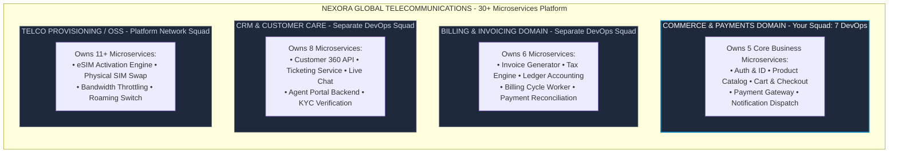

# The Master Cloud & DevOps Engineering Blueprint
### Ground-Level Enterprise Architecture, Multi-Tenant Kubernetes, Workload Sizing Math, CI/CD Pipelines, and Operational Reliability

---

## Table of Contents
1. [Enterprise Architecture & Team Operating Model](#1-enterprise-architecture--team-operating-model)
2. [The 5 Core Microservices: Ground-Level Anatomy & Execution Runtimes](#2-the-5-core-microservices-ground-level-anatomy--execution-runtimes)
3. [Enterprise Cloud & AWS Infrastructure Isolation Strategy](#3-enterprise-cloud--aws-infrastructure-isolation-strategy)
4. [Multi-Tenant Kubernetes (Amazon EKS): Real-World vs. Textbook Theory](#4-multi-tenant-kubernetes-amazon-eks-real-world-vs-textbook-theory)
5. [Workload Sizing, HPA Mathematics & Karpenter Autoscaling (The "3 Replicas" Story)](#5-workload-sizing-hpa-mathematics--karpenter-autoscaling-the-3-replicas-story)
6. [Continuous Integration (CI) Pipeline Engineering](#6-continuous-integration-ci-pipeline-engineering)
7. [Continuous Delivery (CD), GitOps & 4-Tier Promotion Engine](#7-continuous-delivery-cd-gitops--4-tier-promotion-engine)
8. [Production Observability, Metrics & Telemetry Deep Dive](#8-production-observability-metrics--telemetry-deep-dive)
9. [Operational Automations, Python Scripting & FinOps](#9-operational-automations-python-scripting--finops)
10. [The Production Incident Triage Playbook (5 Real-World Incidents)](#10-the-production-incident-triage-playbook-5-real-world-incidents)
11. [The 5 Critical Architectural Challenges & Engineering Solutions](#11-the-5-critical-architectural-challenges--engineering-solutions)

---

# 1. Enterprise Architecture & Team Operating Model

### 1.1 The Enterprise Context: Nexora Global Telecommunications
To establish an authentic, real-world foundation, all technical systems are modeled on **Nexora Global Telecommunications** (reflecting enterprise telecom GCC environments like *Vodafone / _VOIS*). 

Nexora operates a platform of **30+ backend microservices** serving millions of mobile subscribers, prepaid/postpaid billing cycles, e-SIM activations, and payment transactions across multiple European and Asian markets. 

In a massive enterprise like this, you do not just have one monolithic tech team. The organization is split logically into **Domains**, each representing a core business function.

### 1.2 The Evolution of DevOps: Why Centralized Teams Fail
Historically, companies used a **Centralized DevOps Team**. A single pool of 5–10 engineers would manage infrastructure for 20+ product teams. This inevitably turned the DevOps team into a severe operational bottleneck. Every time a developer needed an S3 bucket or a pipeline tweak, they had to file a Jira ticket and wait weeks.

To solve this, Nexora uses a **Domain-Aligned Hybrid Model** operating across 3 tiers. There is a Central Cloud team (Tier 1) that provisions the bare-metal AWS accounts and the base Kubernetes clusters. However, your team—the **Domain DevOps Squad** (Tier 2)—sits directly between the cloud foundation and the software developers. You are the enablers. You own the CI/CD pipelines, the application-level infrastructure (like Redis and SQS), and the multi-environment GitOps delivery for your specific Commerce domain.

### 1.3 Inside the 7-Member DevOps Squad: The On-Call Shield Story
In a mature enterprise, 7 DevOps engineers do not just pull random tickets from a board. Work is structured dynamically to prevent burnout and context-switching.

The number one reason DevOps teams fail to deliver on their sprint commitments is constant, unstructured developer interruptions (*"My build failed"*, *"Why is this pod pending in staging?"*, *"Can you give me database access?"*). 

To combat this, the squad employs an **On-Call Shield**. This is a weekly rotating role. For one entire week, one engineer handles 100% of the Slack interruptions in `#devops-helpdesk`, triages failing CI builds, and acts as the primary incident responder. Because this one person acts as a shield, the other 6 engineers are completely protected from context-switching and can focus exclusively on delivering deep, complex architectural work (like upgrading EKS versions or rewriting Terraform modules).

Additionally, the squad relies on **Squad Liaisons**. These are dedicated high-touch contacts for the Dev Squads. For example, one engineer attends the Cart & Payment squad's backlog refinement meetings, translating their product feature requirements into actual cloud resources (like knowing they will need an SQS FIFO queue for a new payment feature).

---

# 2. The 5 Core Microservices: Ground-Level Anatomy & Execution Runtimes

It is critical to distinguish between the **Programming Language** (the human-readable syntax in the Git repository) and the **Runtime Environment** (the actual engine executing instructions on the CPU, managing memory, and handling OS syscalls).

### The Journey of a Customer Request
Imagine a customer on their mobile phone buying a new 5G data plan. 
1. Their browser hits `checkout.nexora.com`. The traffic lands on an **AWS Application Load Balancer (ALB)**, which terminates the TLS encryption.
2. The ALB routes the request into the Kubernetes cluster. The request first hits the **`auth-service`** (Node.js 20). Because Node.js uses an asynchronous event loop (`libuv`), it is incredibly efficient at I/O-bound tasks. It can rapidly validate the user's JWT by checking against a Redis blacklist without consuming much RAM.
3. The user browses plans via the **`catalog-service`** (Java 17 SpringBoot). This service is compute and memory-bound. It uses the HotSpot JVM and Hibernate ORM to map complex relational data from an Aurora PostgreSQL read-replica into JSON models, utilizing local in-memory caches (Caffeine) for speed.
4. The user adds the plan to their cart via the **`cart-service`** (Python 3.11 FastAPI). This service leverages `async/await` and Pydantic for rapid data validation, storing the highly transient shopping cart state directly into a dedicated Redis cluster, avoiding heavy disk-based database writes.
5. The user checks out. The request hits the **`payment-service`** (Go 1.22 Native Binary). Go is chosen here for its deterministic concurrency and static type safety. There are no unpredictable Garbage Collection pauses that might drop a banking transaction. The Go binary writes an idempotency record to AWS DynamoDB, reaches out to an external bank via a static NAT Gateway IP, and upon success, publishes a `PaymentCompletedEvent` to an SQS FIFO queue.
6. Finally, the **`notif-service`** (Node.js 20 Worker) acting as a headless background consumer, long-polls that SQS queue. It picks up the event and dispatches an SMS receipt via AWS SNS and Twilio.

This orchestration shows how different runtimes are selected based on the exact compute profile (I/O vs CPU vs Deterministic Reliability) of the business capability.

---

# 3. Enterprise Cloud & AWS Infrastructure Isolation Strategy

### 3.1 The Realities of Database and Memory Isolation
In textbook examples, developers often point multiple microservices to a single massive database. In a true enterprise, this creates a catastrophic single point of failure and tight coupling.

While Nexora uses a shared **Aurora PostgreSQL** cluster engine to save the $1,000+/month cost of running multiple physical clusters, the data is heavily isolated into **Logical DBs** (`auth_db`, `catalog_db`). PostgreSQL IAM and role privileges strictly enforce that the `catalog-service` cannot accidentally read `auth_db` tables.

For **Redis**, however, isolation must be physical. Redis is memory-bound. If memory is exhausted, its eviction policy (`allkeys-lru`) discards older keys. If `auth-service` and `cart-service` shared a Redis cluster, a massive flash sale (Black Friday) would cause an explosion of shopping cart data. This would physically evict the user authentication tokens, forcibly logging out thousands of users across the platform. Therefore, `auth-redis` and `cart-redis` run on completely separate, dedicated physical AWS ElastiCache clusters.

---

# 4. Multi-Tenant Kubernetes (Amazon EKS): Real-World vs. Textbook Theory

### 4.1 The Textbook Concept vs. The Real-World Gap
A highly common enterprise pattern is running a single shared EKS cluster per environment (e.g., `nexora-prod-eks`) and partitioning it using **Domain-Specific Namespaces** (`commerce-prod`, `billing-prod`, `crm-prod`). Cost and operational overhead make dedicating an entire EKS cluster per team unrealistic for most organizations. 

However, the textbook version of multi-tenancy often glosses over how this is actually achieved securely in the real world. "Zero-trust default-deny" NetworkPolicies are often aspirational, not actually rolled out. 

**The Real-World Gaps:**
1. **NetworkPolicy Enforcement Isn't Free**: Historically, the default AWS VPC CNI did not enforce NetworkPolicies at all. You could write all the NetworkPolicy YAML you wanted, and Kubernetes would silently ignore it. To make them work, you either had to install Calico/Cilium as an add-on, or explicitly enable the AWS VPC CNI's native NetworkPolicy support.
2. **Namespaces are a Soft Boundary**: Namespaces share the control plane, etcd, the Linux kernel, and the worker nodes. A memory leak or a container escape in the `crm-prod` namespace can completely starve or compromise neighbor pods in `commerce-prod` if they live on the same physical EC2 instance.
3. **Missing Admission Control**: Real hardened clusters do not just rely on RBAC. They run admission controllers (Pod Security Admission, OPA/Gatekeeper, or Kyverno) to actively block risky pod specs cluster-wide, such as privileged containers or `hostPath` mounts.

### 4.2 Hard Compute Isolation: The Node Group Topology
Because namespaces are only soft boundaries, true isolation must happen at the hardware layer using **Dedicated Managed Node Groups**, tied together via Kubernetes Taints and Tolerations.

Instead of a massive shared pool of worker nodes, the cluster is divided into specific node groups mapped to subdomains:

*   **`system-ng`**: Small, stable nodes (`m7g.large`) dedicated to CoreDNS, the ALB controller, Karpenter, and monitoring agents. These critical system controllers should never compete for CPU against a crashing application pod.
*   **`commerce-ng`**: Sized to Commerce's traffic profile (`m7g.2xlarge`). It runs Auth, Catalog, Cart, and Notification.
*   **`billing-ng` & `crm-ng`**: Dedicated nodes for those specific teams, with CRM potentially using memory-optimized (`r7g`) instances for heavy cache lookups.
*   **`telco-oss-ng`**: The largest workload pool handling heavy provisioning logic.

### 4.3 The PCI-DSS Auditor Story: Isolating the Payment Service
The biggest red flag in textbook multi-tenancy is blindly placing a `payment-service` inside a shared node group alongside 25+ unrelated services. 

If you are handling raw credit card data, a Qualified Security Assessor (QSA - the PCI auditor) will push aggressively on **scope reduction**. If your Cardholder Data Environment (CDE) shares infrastructure with non-CDE workloads (like the CRM or Ticketing service), you have to prove perfect segmentation. Proving this with just namespaces and NetworkPolicies is an incredibly painful audit conversation.

To avoid this audit burden, enterprises do one of two things:
1. **The Node-Level Fix**: Create a dedicated node group (`commerce-payment-ng`) strictly for the payment gateway. Apply a hard Taint (`dedicated=pci-payment:NoSchedule`). The payment pods are given a Toleration for this taint. This ensures no other microservice can ever schedule a pod on the payment nodes, proving to the auditor that the memory space and kernel are physically isolated.
2. **The Cluster-Level Fix**: Pull the payment service completely out into its own dedicated AWS Account and standalone EKS cluster, routing traffic to it via AWS Transit Gateway.

---

# 5. Workload Sizing, HPA Mathematics & Karpenter Autoscaling (The "3 Replicas" Story)

### 5.1 The "3 Replicas" Confusion: Floor vs. Peak Capacity
A common source of confusion when discussing web applications serving tens of thousands of users is seeing a Kubernetes deployment configured with `replicas: 3`. 

How can 3 replicas of a single service handle tens of thousands of users? 
**The answer is that 3 is the floor, not the total capacity.** 

Two entirely different things determine how many pods actually run at any given moment:
1. **Minimum Replicas (e.g., 3)**: This number exists purely for *Availability*, not for traffic volume. By having one replica in each of the 3 AWS Availability Zones, if an entire data center loses power, the other two keep serving. It also allows you to roll out updates one pod at a time without ever hitting zero capacity. This number stays deliberately low because running 20 pods around the clock at 3:00 AM when nobody is using the app is wasted spend.
2. **Maximum Replicas (HPA Ceiling)**: This is what actually absorbs the tens of thousands of users. The Horizontal Pod Autoscaler (HPA) watches real-time load (CPU, memory, or requests/sec) and dynamically adds pods, up to a configured ceiling (e.g., 20 or 30). 

### 5.2 Active Users vs. Request Throughput Funnel
Furthermore, 50,000 active concurrent users does *not* equal 50,000 requests per second. 
A browsing user issues maybe one request every second or two, not continuously. 

Consider the purchase funnel drop-off:
*   Most of those 50,000 users are just browsing the **Catalog**.
*   Fewer actually add items to their **Cart**.
*   Even fewer reach the **Payment** checkout.

If Cart specifically sees a slice of that traffic, it might land around 2,000–3,000 requests per second at peak. A modestly resourced pod typically handles 100–200 requests/sec. Therefore, to handle 3,000 req/sec, you need roughly 15–20 pods. 

This is exactly why you configure the Cart service with a minimum of 3 (for 3:00 AM idle time) and a maximum of 20 (for peak traffic). 

### 5.3 Per-Service Autoscaling Behavior
Because traffic shapes differ, each service scales independently with its own rules:
*   **Auth & Profile**: Min 5, Max 30. Hit on nearly every single page load. Highest baseline traffic.
*   **Product Catalog**: Min 5, Max 30. Heaviest browsing traffic, though heavily cacheable.
*   **Cart & Checkout**: Min 3, Max 20. Smaller slice of traffic, only hit by users mid-purchase. Scales best on custom metrics (Requests per Second) rather than CPU, because CPU metrics lag behind real load.
*   **Notification & Dispatch**: Min 2, Max 15+. Because this is a background queue worker, its CPU is often near zero while it waits for jobs. HPA based on CPU will fail here. Instead, **KEDA** (Kubernetes Event-driven Autoscaling) is used to scale the pods based on the actual queue depth (e.g., scale up when there are >500 messages in the SQS queue).

### 5.4 The Top-to-Bottom Nested Dual-Autoscaler
How does this all fit together in the cluster? 

**Cluster → Node Group → Node → Pod → Replica**

Your one shared EKS cluster contains `commerce-ng`, a node group made of a handful of physical EC2 nodes spread across 3 AZs. Kubernetes bin-packs pods from all 5 Commerce services onto whichever node has room. Cart's pods do not get their own dedicated node; they share space with Auth and Catalog on the same underlying machines.

As traffic climbs, the **HPA** watches Cart's load and adds pods. But what happens when the physical EC2 nodes run out of memory to host these new pods? 

The new pods get stuck in a `"Pending"` state. This is where the second layer comes in: **Karpenter** (the Node Autoscaler). Karpenter watches for pods stuck in Pending because no node has spare capacity, and it instantly provisions new EC2 nodes into `commerce-ng` on demand. Once load drops, HPA removes the pods, and Karpenter cordons and terminates the empty nodes to save money. 

They are nested: **HPA decides how many pods; Karpenter decides how many nodes to run those pods on.**

### 5.5 Tying Pod Scale Back to Namespace ResourceQuotas
A `ResourceQuota` applied to the `commerce-prod` namespace prevents it from eating the entire cluster. However, it must be sized to fit within the `commerce-ng` total node capacity, with headroom for HPA bursts. 

If the node group is made of 4× `m7g.2xlarge` instances (yielding 32 vCPU and 128GiB of RAM total), a quota of `requests.cpu: "20"` and `requests.memory: "40Gi"` leaves real burst room for the HPA to scale up. If the quota is set arbitrarily low, it becomes a bottleneck before the nodes ever actually fill up.

---

# 6. Continuous Integration (CI) Pipeline Engineering

A modern CI pipeline is about shifting security left and maximizing speed. Waiting 18 minutes for a build to finish destroys developer flow. 

### 6.1 Slashing CI Build Times (18m &rarr; 3.5m)
Nexora optimized their pipelines through three core techniques:
1.  **Docker BuildKit Layer Caching**: Using GitHub Actions `cache-from: type=gha`, intermediate Docker build stages are stored in the GHA cache backend. If `package.json` hasn't changed, the entire `npm ci` dependency installation step is skipped, restoring from cache in seconds.
2.  **Multi-Stage Build Isolation**: By separating the bloated compilation environment (containing compiler toolchains and source code) from the final runtime image, container sizes plummeted from ~900MB down to ~85MB. 
3.  **Parallel Execution**: Running SonarQube static analysis, Trivy security scans, and unit tests simultaneously across parallel runners instead of sequentially.

### 6.2 Pre-Build vs. Post-Build Security Gates
*   **Gitleaks (Pre-Build)**: Catches AWS keys or database passwords before they even enter the build pipeline.
*   **SonarQube (Pre-Build)**: Enforces a strict quality gate, failing the PR if test coverage drops below 80%.
*   **Trivy Filesystem (Pre-Build)**: Scans `package-lock.json` for vulnerable dependencies.
*   **Trivy Image Scan (Post-Build)**: Scans the final compiled Docker image for OS-level vulnerabilities (e.g., an outdated Alpine Linux `libssl` library).

---

# 7. Continuous Delivery (CD), GitOps & 4-Tier Promotion Engine

Nexora utilizes a strict **4-Tier Environment Promotion Pipeline** driven by ArgoCD and Kustomize. Developers never run `kubectl apply` from their laptops.

### 7.1 The GitOps Workflow
1.  **commerce-dev**: When a developer merges code to `main`, CI builds the image, tags it with the Git SHA (e.g., `sha-9f8e7d6`), and a bot commits this new tag to the `overlays/dev/kustomization.yaml` file in the separate `gitops-manifests` repository. ArgoCD sees the change and automatically syncs the dev cluster.
2.  **commerce-qa**: The image tag is promoted to the QA overlay. Here, automated SDET suites (Newman API tests, Cypress browser tests) run against the live pods. **WireMock** is deployed here to simulate third-party banking errors that can't be easily triggered in reality.
3.  **commerce-stage**: Once QA passes, a Release Candidate is cut. Staging is a production-sized environment where k6 load tests are executed to establish breaking thresholds.
4.  **commerce-prod**: Formal approval is required. The Tech Lead merges the PR to the `prod` overlay. Importantly, **ArgoCD Automated Sync is disabled for Production**. During the Thursday 10:00 AM release window, the On-Call DevOps engineer manually clicks "Sync" in ArgoCD while watching the Grafana dashboards.

### 7.2 Zero-Downtime Graceful Termination
When ArgoCD deploys the new version of the Cart service, it uses a Kubernetes `RollingUpdate` strategy (`maxSurge: 25%`, `maxUnavailable: 0`). 

To prevent dropping in-flight customer checkouts, pods are configured with a `preStop` hook (e.g., `sleep 15`). This pauses the pod's termination for 15 seconds, giving the AWS ALB and the Kubernetes Ingress Controller enough time to remove the pod's IP address from their routing tables before the application process actually receives the `SIGTERM` kill signal.

---

# 8. Production Observability, Metrics & Telemetry Deep Dive

Without visibility, microservices are a black box. The platform relies on a 4-pillar observability stack:
1.  **Prometheus**: Scrapes numerical time-series metrics (CPU, Memory, Requests/sec) every 15 seconds.
2.  **Loki**: Aggregates structured JSON application logs shipped by a Promtail DaemonSet running on every worker node.
3.  **OpenTelemetry (OTel) & Jaeger**: Injects a `traceparent` HTTP header into every request at the Ingress layer. As a request hops from Auth -> Cart -> Payment, Jaeger stitches the logs together into a single distributed trace waterfall.
4.  **Grafana**: The single pane of glass visualizing the data.

### The 4 Golden Signals
The On-Call engineer monitors dashboards strictly built around Google SRE's 4 Golden Signals:
1.  **Latency**: Are we slow? Evaluated at the 95th percentile (`histogram_quantile(0.95, ...)`).
2.  **Traffic**: How much demand is hitting us? (`sum(rate(http_requests_total...))`).
3.  **Errors**: What percentage of requests are failing? (`sum(rate(5xx)) / sum(rate(all)) * 100`).
4.  **Saturation**: How full are our memory and connection pools? 

Alertmanager is configured to page the team on Slack/PagerDuty only when critical thresholds are breached (e.g., HTTP 5xx error rate exceeds 5% for more than 2 minutes).

---

# 9. Operational Automations, Python Scripting & FinOps

DevOps isn't just about deploying code; it's about automating toil and saving the enterprise money (FinOps).

1.  **Non-Prod Nightly Auto-Scaling (Python)**: A Python script utilizing the `kubernetes` (`AppsV1Api`) client library runs as a CronJob at 8:00 PM every night. It loops through `commerce-dev` and `commerce-qa`, scaling all deployments down to 0 replicas. At 7:00 AM, it scales them back up. This simple script saves thousands of dollars monthly in idle EC2 compute costs.
2.  **AWS ECR Lifecycle Policies**: Docker images are massive. An automated JSON lifecycle policy runs on the AWS Elastic Container Registry, automatically purging untagged images older than 14 days and retaining only the last 30 tagged production releases.
3.  **EBS Volume Cleanup**: Scripts identify and delete orphaned AWS Elastic Block Store (EBS) volumes left behind by deleted StatefulSets.

---

# 10. The Production Incident Triage Playbook (5 Real-World Incidents)

When pagers go off at 2:00 AM, the On-Call Shield relies on standardized triage playbooks.

| Incident | Primary Symptom | Root Cause | Immediate Mitigation | Permanent Fix |
| :--- | :--- | :--- | :--- | :--- |
| **#1: HTTP 504 Gateway Timeouts** | Ingress logs return 504 on `/api/v1/cart`. Pods remain running (0 restarts). | **Redis connection pool starvation**. FastAPI Uvicorn workers capped at 50 connections; hung waiting for sockets. | Scaled `REDIS_MAX_CONNECTIONS: 250` in Helm `values-prod.yaml` and executed rolling restart. | Enabled Redis connection multiplexing; added Prometheus alert for `redis_pool_in_use_ratio > 0.80`. |
| **#2: Pods CrashLooping (Exit 137)** | Product Catalog pods repeatedly restarting during batch catalog exports. | **JVM Heap + Native Metaspace exceeded container limit (1Gi)**, triggering Linux kernel OOM Killer. | Increased Kubernetes memory limit to `2Gi` in `values-prod.yaml`. | Configured JVM ergonomics: `-XX:MaxRAMPercentage=75.0` to reserve 25% for Metaspace/OS; set Grafana alert at 85% memory. |
| **#3: CoreDNS CPU Throttling** | All 5 microservices fail downstream calls, throwing 502s. | **CoreDNS had only 2 default replicas** handling DNS for 300+ pods; CPU limit pinned at 100%, dropping UDP packets. | Scaled CoreDNS deployment to 6 replicas: `kubectl scale deployment coredns -n kube-system --replicas=6`. | Deployed `NodeLocal DNSCache` DaemonSet to cache DNS queries locally on every worker node, reducing CoreDNS load by 80%. |
| **#4: AWS IRSA AccessDenied on Boot** | Pods restarting after EKS maintenance fail S3/SQS calls with `AccessDenied: WebIdentityErr`. | **EKS OIDC Provider root CA thumbprint expired** on the AWS IAM side during a cluster control-plane patch. | Pulled latest root CA thumbprint from OIDC discovery endpoint and patched IAM Provider via Terraform. | Automated OIDC thumbprint discovery in root Terraform modules using the AWS TLS Provider data source. |
| **#5: ArgoCD Infinite Sync Loop** | ArgoCD console rapidly flips between `Synced` and `OutOfSync` every 5s; high K8s API CPU. | Developer used `kubectl edit` in prod; a mutating admission webhook was also injecting an uncommitted field. | Enabled `selfHeal: true` in ArgoCD Application spec to forcibly overwrite manual cluster edits. | Added `ignoreDifferences` block in ArgoCD for mutating webhook fields; revoked developer direct write access via RBAC. |

---

# 11. The 5 Critical Architectural Challenges & Engineering Solutions

1. **Managing Configuration Drift Across Environments**:
   * *Problem*: Applications ran fine in Dev but crashed in Production due to divergent Helm values and manual console hotfixes.
   * *Solution*: Implemented Kustomize Base (`base/`) + Overlay (`overlays/dev`, `overlays/prod`) pattern in Git. Revoked direct manual `kubectl` write access across all non-dev clusters, forcing all changes through code review.
2. **Long CI/CD Pipeline Build Times**:
   * *Problem*: Monolithic Docker builds and sequential test executions caused 18-minute feedback loops, frustrating developers.
   * *Solution*: Integrated Docker BuildKit cache (`cache-from: type=gha`), separated compilation stages from runtime stages, and parallelized test matrices.
3. **Eliminating Hardcoded Secrets in Code Repositories**:
   * *Problem*: Developers committed sandbox API credentials and database passwords to Git.
   * *Solution*: Implemented pre-commit `gitleaks` hooks and Trivy secret scanning in CI. Migrated to injecting secrets at runtime using the **External Secrets Operator (ESO)** fetching directly from AWS Secrets Manager via IRSA.
4. **Safe, Zero-Downtime Database Schema Migrations**:
   * *Problem*: Applying `ALTER TABLE` DDL migrations during pod boot locked relational tables and crashed active pods running older code.
   * *Solution*: Adopted the **Expand/Contract Pattern**. Devs first expand the schema with nullable fields in one release, deploy the new code in the next release, and contract (drop) the old columns in a third release. Migrations run via Kubernetes Pre-Upgrade Helm Hooks.
5. **Managing "Noisy Neighbors" in Multi-Tenant Kubernetes**:
   * *Problem*: Memory leaks in one team's namespace starved pods in another team's namespace running on the same worker node.
   * *Solution*: Enforced namespace-level `ResourceQuotas`, required strict `requests` and `limits` on every container, and implemented **Dedicated Managed Node Groups** utilizing Taints and Tolerations for true hardware-level isolation.
